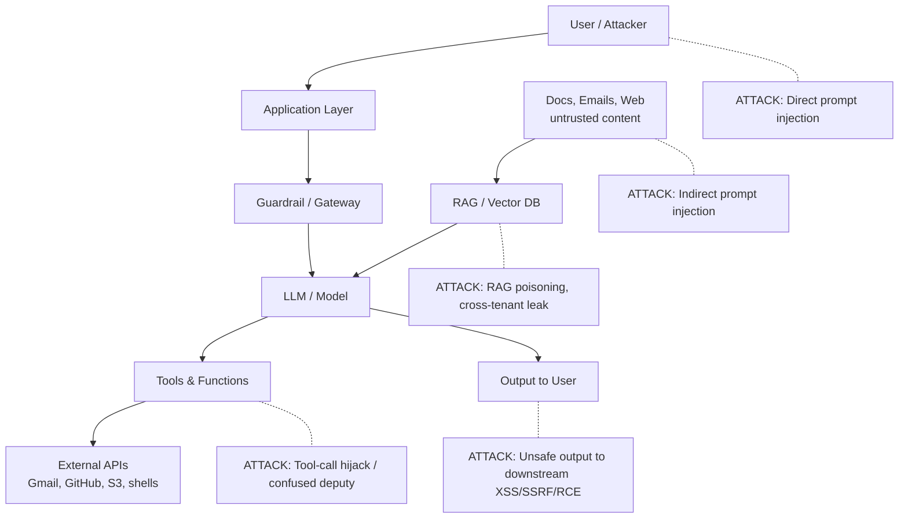

> Source: https://bugbounty.info/Attack-Surface/AI-LLM/index

# AI & LLM Applications

LLM-powered apps, chatbots, agents, and MCP servers are now on most major programs' scopes. HackerOne reported valid AI findings up 210% in 2025 with prompt injection alone up 540%, and 1,121 programs explicitly listed AI in scope  -  a 270% jump year over year. The attack surface is different enough from a classic web app that testing needs its own methodology.

The pattern worth internalising: an LLM is a parser that treats text as instructions, and every channel feeding text into it is a potential injection point. That parser also controls tools with real-world side effects  -  file reads, API calls, email sends, code execution in MCP servers. Bugs that cross a trust boundary between those two sides pay. Clever prompt tricks that don't reach a privileged action almost never do.

## Attack Surface Map

## Where the Bugs Live

**Input plane  -  what the model reads.** Direct user prompts, system prompts, tool descriptions, function schemas. Classic prompt injection sits here, and the subset that pays is when the injection lets you act as a different principal.

**Data plane  -  what the model retrieves.** RAG documents, vector databases, memory, past conversation, file attachments, web pages the agent browses. Indirect prompt injection lives here. The attacker never types anything into the model; they plant instructions in content the victim tells the model to process.

**Control plane  -  what the model can do.** Tools, MCP servers, OAuth-connected APIs, shell access. This is the blast-radius layer. A zero-impact jailbreak becomes a critical when the model has tools that email, write code, or hit production APIs.

## What Pays vs. What Gets Closed

Programs vary, but the pattern across HackerOne, Bugcrowd, Intigriti, and direct programs is consistent:

**Reliably paid:**

- Cross-tenant data access via prompt injection  -  reading another user's conversation, RAG content, or memory
- RCE or shell access via an MCP server or tool-call hijack
- Private key, token, or secret leakage from the system prompt or retrieved context
- Privilege escalation where an agent performs an action the user could not (admin API calls, billing changes)
- Supply-chain compromise of MCP servers or plugins

**Usually closed as informational:**

- "I made the chatbot say a swear word"
- Generic jailbreaks that don't cross a trust boundary
- Model hallucinations with no security impact
- Token exhaustion / cost-bombing unless the program explicitly scopes it
- Outputs an unauthenticated user could have generated themselves

Read each program's AI-specific scope. Many now carve out a specific harness (the production app, not the raw model API), specific boundaries (tenant isolation, tool invocation limits), and explicitly out-of-scope categories (bias, toxicity, content policy).

## Section Pages

### [Direct Prompt Injection](../../Attack-Surface/AI-LLM/Direct-Prompt-Injection)

Jailbreaks, role confusion, system-prompt extraction, policy bypass. The channel you control, hitting the model directly.

### [Indirect Prompt Injection](../../Attack-Surface/AI-LLM/Indirect-Prompt-Injection)

The high-impact class. OWASP LLM01's top entry. Plant instructions in documents, emails, web pages, or images; the victim's agent reads them and follows them.

### [MCP Vulnerabilities](../../Attack-Surface/AI-LLM/MCP-Vulnerabilities)

The Model Context Protocol has active CVEs in 2025 and 2026 including a systemic STDIO command-execution flaw affecting 7,000+ public servers. Treat third-party MCP servers as hostile until proven otherwise.

### [Agent Abuse](../../Attack-Surface/AI-LLM/Agent-Abuse)

Confused deputy bugs in agentic systems. Tool-call hijack, over-scoped OAuth, RAG-to-tool pivot. Where the input and control planes meet, and where the criticals live.

### [Training Data & Memory Leaks](../../Attack-Surface/AI-LLM/Training-Data-and-Memory-Leaks)

Training-data extraction through divergence and completion probes, session memory leaks, cross-tenant bleed on memory features, and fine-tuned model exfiltration.

### [RAG & Vector DB Attacks](../../Attack-Surface/AI-LLM/RAG-and-Vector-DB-Attacks)

Cross-tenant retrieval, embedding poisoning, retrieval hijack, and document injection through writeable trusted sources. Broken access control meets vector similarity.

### [Output Handling Flaws](../../Attack-Surface/AI-LLM/Output-Handling-Flaws)

LLM-assisted XSS, SSRF, SQLi, and RCE. Every downstream sink still matters; the LLM is the steerable primitive sitting upstream.

### [Model DoS & Resource Abuse](../../Attack-Surface/AI-LLM/Model-DoS-and-Resource-Abuse)

Token bombs, recursive loops, cost exhaustion, quota and premium-tier bypass. Often closed as out-of-scope; the findings that pay are quota bypass and billing evasion.

## See Also

- [AI-Assisted Hunting](../../Tooling/AI-Assisted/)  -  using LLMs as a testing tool, not a target
- [Supply Chain](../../Attack-Surface/CI-CD/Supply-Chain)  -  MCP servers and plugin marketplaces are a supply chain
- [SSRF](../../Attack-Surface/Web/SSRF/)  -  agents with network tools expand the SSRF attack surface
- [Impact Statements](../../Reporting/Impact-Statements)  -  AI findings need sharp impact framing to avoid "interesting but informational" closures
