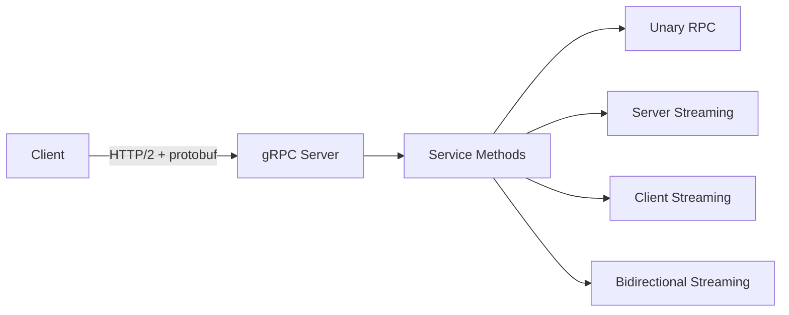

> Source: https://bugbounty.info/Attack-Surface/API/gRPC

# gRPC and Protobuf Testing

gRPC is underexplored by most hunters, which means less competition when you find bugs. The surface area is the same as any API (auth, authz, input validation), but the tooling is different and most people give up at the "I can't read the traffic" stage. Don't.

## What You're Dealing With

gRPC uses HTTP/2 and protobuf by default. The wire format is binary. If you see a service with HTTP/2 and binary content that doesn't look like anything else, it's probably gRPC. Burp can intercept it, but you need the gRPC extension or you're reading gibberish.



**Content-type giveaway:**

```http
Content-Type: application/grpc
Content-Type: application/grpc+proto
Content-Type: application/grpc-web+proto   <- gRPC-Web (HTTP/1.1 compatible)
```

gRPC-Web is easier to intercept since it runs over HTTP/1.1. If the target has a web frontend that talks gRPC, it's almost certainly using gRPC-Web.

## Server Reflection

If server reflection is enabled, you get the full service definition without needing any .proto files. This is like introspection for GraphQL.

```bash
# grpcurl - the essential tool
brew install grpcurl   # or download binary
 
# List services (requires reflection or -proto flag)
grpcurl -plaintext target.com:50051 list
 
# List methods on a service
grpcurl -plaintext target.com:50051 list com.target.UserService
 
# Describe a method (shows request/response types)
grpcurl -plaintext target.com:50051 describe com.target.UserService.GetUser
 
# Call a method
grpcurl -plaintext -d '{"user_id": "123"}' \
  target.com:50051 com.target.UserService/GetUser
 
# With TLS (no client cert)
grpcurl -d '{"user_id": "123"}' \
  target.com:443 com.target.UserService/GetUser
 
# With metadata (headers / auth tokens)
grpcurl -H 'authorization: Bearer <token>' \
  -d '{"user_id": "123"}' \
  target.com:443 com.target.UserService/GetUser
```

**If reflection is disabled:** look for .proto files in the mobile app, JS bundles, or the company's public GitHub repos. Devs frequently commit .proto files.

## Reverse Engineering .proto Files

When you don't have the .proto and reflection is off, you work backwards from the binary.

**From a captured request:**

```bash
# Protobuf is self-describing enough that you can often decode without a schema
# Field numbers and wire types are always present
# python3 -c + blackboxprotobuf
 
pip install blackboxprotobuf
python3 -c "
import blackboxprotobuf
data = bytes.fromhex('<hex of protobuf payload>')
msg, typedef = blackboxprotobuf.decode_message(data)
print(msg)
"
 
# protoc can decode with --decode_raw (no schema needed)
echo -n '<binary>' | protoc --decode_raw
```

**From the mobile app:**

```bash
# .proto files are often embedded in APKs/IPAs
# After decompiling, grep for .proto or look at assets/
grep -r "syntax = \"proto" ./decompiled/
grep -r "message " ./decompiled/ --include="*.proto"
 
# Also look for generated *Grpc.java / *ServiceGrpc.kt files - they reveal method names
grep -r "getServiceDescriptor\|METHOD_" ./decompiled/ --include="*.java"
```

## Common Auth Issues in gRPC

**Missing metadata auth checks:**

```bash
# Call method with no auth header at all
grpcurl -plaintext -d '{"user_id": "1"}' target.com:50051 UserService/GetUser
 
# Try empty token
grpcurl -H 'authorization: Bearer ' ...
 
# Try "anonymous" or internal-looking values
grpcurl -H 'x-internal-caller: true' ...
grpcurl -H 'x-service-account: backend-service' ...
```

**IDOR in gRPC is identical to REST - swap user IDs in request fields.**

**Stream hijacking:** in bidirectional streaming RPCs, test whether you can send messages that reference other users' resources mid-stream.

## Burp Setup for gRPC

1. Install the gRPC extension from BApp Store.
2. For gRPC-Web: just proxy normally, Burp decodes it automatically with the extension.
3. For native gRPC (HTTP/2): use grpcurl with `--connect-to` to proxy through Burp:

```bash
grpcurl \
  -plaintext \
  -connect-to target.com:50051:127.0.0.1:8080 \
  -d '{"user_id":"1"}' \
  target.com:50051 UserService/GetUser
```

**Burp + HTTP/2:** Burp supports HTTP/2 natively now. Make sure "Allow HTTP/2 ALPN override" is enabled in the proxy listener.

## Tooling Summary

| Tool | Use |
| --- | --- |
| grpcurl | List services, call methods, test with custom metadata |
| Burp gRPC extension | Intercept and replay gRPC-Web traffic |
| blackboxprotobuf | Decode protobuf without schema |
| protoc | Compile .proto files, decode raw protobuf |
| ghz | Load testing / rate limit testing for gRPC |

## Public Reports

- gRPC server reflection enabled leaking full service definitions - [HackerOne Hacktivity search](https://hackerone.com/hacktivity?querystring=grpc+reflection)
- IDOR in gRPC user service allows fetching any account via user_id field - [HackerOne #1365721](https://hackerone.com/reports/1365721)
- Missing authentication on internal gRPC method allows unauthenticated data access - [HackerOne #1076259](https://hackerone.com/reports/1076259)
- gRPC-Web endpoint lacks CORS origin check enabling cross-site requests - [HackerOne Hacktivity search](https://hackerone.com/hacktivity?querystring=grpc+cors)

## See Also

- [API Gateway Bypass](../../Attack-Surface/API/API-Gateway-Bypass) - gRPC services behind gateways have interesting path normalization issues
- [index](../../Android/) - .proto files often ship in Android APKs
