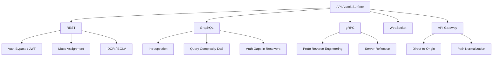

> Source: https://bugbounty.info/Attack-Surface/API/index

# API Attack Surface

APIs are where the real money is. Modern apps are mostly thin clients over a backend API, which means the API IS the app for testing purposes. If a program has both a web app and a mobile app, there's a good chance they share the same API, and the mobile client often has looser validation or extra endpoints the web UI doesn't expose.

## Surface Breakdown

## How API Testing Differs from Web App Testing

Web app testing leans heavily on UI flows and session cookies. API testing is different:

- **No rendered UI.** You're reading raw JSON/protobuf. You have to infer what fields exist and what they mean.
- **Versioning creates legacy attack surface.** `/api/v1/` might have auth checks that `/api/v2/` forgot to carry forward, or vice versa.
- **Mass assignment is rampant.** ORMs and auto-binding frameworks make it trivial to accidentally accept fields you never intended to expose.
- **Rate limiting is an afterthought.** Most devs add it to login endpoints and forget everything else.
- **Authorization is per-resolver, not per-route.** Especially true in GraphQL. One missing check means you can read or write data you shouldn't.

The methodology shift: stop thinking in "pages" and start thinking in "objects and actions." What objects does this API expose? What actions can I take on them? Which of those actions is my account actually authorized to perform?

## Sub-Pages

- [REST](../../Attack-Surface/API/REST) - Endpoint enumeration, auth bypass, mass assignment, rate limiting
- [GraphQL](../../Attack-Surface/API/GraphQL) - Introspection bypass, query DoS, resolver auth gaps, batching attacks
- [gRPC](../../Attack-Surface/API/gRPC) - Proto reverse engineering, server reflection, grpcurl
- [API Gateway Bypass](../../Attack-Surface/API/API-Gateway-Bypass) - Direct-to-origin, path normalization, header manipulation
- [WebSocket Security](../../Attack-Surface/Web/Client-Side/WebSocket) - CSWSH, auth bypass on messages, origin validation, message injection

## WebSocket Notes

See the dedicated [WebSocket Security](../../Attack-Surface/Web/Client-Side/WebSocket) page for full testing methodology, CSWSH PoC templates, and Burp setup. The short version: auth happens at the HTTP upgrade request, but subsequent messages often skip authorization checks entirely. Classic pattern: intercept the upgrade in Burp, then replay WS messages from a lower-privileged account to hit actions the server assumes only admins would send.

## Quick Wins Checklist

- Enumerate versions: v1, v2, v3, beta, internal, legacy
- Swap HTTP methods (GET vs POST vs PUT vs PATCH vs DELETE)
- Remove or downgrade auth headers entirely
- Add `X-Internal: true`, `X-Forwarded-For: 127.0.0.1`, admin-looking headers
- Look for `/swagger.json`, `/openapi.json`, `/api-docs`, `/graphql`, `/graphiql`
- Check mobile app traffic against the web app traffic for endpoint delta
