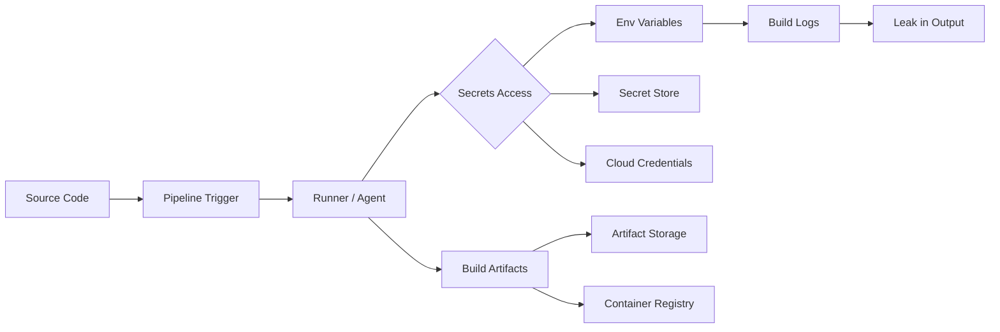

> Source: https://bugbounty.info/Attack-Surface/CI-CD/index

# CI/CD Attack Surface

CI/CD pipelines are where secrets live and where they leak. Every build system that has ever touched a production deployment has credentials in it somewhere. The attack surface is broad: the pipeline config files themselves, the runners that execute them, artifact storage, and the trust relationships between the pipeline and the cloud environment it deploys to.

## Why CI/CD Matters for Bug Bounty

Most programs consider pipeline compromise high severity. If you can exfiltrate secrets from a CI pipeline, you likely get: cloud provider credentials, code signing keys, deployment tokens, API keys for every third-party service the app uses. That's often a P1.

Supply chain attacks (compromising a dependency or build step to inject malicious code) are explicitly in scope for many programs now, especially after Solar Winds and xz-utils.

## The Attack Surface



## Common Entry Points

**Pipeline config files in public repos:** `.github/workflows/`, `.gitlab-ci.yml`, `Jenkinsfile`, `.circleci/config.yml`, `.travis.yml`. These reveal the build structure, secret names, and sometimes values.

**Workflow injection:** Untrusted input (PR titles, commit messages, branch names) flows into shell commands in pipeline steps. Classic in GitHub Actions `pull_request_target` context.

**Self-hosted runner compromise:** Runners that execute on company infrastructure with broad network access. Poisoning a build can access internal services.

**Artifact exposure:** Build artifacts stored publicly or with weak access controls. Container images, binaries, test reports, coverage reports - all can contain secrets.

**Dependency confusion / supply chain:** Registries that don't pin versions or use internal package names that can be squatted on public registries.

## Platforms Covered

- [GitHub Actions](../../Attack-Surface/CI-CD/GitHub-Actions) - `pull_request_target` injection, secret exfil, GITHUB_TOKEN abuse
- [GitLab CI](../../Attack-Surface/CI-CD/GitLab-CI) - Runner exploitation, variable exposure, pipeline manipulation
- [Jenkins](../../Attack-Surface/CI-CD/Jenkins) - Script console, credential dumping, Groovy sandbox escape
- [Secret Leakage](../../Attack-Surface/CI-CD/Secret-Leakage) - Secrets in build logs, artifact files, env var exposure
- [Supply Chain](../../Attack-Surface/CI-CD/Supply-Chain) - Dependency confusion, typosquatting, package registry attacks

## What I Always Check

1. **Public repos with workflow files** - look for `pull_request_target`, secrets passed to untrusted contexts, `run: ${{ github.event.pull_request.title }}`
2. **Build log artifacts** - many programs accidentally expose logs that contain `::add-mask::` failures or unmasked env dumps
3. **OIDC federation** - modern pipelines use OIDC to assume cloud roles. Check what roles the pipeline can assume and from which branches/repos
4. **Dependency pinning** - `uses: some-action@main` instead of `uses: some-action@SHA` is supply chain risk
5. **Self-hosted runner labels** - `runs-on: self-hosted` with broad labels can mean the runner has prod access

## General Secret Hunting

```bash
# Scan a repo for secrets in history
trufflehog git https://github.com/target/repo --only-verified
 
# Or locally
gitleaks detect --source /path/to/repo --verbose
 
# Check git history for removed secrets
git log --all --full-history -- "**/*.env" "**/*.pem" "**/credentials*"
git log -p --all | grep -A5 -i "password\|secret\|key\|token"
```

## Related

- [Cloud Attack Surface](../../Attack-Surface/Cloud/) - CI/CD is how cloud creds leak
- [IAM Privilege Escalation](../../Attack-Surface/Cloud/AWS/IAM-Privilege-Escalation) - what you do with the creds once you have them
