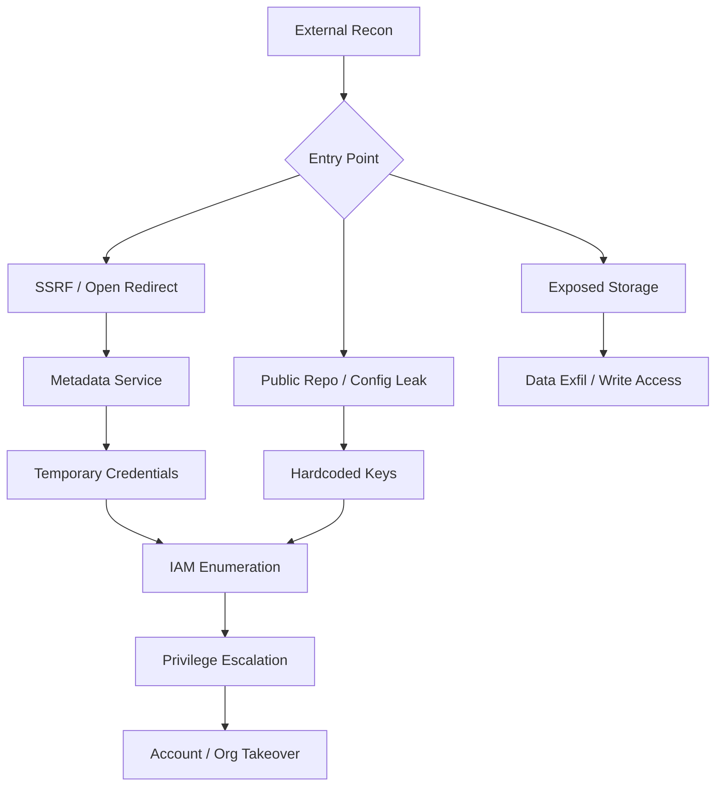

> Source: https://bugbounty.info/Attack-Surface/Cloud/index

# Cloud Attack Surface

Cloud infrastructure is one of the highest-signal areas in modern bug bounty. Misconfigured storage buckets, over-permissive IAM, and exposed metadata services convert recon findings into crits fast. Most programs run on AWS, a meaningful chunk on Azure or GCP, and plenty straddle multiple providers.

## The Natural Entry Point: SSRF

SSRF is almost always the first step into cloud. Every major provider exposes a metadata service on a link-local address:

| Provider | Metadata URL |
| --- | --- |
| AWS | `http://169.254.169.254/latest/meta-data/` |
| Azure | `http://169.254.169.254/metadata/instance?api-version=2021-02-01` (requires `Metadata: true` header) |
| GCP | `http://metadata.google.internal/computeMetadata/v1/` (requires `Metadata-Flavor: Google` header) |

If you've got SSRF on a cloud-hosted target, pivot to the metadata service immediately. You're looking for IAM credentials, service account tokens, and instance identity documents. From there the path to privilege escalation or lateral movement opens up.

## Attack Flow Overview

## Provider Pages

- [AWS](../../Attack-Surface/Cloud/AWS/) - S3, IAM, Lambda, Cognito. The biggest attack surface by volume.
- [Azure](../../Attack-Surface/Cloud/Azure/) - Blob storage, Entra ID (formerly AAD), Function Apps.
- [GCP](../../Attack-Surface/Cloud/GCP/) - Cloud Storage, Firebase, service account keys.
- [Multi-Cloud](../../Attack-Surface/Cloud/Multi-Cloud/) - Cross-provider patterns: metadata abuse, Terraform state, registry exposure.

## What I Always Check First

1. **Exposed credentials in JS/source** - hardcoded AWS keys, service account JSON blobs
2. **Bucket/blob enumeration** - permutations of the app name against S3/GCS/Azure Blob
3. **SSRF to metadata** - any URL-fetching feature, PDF generators, webhooks
4. **Public container registries** - Docker Hub, ECR, GCR set to public
5. **CI/CD pipeline configs** - `.github/workflows`, `.gitlab-ci.yml`, `Jenkinsfile` in public repos

## Tooling

- `aws-cli`, `gcloud`, `az` - provider CLIs for validating creds
- `enumerate-iam` - brute-force what an AWS key can do
- `Pacu` - AWS exploitation framework
- `ScoutSuite` - multi-cloud auditing (useful for understanding scope)
- `trufflehog`, `gitleaks` - credential scanning in repos/history
- `cloudfox` - enumerate accessible resources given initial AWS access

## Related

- [CD Attack Surface](../../Attack-Surface/CI-CD/) - pipelines are how secrets leak into cloud
- [SSRF](../../Attack-Surface/Web/SSRF/) - the entry point for most cloud attacks
