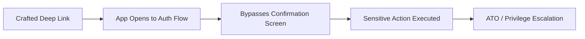

> Source: https://bugbounty.info/Attack-Surface/Mobile/Shared/index

# Shared Mobile Concerns

These apply to both Android and iOS. If you've done your pinning bypass and have traffic flowing, this is what to do with it. Also covers attack chains that start in the app and end with account takeover.

## API Endpoint Extraction via Proxy

Once cert pinning is bypassed, proxy ALL app traffic through Burp and use the app exhaustively. Don't just test the happy path - tap every button, every settings screen, every share and export function.

**Burp proxy setup for mobile:**

```bash
# On your laptop:
# Burp -> Proxy -> Options -> Add listener on 0.0.0.0:8080
 
# On device:
# WiFi -> Proxy -> Manual -> your laptop IP, port 8080
# Install Burp CA cert (browse to http://burpsuite)
 
# Android 7+ system CA trust workaround (without root):
# Use a patched APK that sets network_security_config.xml to trust user certs
# apktool d target.apk, add res/xml/network_security_config.xml:
cat <<'EOF'
<?xml version="1.0" encoding="utf-8"?>
<network-security-config>
    <base-config>
        <trust-anchors>
            <certificates src="system"/>
            <certificates src="user"/>
        </trust-anchors>
    </base-config>
</network-security-config>
EOF
# Then rebuild: apktool b ./apktool-out/ -o patched.apk && sign it
```

**What to capture and look for:**

```text
1. Auth tokens - format, algorithm, expiry
2. Internal API hostnames - may differ from the web API
3. Endpoints not in the web app - export, admin, bulk, internal
4. API versioning - mobile app may use v1 while web uses v2 (or vice versa)
5. Custom headers - X-App-Version, X-Device-ID, X-Platform - bypass these by adding to your requests
6. Fields in responses that the UI doesn't render - look at raw JSON
```

**Automating endpoint discovery from captured traffic:**

```bash
# Export Burp proxy history as XML, then parse
# Or use Burp's built-in "crawl and audit" after capturing manual traffic
 
# Extract unique API paths from Burp history with python
# (or just eyeball the Site Map)
```

## API Endpoint Delta: Mobile vs Web

This is one of the highest-ROI things you can do. The web app and mobile app usually share a backend but the endpoints differ. Devs add mobile-specific endpoints and forget to security-review them with the same rigor.

```text
Methodology:
1. Capture web app traffic for the same feature set
2. Capture mobile app traffic
3. Diff the endpoint lists
4. Endpoints that exist only in mobile traffic are your targets
5. Try calling mobile-only endpoints from a web session (no mobile headers) - if they work, test harder
```

Common mobile-only endpoints:

- `/api/mobile/upload` vs `/api/upload` - different size/type validation
- `/api/v1/sync` - bulk data sync endpoints with BOLA potential
- `/api/push/register` - device registration, see push notification abuse below
- `/api/app/config` - server-driven UI config, may expose feature flags or internal settings

## Deep Link to Account Takeover Chains

Deep links that handle auth callbacks are the most dangerous. The chain usually looks like this:



**Common chains:**

**OAuth code interception (Android):**

```text
1. App handles: target://oauth/callback?code=X
2. Attacker's malicious app also registers target:// scheme
3. On older Android, the OS shows a chooser - user might pick the wrong app
4. On newer Android, ambiguous intent resolution could default to attacker app
5. Attacker receives the OAuth code, exchanges it for a token
```

**Password reset deep link:**

```bash
# App opens password reset screen pre-filled from deep link
target://reset-password?token=ABC123&email=victim@example.com
 
# Test:
# 1. Can you reuse a consumed token?
# 2. Does the email parameter actually bind to the token's account, or can you swap it?
# 3. Can you trigger the reset with no token at all? (token= empty/missing)
```

**Email change confirmation bypass:**

```bash
# If email change confirmation comes via deep link:
target://verify-email?token=ABC123
 
# Test: does confirming YOUR email change token also work when called with a different account's email already-set token?
# Try: intercept your own email change link, modify email= param before the app processes it
```

**Account linking hijack:**

```bash
# Social login deep links
target://oauth/google?code=X&state=Y
 
# state parameter CSRF check: is the state validated against session?
# If state is predictable or missing, trigger social account linking to attacker-controlled Google account
```

## Push Notification Abuse

Push registration endpoints accept a device token and associate it with an account. Bugs here are uncommon but impactful.

**What to test:**

```bash
# 1. Register your device token to another user's account
POST /api/push/register
{"device_token": "your_apns_token", "user_id": "victim_id"}
# If no auth check on user_id, you receive victim's push notifications
 
# 2. Deregister another user's device (DoS on notifications)
DELETE /api/push/register
{"device_token": "victim_device_token"}
 
# 3. Push notification content exposure
# Some apps include sensitive data in push notification payloads
# Visible on lock screen, logged by analytics SDKs, readable by other apps in some configs
# (iOS: check if app sets notification content to include tokens/PII)
```

**Finding the device token:**

```bash
# Android: Firebase Cloud Messaging token
# In Burp, look for requests to /api/push/register or similar after first app launch
# Also in SharedPreferences: grep for "fcm_token", "push_token", "device_token"
 
# iOS: APNs token comes from application:didRegisterForRemoteNotificationsWithDeviceToken:
# Hook it with Frida to capture it:
frida -U -f com.target.app -l - <<'EOF'
ObjC.implement(ObjC.classes.AppDelegate["- application:didRegisterForRemoteNotificationsWithDeviceToken:"], function(handle, selector, app, tokenData) {
    var token = ObjC.Object(tokenData).description().toString();
    console.log("APNs token: " + token);
    return this.application_didRegisterForRemoteNotificationsWithDeviceToken_(app, tokenData);
});
EOF
```

## Secrets in App Update Diffs

When an app updates, diff the two versions. Devs sometimes add and remove endpoints, change auth logic, or accidentally introduce new hardcoded values.

```bash
# Download current version and previous version
# Decompile both, then diff
diff -r ./decompiled-v1/ ./decompiled-v2/ > version-diff.txt
grep -A5 "api\|secret\|key\|token\|endpoint" version-diff.txt
```

## Public Reports

- Mobile-only API endpoint lacks auth check present on web version, allows IDOR - [HackerOne #1157276](https://hackerone.com/reports/1157276)
- Push notification registration allows associating attacker device token to victim account - [HackerOne #1041378](https://hackerone.com/reports/1041378)
- Password reset deep link accepts empty token parameter, resets any account - [HackerOne #1357790](https://hackerone.com/reports/1357790)
- OAuth code interception via intent chooser on Android allows account takeover - [HackerOne #1312965](https://hackerone.com/reports/1312965)

## See Also

- [Android Testing](../../../Attack-Surface/Mobile/Android/) - cert pinning bypass for Android
- [iOS Testing](../../../Attack-Surface/Mobile/iOS/) - cert pinning bypass for iOS
- [REST API Testing](../../../Attack-Surface/API/REST) - backend testing after you have the endpoints
- [API Gateway Bypass](../../../Attack-Surface/API/API-Gateway-Bypass) - mobile apps often talk directly to backends, skipping gateways
