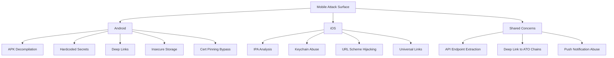

> Source: https://bugbounty.info/Attack-Surface/Mobile/index

# Mobile Attack Surface

The app binary is a goldmine. Hardcoded secrets, API endpoints, internal hostnames, encryption keys, AWS credentials - all sitting in a file you can download from the App Store or APK mirror. Most hunters skip mobile because it feels like more setup. That's why the bugs persist.

The important mental shift: the mobile app itself is secondary. What matters is what the app *reveals* and how it *talks to the backend*. The real bugs are almost always in the backend API. The app just gives you the map.

## Attack Surface Breakdown



## Why Mobile is Worth Your Time

- **The app binary ships with secrets devs never meant to expose.** Firebase config, AWS keys, third-party API keys, internal API base URLs, hardcoded credentials.
- **Backend APIs built for mobile often skip the rate limiting and input validation that the web API has.** They're "for trusted apps only."
- **Deep links are an underexplored attack surface.** They let any app on the device trigger actions in your target app. A crafted deep link can pre-fill forms, trigger OAuth flows, skip confirmation screens.
- **Certificate pinning gets added and then never tested.** Frida bypasses it in two minutes.

## Setup You Actually Need

**Android:**

```text
- Android Studio (for emulator) or physical device
- jadx (decompile APK to Java)
- apktool (repack/patch APKs)
- Frida + frida-server on device
- Burp Suite (proxy)
- adb
```

**iOS:**

```text
- Jailbroken device (checkra1n, palera1n) or simulator for static analysis
- Frida
- objection (Frida wrapper with built-in hooks)
- class-dump or frida-ios-dump for class headers
- ipatool or Apple Configurator for IPA download
- Burp Suite (proxy)
```

## Where to Get the App Binary

```bash
# Android - multiple options
apkeep -a com.target.app -d google-play .   # apkeep tool
# Or download APK directly from apkpure.com, apkmirror.com
 
# iOS - requires a device or paid tooling
# ipatool (requires Apple ID, app must be in your purchase history or free)
ipatool download -b com.target.app --output target.ipa
 
# From a jailbroken device after installing the app
frida-ios-dump -u mobile -H 127.0.0.1 com.target.app
```

## Sub-Pages

- [Android Testing](../../Android/) - APK decompilation, hardcoded secrets, deep links, cert pinning bypass
- [iOS Testing](../../iOS/) - IPA analysis, keychain, URL schemes, universal links
- [Shared Mobile Concerns](../../Shared/) - API extraction via proxy, deep link to ATO chains, push notification abuse

## Quick Wins Without a Device

Static analysis alone can net you real bugs. Before you even set up a proxy:

1. Download the APK/IPA
2. Run `strings` and `grep` for secrets (`api_key`, `secret`, `password`, `AWS_`, `firebase`)
3. Decompile and search for URLs - you'll find internal API endpoints
4. Check the manifest (Android) or Info.plist (iOS) for URL schemes and exported components
5. Check for `.git`, debug endpoints, staging URLs hardcoded for dev builds that made it to prod
