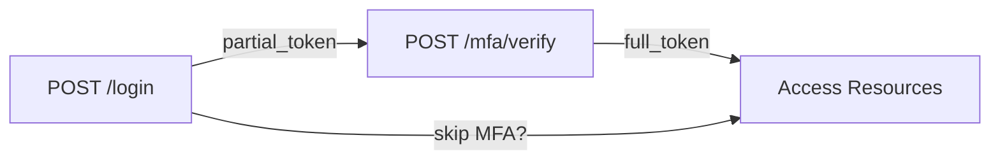

> Source: https://bugbounty.info/Attack-Surface/Web/Authentication/MFA-Bypass

# MFA Bypass

MFA is the last line of defense for most accounts, which is exactly why breaking it pays well. The bugs here aren't about cracking TOTP codes  -  they're about logic flaws in how MFA is enforced.

## Response Manipulation

The fastest thing to try. After submitting credentials, if the server returns:

```json
{"mfa_required": true, "next_step": "totp"}
```

Intercept that response in Burp and change it:

```json
{"mfa_required": false, "next_step": "dashboard"}
```

Or if there's a redirect to `/mfa/verify`, see if you can navigate directly to `/dashboard` without completing MFA. Some apps set a partial-auth session cookie after credentials are verified and never check if MFA was completed on subsequent requests.

## Race Condition in MFA

This is a beautiful bug when it exists. The window is tiny but Turbo Intruder makes it repeatable.

**Scenario:** You know the correct TOTP code (it's your account). Send 20 simultaneous requests with that code. If two requests land in the same processing window before the code is marked "used", both succeed and you get two sessions. More critically  -  send 20 requests with *slightly wrong* codes. If the race window causes the server to check the code before a previous failed attempt is logged, you can bypass lockout.

```python
# Turbo Intruder template for race condition MFA
def queueRequests(target, wordlists):
    engine = RequestEngine(endpoint=target.endpoint,
                           concurrentConnections=20,
                           requestsPerConnection=1,
                           pipeline=False)
    for i in range(20):
        engine.queue(target.req, str(i).zfill(6))
 
def handleResponse(req, interesting):
    if '302' in req.response or 'dashboard' in req.response:
        table.add(req)
```

## Backup Code Brute Force

Backup codes are typically 8-10 digits. That's 100 million possibilities  -  unrealistic to brute force unless:

1. The codes are numeric and only 6-8 digits (~1 million combinations)
2. There's no rate limiting on the backup code endpoint
3. The backup code endpoint is a *different* endpoint than the TOTP endpoint  -  and it has weaker protections

Always test the backup code flow separately. It's often built by a different developer and rate limiting gets missed.

```http
POST /auth/backup-code HTTP/1.1
Host: target.com
 
code=12345678&session_token=PARTIAL_AUTH_TOKEN
```

Run Intruder with a numeric sequential payload. Check if you get locked out after 5 attempts. If not  -  it's a finding.

## MFA Enrollment Bypass

When MFA is *optional* but enforced for certain resources, look for ways to access those resources without enrolling. Try direct navigation to the protected endpoint  -  sometimes the "MFA required" check only fires on the normal navigation path, not on direct API calls.

If MFA enrollment sends a setup code via SMS/email and that code appears in the response or in a predictable format  -  that's a full enrollment bypass.

## TOTP Code Reuse

A valid TOTP code should only be accepted once within its 30-second window. Test:

1. Get a valid code from your authenticator app
2. Use it to authenticate
3. Immediately use the same code again in a second request
4. If the second request succeeds  -  TOTP reuse is possible

## Step Skipping / Direct API Calls

Multi-step auth flows expose this constantly. Map the full flow:

```http
POST /auth/login         -> returns partial session token
POST /auth/mfa/verify   -> returns full session token
```

Try using the partial session token to access authenticated API endpoints directly. The API layer might not check whether MFA was completed  -  only whether a session token exists.



## SMS/Email OTP Issues

- **OTP valid forever**  -  does it expire? Try a 30-minute-old OTP.
- **OTP predictable**  -  some systems use 4-digit numeric OTPs. 10,000 possibilities with no rate limiting is trivially brute-forceable.
- **OTP in response**  -  I've seen this. The OTP is returned in the response body or a cookie "for convenience." Check carefully.
- **OTP channel can be changed**  -  if you can change the OTP delivery method (SMS vs email) during the MFA step and you control the email, game over.

## Checklist

- Response manipulation  -  change `mfa_required: true` to `false`
- Direct navigation to post-MFA endpoints with partial session
- Race condition on code submission
- Backup code endpoint rate limiting
- TOTP code reuse within same window
- OTP expiry  -  is there one?
- OTP in API response body

## Related Pages

- [Login Bypass](../../../Attack-Surface/Web/Authentication/Login-Bypass)  -  start here before MFA testing
- [Session Management](../../../Attack-Surface/Web/Authentication/Session-Management)  -  understanding partial vs full session states
- [SSO](../../../Attack-Surface/Web/Authentication/SSO)  -  SSO-enforced MFA has additional bypass surface
