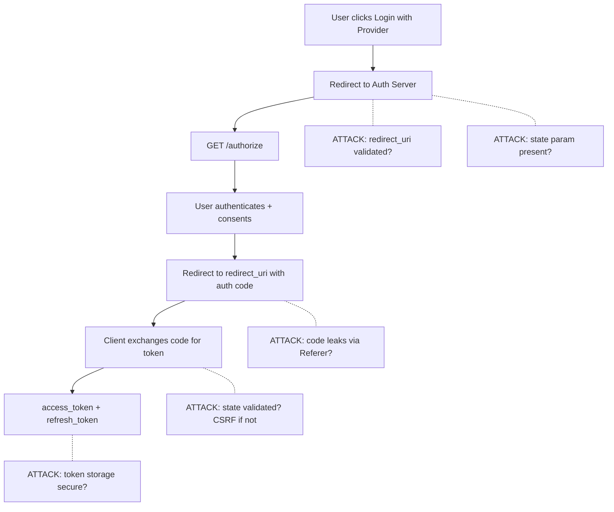

> Source: https://bugbounty.info/Attack-Surface/Web/Authentication/OAuth

# OAuth

OAuth is a gift to bug bounty hunters. The spec is complex, implementations vary wildly, and developers frequently misunderstand what they're supposed to be protecting. Every app with "Login with Google/GitHub/Facebook" is worth testing here.

## OAuth Flow with Attack Points



## redirect_uri Manipulation

This is the big one. If the `redirect_uri` isn't strictly validated, you can steal auth codes.

**Open redirect chaining**  -  if the app allows `redirect_uri=https://target.com/callback` and there's an open redirect at `https://target.com/redirect?to=`, try:

```text
redirect_uri=https://target.com/redirect?to=https://evil.com
```

**Path traversal**  -  if the app validates the domain but not the path:

```bash
# Registered: https://target.com/callback
# Try:
redirect_uri=https://target.com/callback/../../../attacker-controlled-path
redirect_uri=https://target.com/callback%2F..%2F..%2Fevil
```

**Subdomain/path confusion:**

```text
redirect_uri=https://target.com.evil.com/callback
redirect_uri=https://target.com/callback?x=https://evil.com
redirect_uri=https://target.com/callback#https://evil.com
```

## State Parameter  -  CSRF on OAuth

If there's no `state` parameter, or it's not validated on return, the entire OAuth flow is vulnerable to CSRF. You can force a victim to link your account to theirs.

**PoC:**

1. Start an OAuth flow, capture the authorization URL
2. Don't complete it  -  grab the URL up to the redirect
3. Send that URL to a victim (logged in to the target app)
4. If the app doesn't validate `state`, victim's account gets linked to your OAuth identity

## Token Leakage via Referer

Same issue as [Password Reset](../../../Attack-Surface/Web/Authentication/Password-Reset)  -  if the redirect lands on a page with third-party scripts and the access token appears in the URL fragment or query string, it leaks.

`https://target.com/callback?code=AUTH_CODE`  -  that code ends up in Referer headers.

## PKCE Bypass

PKCE (Proof Key for Code Exchange) is supposed to prevent code interception. Common implementation bugs:

- `code_verifier` accepted without `code_challenge` being checked
- Server accepts any `code_verifier` value regardless of what was sent during authorization
- PKCE entirely optional when it should be required

Test by starting a PKCE flow, intercepting the token exchange, and removing or altering the `code_verifier`:

```http
POST /oauth/token HTTP/1.1
Host: auth.target.com
Content-Type: application/x-www-form-urlencoded
 
grant_type=authorization_code&code=AUTH_CODE&redirect_uri=https://target.com/callback
# No code_verifier  -  does the server reject this?
```

## Scope Escalation

Request scopes beyond what the app normally requests. Sometimes the auth server approves anything the client asks for without checking against what was registered.

```bash
# Normal request
scope=read:profile email
 
# Try escalating
scope=read:profile email admin write:all repo
```

Also look for scope confusion  -  if the app uses `offline_access` to get a refresh token but the refresh token has broader permissions than intended.

## Account Takeover via Unlinked Email

Classic chain: target app allows sign-up with email and also supports OAuth. You register `victim@gmail.com` with a password. Victim later logs in via "Login with Google" using the same email. If the app merges these accounts automatically without email verification  -  you have the victim's account.

## Implicit Flow

If the app is using the implicit flow (token returned directly in the URL fragment, not via code exchange), that's worth noting. Tokens in URL fragments can leak via:

- Browser history
- Server logs if the fragment gets accidentally server-side
- JavaScript on the page reading `window.location.hash`

## OIDC id_token Attacks

OpenID Connect layers identity on top of OAuth. The `id_token` is a JWT, which means every JWT attack applies  -  and then there are OIDC-specific issues on top.

**Algorithm confusion on id_token**  -  the same RS256-to-HS256 confusion that applies to auth JWTs applies here. If the IdP publishes its public key at `/.well-known/jwks.json`, try signing a forged id_token with HS256 using that public key. See [JWT Attacks](../../../JWT-Attacks) for the full technique.

**Missing `aud` validation**  -  the `aud` claim in an id_token should be the client's `client_id`. If the SP doesn't validate `aud`, you can replay an id_token issued for a different client application:

```bash
# Get an id_token from a different OAuth client on the same IdP
# Replay it to the target SP  -  does it accept?
POST /oauth/callback
id_token=TOKEN_ISSUED_FOR_OTHER_CLIENT
```

**Missing `iss` validation**  -  if the SP doesn't check the `iss` (issuer) claim, you can set up your own IdP, issue a token with the victim's `sub`, and replay it.

**Nonce replay**  -  the `nonce` in an id_token binds the token to a specific auth session. SPs that don't validate the nonce against the one they sent in the original authorization request are vulnerable to replay attacks with captured id_tokens.

## Dynamic Client Registration Abuse

RFC 7591 defines a Dynamic Client Registration endpoint that lets clients register themselves programmatically. If the endpoint is unauthenticated or weakly authenticated:

```http
POST /oauth/register HTTP/1.1
Host: auth.target.com
Content-Type: application/json
 
{
  "client_name": "Legit App",
  "redirect_uris": ["https://attacker.com/callback"],
  "grant_types": ["authorization_code"],
  "response_types": ["code"]
}
```

A successful registration returns a `client_id` and optionally `client_secret`. You now have a registered OAuth client you control. Combined with a phishing or CSRF attack on a victim, you can harvest authorization codes that redirect to your callback.

Check for: `/oauth/register`, `/connect/register`, `/.well-known/openid-configuration` (look for `registration_endpoint`).

## PKCE Downgrade

When a server supports PKCE but doesn't require it, a downgrade attack removes PKCE from the flow entirely. The existing PKCE bypass section covers implementation bugs; this is about the server accepting a code-exchange request with no `code_verifier` at all when the original authorization request included a `code_challenge`.

Test by starting a PKCE-enabled flow, capturing the auth code, then exchanging without the verifier:

```http
POST /oauth/token HTTP/1.1
Host: auth.target.com
Content-Type: application/x-www-form-urlencoded
 
grant_type=authorization_code&code=AUTH_CODE&redirect_uri=https://target.com/callback
# code_verifier deliberately absent
```

If the server returns a token, PKCE is optional  -  meaning any intercepted code can be exchanged.

## Cross-Device and CIBA Flows

**Device Authorization Grant (RFC 8628)**  -  the device flow shows a user a code and a URL, then polls until they authenticate. If an attacker can send a victim a device-flow URL, the victim authenticates on their own device and the attacker receives the token on theirs. This is a social-engineering-assisted OAuth attack, but the technical enabler is the flow itself.

Look for: `grant_type=urn:ietf:params:oauth:grant-type:device_code` in token requests; `device_authorization_endpoint` in OpenID config.

**CIBA (Client-Initiated Backchannel Authentication)**  -  the client sends a login hint (email, phone number) and an out-of-band push notification goes to the user's device. If the `login_hint` parameter accepts attacker-supplied user identifiers without rate limiting, this enables account enumeration and potential push-notification spam. More critically  -  if the server doesn't properly bind the notification to the requesting session, there's a race condition where a spoofed client can request auth on behalf of a victim.

## Cookie-Bound and DPoP Tokens

DPoP (Demonstrating Proof of Possession) binds access tokens to a specific key pair, making stolen tokens useless without the private key. It's a 2024-2025 adoption and shows up in newer OAuth implementations.

How to spot it: requests include a `DPoP` header containing a signed JWT alongside the `Authorization: DPoP <token>` header.

**Where to look for bypasses:**

- Does the server validate the DPoP proof on every request, or only on token issuance?
- Is the `htm` (HTTP method) and `htu` (HTTP URL) in the DPoP proof validated against the actual request?
- Does the server accept `Authorization: Bearer <token>` when DPoP was negotiated?

```http
# Test: send the access token as a Bearer token instead of DPoP-bound
GET /api/profile HTTP/1.1
Host: api.target.com
Authorization: Bearer ACCESS_TOKEN
# No DPoP header  -  does the server accept it?
```

Cookie-bound tokens  -  some implementations bind tokens to a `__Host-` or `__Secure-` cookie. Check whether the token is also accepted via `Authorization` header, which strips the cookie binding.

## Checklist

- Check the `redirect_uri` for open redirect chains, path traversal, and subdomain confusion
- Confirm `state` parameter is present and validated server-side on return
- Test whether `state` is tied to the session or just a static value
- Check for auth code leakage via `Referer` header on the callback page
- Start a PKCE flow, exchange the code without `code_verifier`  -  is it accepted?
- Test scope escalation by adding admin/write scopes to the authorization request
- Attempt the unlinked email account takeover (register by email, then OAuth with same email)
- Check for implicit flow tokens in URL fragments leaking to third-party scripts
- If OIDC: test `aud` and `iss` validation on id_tokens; check nonce replay
- Look for a Dynamic Client Registration endpoint and test unauthenticated access
- If DPoP is used: test Bearer token fallback and missing claim validation
- Check for a CIBA or Device Authorization endpoint and test login_hint enumeration

## Public Reports

Real-world OAuth findings across bug bounty programmes:

- Open redirect on cs.money chained with OAuth for account takeover - [HackerOne #905607](https://hackerone.com/reports/905607)
- Account takeover via Pornhub OAuth flow using unverified email - [HackerOne #192648](https://hackerone.com/reports/192648)
- Account takeover via Google OneTap on Priceline without email verification - [HackerOne #671406](https://hackerone.com/reports/671406)
- GitLab OAuth email verification bypass leading to third-party account takeover - [HackerOne #922456](https://hackerone.com/reports/922456)
- OAuth PKCE code challenge bypass on GitLab leading to account takeover - [HackerOne #1025581](https://hackerone.com/reports/1025581)
- Dynamic client registration abuse enabling authorization code theft - [HackerOne #705937](https://hackerone.com/reports/705937)

## See Also

- [SSO](../../../Attack-Surface/Web/Authentication/SSO)  -  SAML-based SSO has overlapping attack patterns
- [JWT Attacks](../../../JWT-Attacks)  -  id_token attacks share the same JWT primitives
- [Session Management](../../../Attack-Surface/Web/Authentication/Session-Management)  -  where OAuth tokens end up and how they're stored
- [Password Reset](../../../Attack-Surface/Web/Authentication/Password-Reset)  -  apps with OAuth sometimes have a broken legacy password reset too
