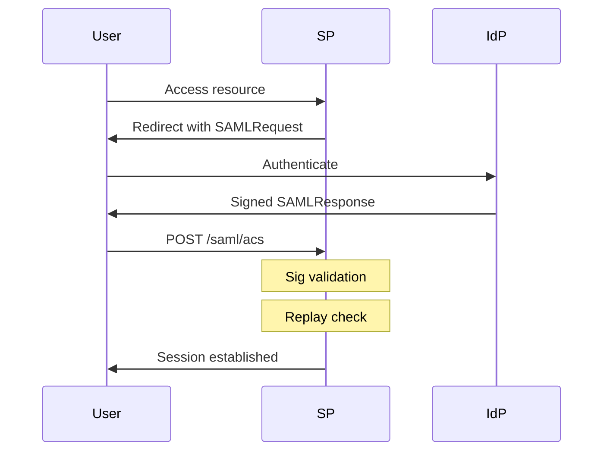

> Source: https://bugbounty.info/Attack-Surface/Web/Authentication/SSO

# SSO & SAML

SAML is enterprise-grade authentication that's enterprise-grade broken. Every large target using "Login with your company account" is running SAML underneath. These bugs are high severity  -  SAML assertions represent trusted identity claims, so breaking validation is almost always a P1.

## How SAML Works (Quick)



The `SAMLResponse` is a base64-encoded, signed XML document. The attack surface is entirely in how the SP validates that document.

## Response Manipulation

**Try the simplest thing first**  -  decode the SAMLResponse, edit the `<NameID>` or email attribute to a victim/admin, re-encode, and replay. Some SPs skip signature validation entirely. I've seen this on production enterprise apps.

```bash
# Decode
echo "BASE64_SAML_RESPONSE" | base64 -d > response.xml
 
# Edit the NameID or email attribute
# <NameID>attacker@company.com</NameID>  ->  <NameID>admin@company.com</NameID>
 
# Re-encode
base64 -w 0 response.xml
```

Submit the modified response in the `SAMLResponse` POST parameter. If no error, you're in.

## XML Signature Wrapping (XSW)

The signature in SAML covers a specific XML element identified by an ID. XSW attacks insert a malicious unsigned element that shadows the signed one, exploiting ambiguity in how the SP processes the document.

The idea: the SP validates the signature on element with `ID="signed"`  -  that element is fine. But when the SP extracts the `NameID`, it picks up your *unsigned* injected element instead.

There are 8 classic XSW variants. Use the **SAML Raider** Burp extension  -  it automates all 8 and shows you which ones the SP accepts.

**Manual example (XSW #2):**

```xml
<samlp:Response>
  <!-- Injected malicious assertion (unsigned) -->
  <saml:Assertion ID="evil">
    <saml:NameID>admin@victim.com</saml:NameID>
  </saml:Assertion>
  <!-- Original signed assertion (valid signature) -->
  <saml:Assertion ID="original">
    <saml:NameID>attacker@attacker.com</saml:NameID>
    <ds:Signature>...valid signature over ID=original...</ds:Signature>
  </saml:Assertion>
</samlp:Response>
```

## Assertion Replay

SAML assertions have a `NotOnOrAfter` expiry but many SPs don't track which assertions they've already consumed. Capture a valid assertion, store it, replay it hours/days later.

```http
POST /saml/acs HTTP/1.1
Host: target.com
Content-Type: application/x-www-form-urlencoded
 
SAMLResponse=BASE64_CAPTURED_ASSERTION&RelayState=...
```

A properly implemented SP maintains an assertion ID cache and rejects duplicates. Test by replaying your own fresh assertion twice in a row  -  the second should fail with an error about reused assertions.

## Signature Bypass via Algorithm Confusion

**Remove the signature entirely**  -  some SPs validate the signature only if it's present. If it's absent, they skip validation.

```xml
<!-- Remove the entire <ds:Signature> block and see what happens -->
```

**Change the algorithm to none**  -  modify `<ds:SignatureMethod Algorithm="http://www.w3.org/2001/04/xmldsig-more#rsa-sha256"/>` to a null/none algorithm. Rare but has appeared in custom SAML parsers.

**Comment injection**  -  XML comments can sometimes confuse parsers:

```xml
<saml:NameID>admin<!---->.attacker@company.com</saml:NameID>
```

## Burp + SAML Raider Workflow

1. Install **SAML Raider** from the BApp Store
2. Capture a SAMLResponse in Burp Proxy
3. Right-click -> Extensions -> SAML Raider -> Send to SAML Raider
4. Run all XSW payloads automatically
5. For manual testing  -  decode, edit, re-encode in the SAML Raider panel directly

## Common Misconfigurations

- SP accepts assertions from any IdP (no issuer validation)  -  you can set up your own IdP and forge assertions
- `InResponseTo` attribute not validated  -  enables CSRF-style attacks
- ACS URL not validated  -  assertions can be posted to the wrong endpoint

## SAML Signature Wrapping  -  XSW Classes

The XSW variants are numbered 1 through 8 based on where the malicious element is inserted relative to the signed element and the Response wrapper. SAML Raider tests all of them automatically, but understanding the structure helps you read the results and write your own variants.

The core principle across all XSW variants: the signature validator finds and validates the signed element by ID, but the application's NameID/attribute extractor picks up a *different* element. The two components disagree on which element "won".

| Variant | Structure | What moves |
| --- | --- | --- |
| XSW-1 | Evil assertion before signed Response | Unsigned assertion injected above signed Response element |
| XSW-2 | Evil assertion after signed Response | Same but positioned after |
| XSW-3 | Evil assertion before signed Assertion | Unsigned assertion injected above signed Assertion |
| XSW-4 | Evil assertion inside signed Assertion | Nested unsigned Assertion inside the signed one |
| XSW-5 | Signed element wrapped inside evil | Signed Assertion moved into unsigned Assertion |
| XSW-6 | Extensions element with evil Assertion | Evil Assertion in the Extensions block |
| XSW-7 | Signed inside Advice element | Signed Assertion moved into Advice, evil at root |
| XSW-8 | Object element | Signed Assertion moved into saml:Object element |

To identify which SPs are vulnerable: use SAML Raider, run all 8 variants, and note which ones return a session rather than an error. If any succeed  -  the SP is extracting attributes from the unsigned element.

**Vulnerable SP pattern to look for:** custom SAML parsers that call `getElementsByTagName("NameID")[0]` rather than finding the element by the ID referenced in the `<ds:Reference URI="#id">` of the signature.

## Assertion Encryption Bypass

When an IdP is configured to send encrypted assertions (`<saml:EncryptedAssertion>`), the SP should reject unencrypted ones. Many don't.

Test: decode a SAMLResponse, strip the `<saml:EncryptedAssertion>` wrapper, insert a plain `<saml:Assertion>` with the attacker's NameID, and submit. If the SP accepts the plaintext assertion, it never enforced encryption at all.

```xml
<!-- Replace this -->
<saml:EncryptedAssertion>
  <xenc:EncryptedData>...</xenc:EncryptedData>
</saml:EncryptedAssertion>
 
<!-- With a plain unsigned assertion -->
<saml:Assertion ID="evil" ...>
  <saml:NameID>admin@target.com</saml:NameID>
  ...
</saml:Assertion>
```

This is particularly common when the SP was originally deployed without encryption and encryption was added to the IdP configuration later without updating the SP's validation requirements.

## IdP-Initiated Flow Attacks

In SP-initiated SSO, the SP generates a SAMLRequest with an `InResponseTo` ID that the IdP must include in its response. The SP then verifies the response matches a request it sent.

In IdP-initiated SSO, there's no SAMLRequest  -  the IdP sends an assertion unprompted and the SP accepts it. The SP cannot validate `InResponseTo` (there is none). This opens several attack paths:

- **Forged assertion delivery**  -  if you can set up or compromise an IdP that the SP trusts (or if the SP trusts all issuers), you can send assertions for any NameID
- **Missing RelayState validation**  -  RelayState in IdP-initiated flows is attacker-controllable if the SP doesn't bind it to an authenticated session; this can redirect victims after login
- **Consent bypass**  -  some apps show a consent screen during SP-initiated flow but skip it for IdP-initiated, allowing attribute disclosure without user awareness

Check whether the SP's ACS endpoint accepts assertions without a matching `InResponseTo`. Send a fresh assertion with no corresponding request:

```http
POST /saml/acs HTTP/1.1
Host: target.com
Content-Type: application/x-www-form-urlencoded
 
SAMLResponse=BASE64_OF_ASSERTION_WITHOUT_IN_RESPONSE_TO
```

## JIT Provisioning Role Abuse

Just-In-Time provisioning creates user accounts on first SSO login using attributes from the SAML assertion. If the IdP is one you control (or can manipulate), and the SP maps SAML attributes to roles or permissions without additional authorisation checks:

```xml
<!-- Assertion with attacker-controlled attribute values -->
<saml:AttributeStatement>
  <saml:Attribute Name="role">
    <saml:AttributeValue>admin</saml:AttributeValue>
  </saml:Attribute>
  <saml:Attribute Name="groups">
    <saml:AttributeValue>platform-admins</saml:AttributeValue>
  </saml:Attribute>
</saml:AttributeStatement>
```

If the SP provisions the account with `role=admin` purely because the assertion says so  -  that's a privilege escalation via attribute injection. This is common in B2B SaaS products that let enterprise customers bring their own IdP.

Testing approach: complete a normal SSO login, intercept the SAMLResponse, modify the role/group attribute values, and re-submit. Also test with a self-signed IdP if the SP has a "bring your own IdP" configuration option.

## Checklist

- Decode the SAMLResponse and inspect the NameID, attributes, and signature structure
- Try modifying the NameID with no other changes  -  does the SP reject unsigned modifications?
- Run all 8 XSW variants using SAML Raider  -  note which ones produce a session
- Remove the entire `<ds:Signature>` block  -  does the SP accept a signature-free assertion?
- Try sending an unencrypted assertion when the IdP normally sends encrypted ones
- Test assertion replay  -  submit the same SAMLResponse twice in quick succession
- Submit an assertion without a corresponding `InResponseTo`  -  does the SP accept IdP-initiated flow?
- Check `InResponseTo` and `NotBefore`/`NotOnOrAfter` validation
- If JIT provisioning is enabled: inject role/group attribute values and check what's provisioned
- Check whether the ACS URL is validated against the registered SP metadata
- Test `RelayState` for open redirect if the SP performs a redirect post-login
- Check issuer (`<saml:Issuer>`) validation  -  does the SP accept assertions from any IdP?

## Public Reports

Real-world SAML and SSO findings:

- SAML authentication bypass via XML signature wrapping on Zendesk - [HackerOne #137503](https://hackerone.com/reports/137503)
- Account takeover via SAML response manipulation on Clever - [HackerOne #246739](https://hackerone.com/reports/246739)
- SAML signature bypass allowing authentication as any user - [HackerOne #812064](https://hackerone.com/reports/812064)
- Privilege escalation via SAML attribute manipulation in role mapping - [HackerOne #827404](https://hackerone.com/reports/827404)

## See Also

- [OAuth](../../../Attack-Surface/Web/Authentication/OAuth)  -  modern alternative to SAML; many apps support both
- [JWT Attacks](../../../JWT-Attacks)  -  SAML and JWT share algorithm confusion patterns
- [MFA Bypass](../../../Attack-Surface/Web/Authentication/MFA-Bypass)  -  SSO often controls MFA enforcement; bypassing SSO bypasses MFA
- [Privilege Escalation](../../../Attack-Surface/Web/Authorization/Privilege-Escalation)  -  SAML attribute manipulation for role escalation
