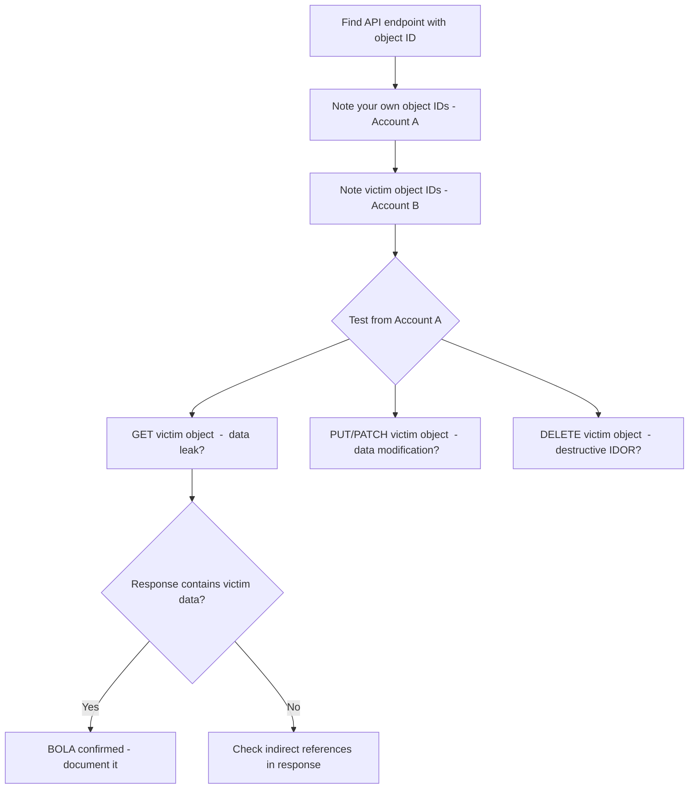

> Source: https://bugbounty.info/Attack-Surface/Web/Authorization/BOLA

# BOLA & BFLA

BOLA (Broken Object Level Authorization) and BFLA (Broken Function Level Authorization) are the OWASP API Security Top 10 names for what used to be called IDOR and vertical privilege escalation. The framing matters because API-first apps expose these differently than traditional web apps.

## BOLA vs Classic IDOR

They're the same bug. BOLA is the API-centric framing  -  OWASP introduced it because REST APIs make the pattern more visible. In an API, every resource is an object accessed via its ID. When authorization isn't checked at the object level, you get BOLA.

```text
Classic IDOR:   GET /invoices/1234  (web page)
BOLA:           GET /api/v2/invoices/1234  (API endpoint)
```

The reason BOLA gets its own name: API endpoints are more systematically enumerable. You find them in JS bundles, Swagger/OpenAPI specs, mobile app traffic, and Postman collections leaked on GitHub.

## BFLA  -  Function Level Authorization

Where BOLA is about *which data* you can access, BFLA is about *what you can do*. Regular users accessing admin functions.

```http
# BOLA  -  accessing another user's object
GET /api/v1/users/456/profile HTTP/1.1
 
# BFLA  -  accessing an admin function as a regular user
DELETE /api/v1/users/456 HTTP/1.1
POST /api/v1/admin/impersonate HTTP/1.1
GET /api/v1/users?export=all HTTP/1.1
```

BFLA is usually higher severity  -  it's not just data leakage, it's unauthorized capability execution.

## Finding API Endpoints

You can't test what you can't find. Enumerate aggressively.

**Swagger/OpenAPI specs**  -  check common paths:

```bash
/swagger.json
/openapi.json
/api/swagger.json
/api-docs
/v1/api-docs
/v2/api-docs
/swagger-ui.html
/.well-known/openapi
```

**JavaScript bundle analysis**  -  download the main JS bundle, search for API patterns:

```bash
curl https://target.com/static/js/main.chunk.js | grep -oP '"/api/[^"]*"' | sort -u
```

**Mobile traffic**  -  proxy Android/iOS traffic through Burp. Mobile apps often hit undocumented API endpoints not exposed in the web app.

**GitHub dorking:**

```text
org:targetcompany "api/v1" filename:*.json
org:targetcompany "Bearer" filename:postman_collection
```

## BOLA Testing Pattern



## API Versioning  -  Check All Versions

New API versions often have authorization fixes. Old ones often don't. If `v2` is locked down, try `v1`, `v0`, `beta`, `internal`:

```http
GET /api/v2/users/456  -> 403 Forbidden
GET /api/v1/users/456  -> 200 OK (BOLA on deprecated endpoint)
GET /api/internal/users/456  -> 200 OK
```

## HTTP Method Switching

An endpoint might have authorization on GET but not on PUT. Or DELETE might be completely unprotected:

```http
GET /api/v1/reports/789    -> 403 (auth checked)
DELETE /api/v1/reports/789 -> 200 (no auth check)
HEAD /api/v1/reports/789   -> 200 (leaks existence)
```

Try all methods  -  GET, POST, PUT, PATCH, DELETE, HEAD, OPTIONS  -  on every endpoint you find.

## Mass Assignment  -  BOLA's Cousin

When updating an object via API, include fields that shouldn't be user-controllable:

```http
PATCH /api/v1/users/me HTTP/1.1
Content-Type: application/json
 
{
  "name": "Attacker",
  "email": "attacker@attacker.com",
  "role": "admin",
  "is_verified": true,
  "subscription_tier": "enterprise"
}
```

If the API passes the entire body to the ORM without field filtering (common in Rails, Django REST Framework, Mongoose), those extra fields get updated. This is mass assignment  -  related to BFLA when the affected fields relate to authorization.

## Checklist

- Found all API endpoints (Swagger, JS bundles, mobile traffic)
- Tested all API versions (v1, v2, internal, beta)
- Tested all HTTP methods on each endpoint
- Tested BOLA with two accounts (object-level)
- Tested BFLA  -  admin functions accessible to regular users
- Tested mass assignment on PUT/PATCH endpoints

## Public Reports

- BOLA on Shopify Partner API allows reading any partner's revenue and order data - [HackerOne #1707819](https://hackerone.com/reports/1707819)
- BFLA via undocumented admin API endpoint accessible to regular users - [HackerOne #1602028](https://hackerone.com/reports/1602028)
- API v1 BOLA still present after v2 authorization fix on Grab - [HackerOne #1261048](https://hackerone.com/reports/1261048)
- HTTP method switching bypasses BOLA protection: GET returns 403, DELETE returns 200 - [HackerOne #980511](https://hackerone.com/reports/980511)
- BOLA via GraphQL nested resolver gives access to admin mutation - [HackerOne #1032752](https://hackerone.com/reports/1032752)

## Related Pages

- [IDOR](../../../Attack-Surface/Web/Authorization/IDOR)  -  same bug, traditional web framing
- [Privilege Escalation](../../../Attack-Surface/Web/Authorization/Privilege-Escalation)  -  BFLA often leads here
- [Multi-Tenancy](../../../Attack-Surface/Web/Authorization/Multi-Tenancy)  -  API BOLA across tenant boundaries
