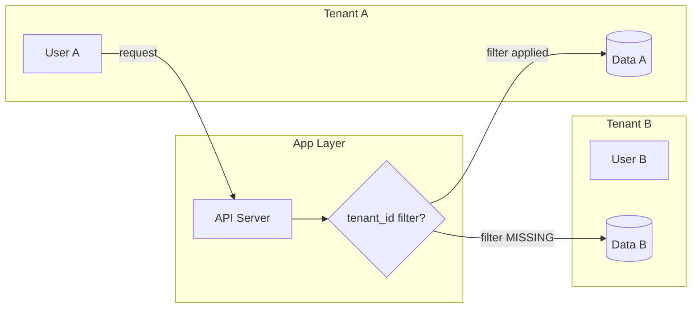

> Source: https://bugbounty.info/Attack-Surface/Web/Authorization/Multi-Tenancy

# Multi-Tenancy

Cross-tenant data access is consistently high severity  -  P1 on most programs  -  because it's not just your data at risk, it's every customer's data. SaaS platforms, B2B apps, and anything with "workspaces" or "organizations" is the target.

## The Core Problem

Multi-tenant apps have to isolate data between tenants. That isolation usually happens at the application layer  -  a query filter like `WHERE tenant_id = :current_tenant`. When that filter is missing, misapplied, or bypassable, you get cross-tenant access.



## Tenant ID Manipulation

The most direct attack  -  find where the tenant ID is represented in the request and tamper with it.

**URL-based tenant:**

```http
# Your tenant
GET /api/v1/tenants/acme-corp/users HTTP/1.1
 
# Competitor's tenant  -  do you get their users?
GET /api/v1/tenants/victim-corp/users HTTP/1.1
```

**Header-based tenant:**

```http
GET /api/v1/users HTTP/1.1
X-Tenant-ID: acme-corp
# Change to:
X-Tenant-ID: victim-corp
```

**Subdomain-based tenant:**

```text
https://acme.target.com/api/users
```

Subdomain tenants are harder to attack directly, but look for places where the tenant identifier leaks into requests as a parameter elsewhere  -  admin APIs, export endpoints, support tools.

## Testing with One Account

You only have one legitimate account. Here's how to still find cross-tenant issues:

**Method 1  -  ID enumeration.** Your tenant's objects have IDs. Try adjacent IDs. A resource at `/api/documents/5001` belonging to your tenant  -  does `/api/documents/4999` belong to another tenant and is it accessible?

**Method 2  -  Tenant ID guessing.** Tenant identifiers are often predictable (company name, domain, sequential integer). If you know the target company has a customer named "Acme Corp", try `acme`, `acme-corp`, `acme_corp` as the tenant ID.

**Method 3  -  Shared resource endpoints.** Look for endpoints that aggregate data across tenants for "benchmarking" or "analytics" features. These are often under-secured because they're not the main product.

**Method 4  -  Invite/collaboration flows.** If you can invite a user from Tenant B to collaborate on a resource in Tenant A, what happens to that shared resource's visibility? Does Tenant B now get access to Tenant A's broader data?

## API Parameter Injection

When the tenant ID is embedded in the request body, try injecting additional parameters to access other tenant data:

```http
POST /api/v1/search HTTP/1.1
Content-Type: application/json
 
{
  "query": "invoice",
  "tenant_id": "acme-corp"
}
 
# Try:
{
  "query": "invoice",
  "tenant_id": "acme-corp",
  "include_tenants": ["victim-corp"]
}
 
# Or just change tenant_id:
{
  "query": "invoice",
  "tenant_id": "victim-corp"
}
```

## Shared Infrastructure Leakage

These aren't direct tenant ID attacks  -  they're bugs in shared components:

**Shared caches**  -  if tenant A warms a cache entry for a resource and tenant B can hit the same cache key (because the cache key doesn't include the tenant ID), B reads A's cached data. Look for cache-control headers, Varnish/Redis indicators, and test by querying the same resource from two tenants in quick succession.

**Background jobs**  -  export jobs, report generation, notification processing. These often process data from a job queue without tenant context. If you can inject your tenant ID into another tenant's job queue entry, the output might include cross-tenant data.

**File storage**  -  uploaded files stored at predictable paths without tenant scoping:

```bash
/uploads/invoices/2024-01-15-invoice.pdf  (no tenant in path)
vs.
/uploads/acme-corp/invoices/2024-01-15-invoice.pdf  (properly scoped)
```

## Elevation of Impact

Cross-tenant access is already high severity. Elevation points:

- Can you *write* to another tenant's data, not just read? (P1 almost anywhere)
- Can you delete another tenant's resources? (P1)
- Can you access admin/configuration data for another tenant? (P1)
- Does the target process PII, PCI, or PHI? (regulatory implications = higher bounty)

## Checklist

- Find all places tenant ID appears in requests (URL, header, body, cookie)
- Tamper with each  -  substitute competitor/test tenant IDs
- Enumerate adjacent object IDs from your tenant in cross-tenant context
- Test invite/collaboration flows for tenant boundary violations
- Check export/report endpoints  -  often aggregate across tenant boundaries
- Test file upload paths for predictable, non-scoped storage locations
- Check background job parameters for tenant context

## Public Reports

- Cross-tenant data access via tenant_id parameter manipulation on SaaS platform - [HackerOne #1069487](https://hackerone.com/reports/1069487)
- Shared cache key without tenant scope leaks another customer's report data - [HackerOne #1181963](https://hackerone.com/reports/1181963)
- Export endpoint aggregates data across all tenants, readable by any authenticated user - [HackerOne #901725](https://hackerone.com/reports/901725)
- Invite flow in multi-tenant app allows accessing invitee's workspace documents - [HackerOne #1196561](https://hackerone.com/reports/1196561)
- Object ID enumeration across tenant boundary gives read access to competitor's projects - [HackerOne #1487404](https://hackerone.com/reports/1487404)

## Related Pages

- [IDOR](../../../Attack-Surface/Web/Authorization/IDOR)  -  same idea, but within a single tenant
- [BOLA](../../../Attack-Surface/Web/Authorization/BOLA)  -  API-layer access control; same techniques apply cross-tenant
- [Privilege Escalation](../../../Attack-Surface/Web/Authorization/Privilege-Escalation)  -  combine with tenant bypass for maximum impact
