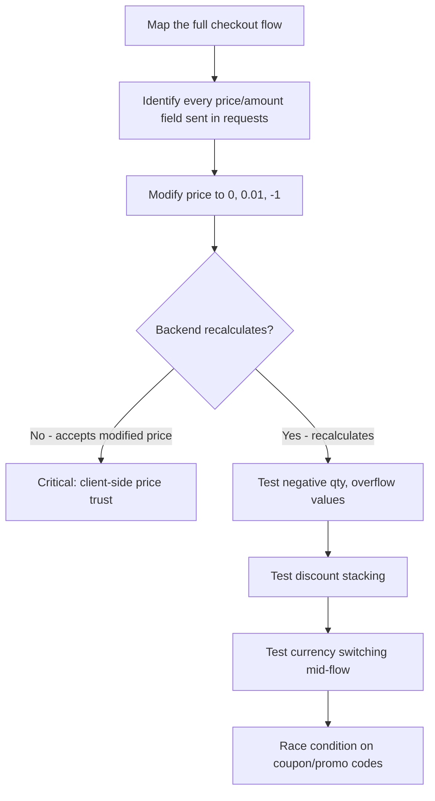

> Source: https://bugbounty.info/Attack-Surface/Web/Business-Logic/Price-Manipulation

# Price Manipulation

Payment flows are where developers make the most optimistic assumptions about user behavior. The most common mistake: trusting price data that comes from the client. The second most common: not validating input boundaries (negative values, overflows, absurd quantities). I've gotten critical findings just by changing a price field from `99.99` to `-99.99` and watching the app issue me a refund on checkout.

## Client-Side Price Trust

The most direct form. Price is calculated client-side and sent in the request body:

```http
POST /checkout HTTP/1.1
 
{"items":[{"sku":"PROD001","qty":1,"price":99.99}],"total":99.99}
```

Change `price` to `0.01` or `0`. Some backends recalculate  -  those are fine. Some accept whatever price is sent  -  that's a critical bug. The trick is that modern SPAs often pass price in the request even when the backend ignores it, so you have to test empirically.

Also look for price in hidden form fields (classic server-side rendered apps):

```html
<input type="hidden" name="price" value="99.99">
<input type="hidden" name="item_id" value="PROD001">
```

Intercept with Burp and modify `price` before the form submits.

## Negative Values

```http
POST /api/order HTTP/1.1
{"quantity": -1, "unitPrice": 99.99}
```

If `quantity * unitPrice` isn't validated for sign, a negative quantity produces a negative total  -  meaning the app owes you money. The checkout flow may complete and issue a credit or reduce a balance. Same test with negative price:

```json
{"price": -99.99}   -> total = -99.99 -> store credit applied?
{"discount": 999}   -> total goes negative
{"qty": 1, "price": -99.99, "discountedPrice": -99.99}
```

## Integer Overflow

Less common in modern languages with arbitrary precision, but still relevant in:

- Go (`int32` max: 2,147,483,647)
- PHP with certain integer operations
- Legacy Java with `int` instead of `BigDecimal`
- Database columns with `INT` vs `BIGINT`

Test with `quantity: 2147483648`  -  if the backend stores this as a signed 32-bit integer, it wraps to `-2147483648`. The total price becomes negative.

```http
{"quantity": 2147483648, "unitPrice": 0.01}
-> DB stores: -2147483648 qty
-> Total: -$21474836.48
-> ???
```

Realistically you're looking for edge cases where large numbers cause unexpected behavior  -  a checkout that errors, produces NaN, or applies a massive unintended discount.

## Discount Stacking

Apply the same coupon multiple times. Apply multiple distinct coupons when only one should be allowed. Apply a percentage discount after a fixed discount in an order that changes the calculation:

```http
POST /cart/discount HTTP/1.1
{"code": "FIRST50"}   -> -50%
 
POST /cart/discount HTTP/1.1
{"code": "LOYAL10"}   -> another -10%
 
POST /cart/discount HTTP/1.1
{"code": "FIRST50"}   -> same code again
```

Some apps track applied discounts client-side only. Others validate server-side but don't check for duplicate codes. Others allow multiple codes but cap the discount  -  find the cap logic by stacking aggressively and looking for where it stops.

Race conditions are relevant here  -  see [Race Conditions](../../../Attack-Surface/Web/Business-Logic/Race-Conditions) for coupon reuse via timing.

## Currency Conversion Abuse

Apps that support multiple currencies sometimes calculate price conversion inconsistently:

- Price is $100 USD
- Select currency: JPY -> app displays ¥14,800 but processes as $14,800
- Or the conversion is applied twice  -  once display-side, once server-side

Test by:

1. Adding an item in one currency
2. Switching currency in the cart
3. Completing checkout
4. Checking what was actually charged

Also look for currency mismatches in refund flows. If you buy in USD and request a refund that processes in a weaker currency, there may be a discrepancy.

## Testing Payment Flows Systematically



Intercept every request during checkout. Map all fields. Test each independently. Don't just test the obvious `price` field  -  look for `discountAmount`, `taxRate`, `shippingCost`, `conversionRate`, `creditApplied`.

## PoC Documentation

For any price manipulation bug, your report needs:

1. The exact request with the modified field
2. The response showing the accepted (wrong) price
3. Screenshot of the order confirmation showing the manipulated amount
4. The order in your account history confirming it completed

Don't just show the HTTP response  -  show the order was actually created at the wrong price.

## Checklist

- Map every field sent in cart/checkout requests  -  price, qty, discount, tax, currency
- Test negative values on all numeric fields
- Test zero price, zero qty (what does free mean to the app?)
- Attempt discount code stacking (same code twice, multiple distinct codes)
- Change currency mid-flow and check conversion consistency
- Test large numbers on quantity fields (int overflow)
- Check if [Race Conditions](../../../Attack-Surface/Web/Business-Logic/Race-Conditions) apply to coupon redemption
- Look for price in hidden form fields on server-rendered pages

## Public Reports

- Negative quantity in cart produces negative total, app issues account credit - [HackerOne #1162788](https://hackerone.com/reports/1162788)
- Client-side price parameter trusted by backend allows purchasing item for $0.01 - [HackerOne #1408498](https://hackerone.com/reports/1408498)
- Discount code stacking: applying the same promo code twice reduces total to zero - [HackerOne #1300748](https://hackerone.com/reports/1300748)
- Integer overflow in quantity field (int32) produces negative charge on checkout - [HackerOne Hacktivity search](https://hackerone.com/hacktivity?querystring=price+manipulation+integer+overflow)

## See Also

- [Race Conditions](../../../Attack-Surface/Web/Business-Logic/Race-Conditions)
- [State Machine Bugs](../../../Attack-Surface/Web/Business-Logic/State-Machine)
- [Mass Assignment](../../../Attack-Surface/Web/Business-Logic/Mass-Assignment)
