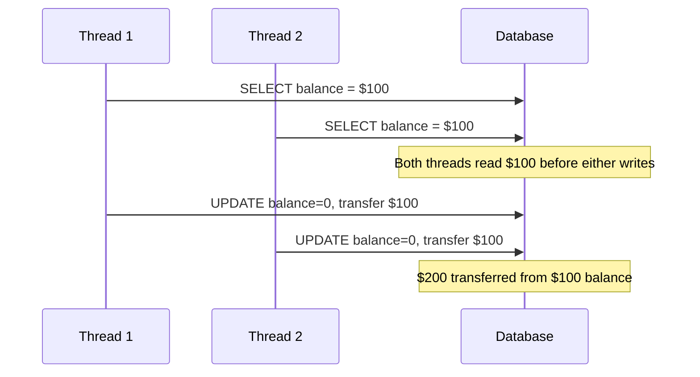
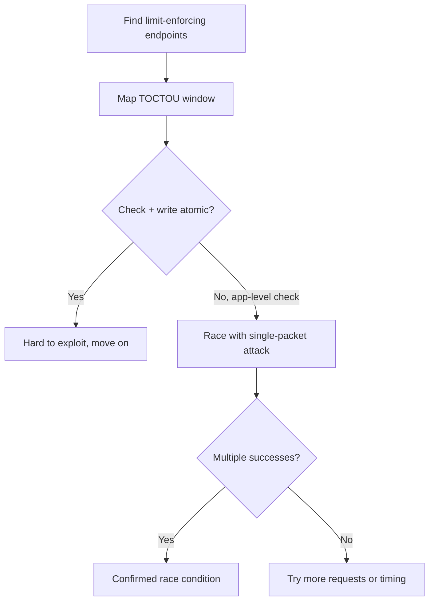

> Source: https://bugbounty.info/Attack-Surface/Web/Business-Logic/Race-Conditions

# Race Conditions

Race conditions in web apps are TOCTOU bugs at the HTTP layer  -  the app checks state, then acts on it, and there's a window between the two where you can sneak in a duplicate operation. The window is often measured in microseconds. Modern tooling  -  specifically the single-packet attack  -  makes exploiting those windows reliable.

## The Core Pattern



The app reads state, decides what's allowed, then writes. If two requests hit the read phase simultaneously, both see the "correct" state and both proceed  -  the check fires twice but the enforcement only works once.

## The Single-Packet Attack

Sending requests "simultaneously" over TCP doesn't work  -  network jitter means one arrives before the other. The single-packet attack solves this by batching multiple HTTP/1.1 requests into a single TCP packet, or using HTTP/2 multiplexing to send multiple streams in one frame. The server receives all requests at essentially the same instant.

Burp's Repeater has a "Send group (parallel)" option that does this  -  select multiple tabs, use the parallel send mode.

### Using Turbo Intruder

```python
# turbo-intruder race.py  -  coupon reuse test
def queueRequests(target, wordlists):
    engine = RequestEngine(endpoint=target.endpoint,
                           concurrentConnections=1,
                           requestsPerConnection=20,
                           pipeline=True)
 
    # Send 20 requests simultaneously
    for i in range(20):
        engine.queue(target.req, None)
 
def handleResponse(req, interesting):
    table.add(req)
```

In Turbo Intruder: `Extensions > Turbo Intruder`, load the script above, select `race-single-packet-attack` from the examples dropdown. Set concurrentConnections=1 and requestsPerConnection to however many parallel requests you want.

## Real Scenarios

### Coupon / Promo Code Reuse

```http
POST /checkout/apply-coupon HTTP/1.1
{"code": "SAVE50", "orderId": "abc123"}
```

Normal flow: apply -> validate unused -> mark used -> apply discount. Race the apply request 10-15 times simultaneously. If the "mark used" write hasn't committed before the other reads check the "is used" state, multiple discounts land.

Turbo Intruder setup: 15 identical requests, single-packet send. Check how many discount line items appear in the final order.

### Balance Manipulation / Double Spend

```http
POST /wallet/withdraw HTTP/1.1
{"amount": 100, "destination": "external"}
```

If balance check and debit aren't atomic (wrapped in a transaction with pessimistic locking), you can withdraw the same balance twice. Test with an amount equal to your full balance. Race two requests  -  if both succeed, you've demonstrated double-spend.

### Vote / Like Manipulation

```http
POST /post/1337/vote HTTP/1.1
{"direction": "up"}
```

Apps that enforce "one vote per user" via application-layer checks (not DB constraints) are vulnerable. Race 20 vote requests  -  check the vote count after. More than 1 increment means the limit isn't atomic.

### Rate Limit Bypass

Password reset OTP codes with a rate limit: "3 attempts then lockout." Race 10 guesses simultaneously  -  if all arrive before the counter increments from any of them, you get 10 guesses instead of 3.

### Limit Bypass on Feature Usage

```http
POST /api/export HTTP/1.1
{"reportId": "abc"}
```

Free tier allows 3 exports. Race 6 requests. If the counter check isn't atomic with the increment, you get more than your limit.

## Detection Methodology



I look for these patterns first: coupon/voucher application, referral code use, "one per user" limits, balance-affecting operations, vote/rating systems, API rate limits enforced in app code.

## Burp Suite Setup

1. Capture the target request
2. Right-click -> Send to Repeater
3. Duplicate the tab 10-15 times (Ctrl+R, then Ctrl+Shift+R repeatedly)
4. Select all tabs
5. Right-click -> "Send group (parallel)"  -  uses single-packet HTTP/2

Or use Turbo Intruder for finer control. The Turbo Intruder `examples/race.py` template is the starting point.

## Checklist

- Identify all endpoints that enforce limits, uniqueness, or check before modify
- Determine if checks are application-layer or DB-level (transactions/locks)
- Use Burp parallel send or Turbo Intruder single-packet mode
- Start with 10-15 parallel requests; scale up if needed
- Check for negative balances (negative number = double spend)
- Check for multiple successful uses of single-use codes
- Document exact request count, success count, and resulting state change

## Public Reports

Real-world race condition findings across bug bounty programs:

- Race condition in HackerOne flag submission allowing duplicate point claims - [HackerOne #454949](https://hackerone.com/reports/454949)
- Race condition in HackerOne retest allowing multiple payouts - [HackerOne #604534](https://hackerone.com/reports/604534)
- Race condition on Shopify bypassing store location limits - [HackerOne #413759](https://hackerone.com/reports/413759)
- Race condition on Slack account survey endpoint - [HackerOne #165570](https://hackerone.com/reports/165570)

## See Also

- [Price Manipulation](../../../Attack-Surface/Web/Business-Logic/Price-Manipulation)
- [State Machine Bugs](../../../Attack-Surface/Web/Business-Logic/State-Machine)
