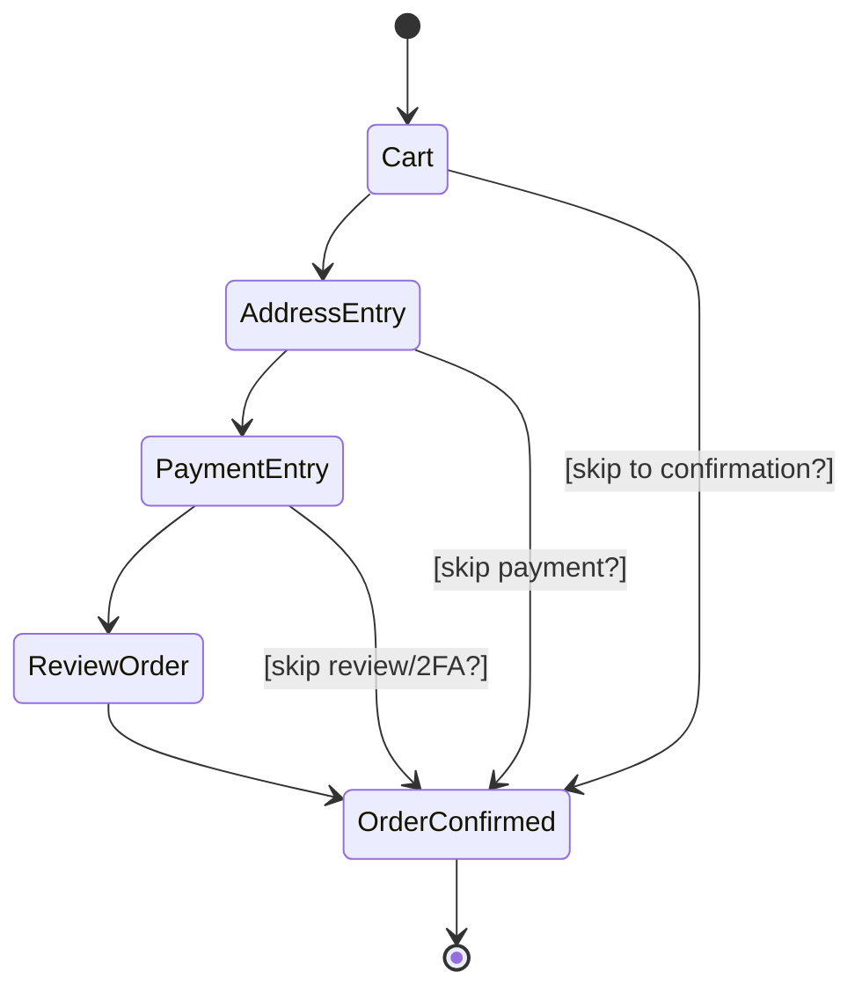
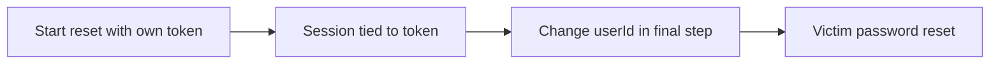

> Source: https://bugbounty.info/Attack-Surface/Web/Business-Logic/State-Machine

# State Machine Bugs

Multi-step flows have an implicit state machine  -  the app expects you to go through steps in order. Step 1 -> Step 2 -> Step 3 -> Complete. But most apps don't enforce this server-side. They track state poorly or not at all. You can skip steps, go backwards, replay transitions, or access terminal states without completing prerequisites. These bugs are logic errors, not technical vulns, which means scanners miss them entirely.

## What a State Machine Bug Looks Like



The arrows pointing directly to `OrderConfirmed` are the attacks. The app assumes you went through all the intervening steps. It only enforces the final state transition.

## Step-Skipping in Checkout

The classic: a multi-step checkout that doesn't verify each prior step was completed server-side.

1. Add item to cart
2. Proceed to address entry  -  skip by navigating directly to `/checkout/payment`
3. Proceed to payment  -  skip by navigating directly to `/checkout/confirm`
4. Submit order

If the confirmation endpoint only checks "is there a cart session?" rather than "did the user complete payment entry?", you can sometimes place orders without entering valid payment details, bypass address verification, or skip mandatory fields.

Test by capturing the final submission request and replaying it with a fresh session that hasn't gone through earlier steps.

## Verification Step Bypass

Apps with email/phone verification flows often allow access to protected features before verification is complete, or allow you to skip to a post-verification state:

```text
Register -> Unverified Account -> [Email Verification Required]
                                      v skip?
                               Verified Account -> Full Access
```

Test: register an account, skip verification, directly access features that require verified status. Try accessing the API endpoints that verification enables without having the verification cookie/flag set.

Also test: is the verification token checked server-side or just client-side? Intercept the verification response and see if changing `{"verified": false}` to `{"verified": true}` does anything. (It shouldn't, but it sometimes does in older Rails/PHP apps.)

## Replaying State Transitions

Some flows allow you to re-enter states you've already passed through in order to abuse them:

```http
POST /checkout/apply-coupon HTTP/1.1
{"code": "SAVE50"}
-> Returns: orderTotal: $49.99
 
# Order is now in "coupon applied" state
# Navigate back to cart, re-apply same coupon
 
POST /checkout/apply-coupon HTTP/1.1
{"code": "SAVE50"}
-> Returns: orderTotal: $0.00
```

Or: complete a purchase -> navigate back to checkout -> resubmit the payment request with the same intent ID. Does the second submission succeed? Does the first refund trigger? See also [Race Conditions](../../../Attack-Surface/Web/Business-Logic/Race-Conditions) for concurrent-request variants.

## Accessing Unauthorized States

Account upgrade flows: can you reach a "premium" state without completing the payment?

```text
Free Plan -> Upgrade Selected -> Payment -> Premium Plan
```

If navigating to `/dashboard?plan=premium` or calling `POST /user/plan {"plan":"premium"}` after selecting upgrade but before completing payment flips your account to premium, that's a business logic failure. Test by intercepting the sequence of requests and replaying state-setting requests out of order.

Password reset flow: can you reach the "set new password" state without owning the reset token?

```http
POST /password-reset/confirm HTTP/1.1
{"token": "", "newPassword": "attacker123"}
```

Missing or empty token on the final step  -  does the app still process the password change? I've seen this on older PHP apps where the final form submission didn't re-validate the token.

## Multi-Step Account Takeover via State Confusion



Password reset flows that associate the token with a session but don't re-check the token on submission are vulnerable to this. You complete the token-validation step with your own token, then replay the final step changing the userId parameter.

## Testing Methodology

1. Map every step in the flow  -  capture all requests in order
2. For each step, identify what server-side state is expected to have been set
3. Replay the final step request from a fresh session (no prior steps)
4. Replay intermediate steps out of order
5. Try going backwards (complete step 3, return to step 1, then jump to step 4)
6. Manipulate state identifiers (userId, orderId, planId) in state-transition requests

## Checklist

- Map the full flow from start to finish  -  every request, every state transition
- Identify the final submission request and replay it from a clean session
- Test skipping each intermediate step individually
- Test navigating backwards and re-triggering transitions
- Look for user-controllable state identifiers in step-completion requests
- Check verification flows  -  can you access post-verification features before verifying?
- Test password reset final step  -  is the token re-validated on submission?
- Look for plan/role state changes that fire before payment completes

## Public Reports

- Multi-step checkout skip allows placing orders without completing payment step - [HackerOne #1200234](https://hackerone.com/reports/1200234)
- Email verification bypass: accessing post-verification features before confirming email - [HackerOne #1009419](https://hackerone.com/reports/1009419)
- Password reset final step doesn't re-validate token, allows resetting any account - [HackerOne #685005](https://hackerone.com/reports/685005)
- Plan upgrade state transition fires before payment completes, grants premium access free - [HackerOne #1047623](https://hackerone.com/reports/1047623)

## See Also

- [Price Manipulation](../../../Attack-Surface/Web/Business-Logic/Price-Manipulation)
- [Race Conditions](../../../Attack-Surface/Web/Business-Logic/Race-Conditions)
- [IDOR](../../../Attack-Surface/Web/Authorization/IDOR)
