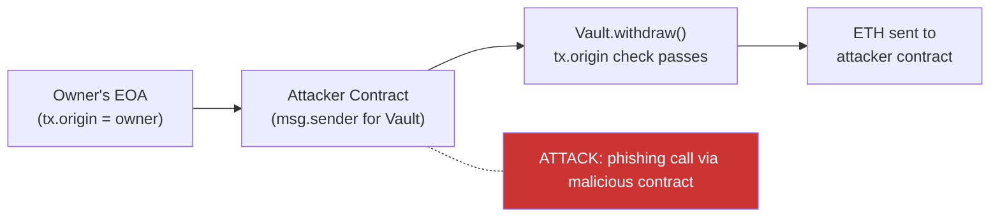

> Source: https://bugbounty.info/Attack-Surface/Web3/Access-Control

# Access Control

Access control bugs in smart contracts are often trivially visible in the source code and catastrophically exploitable on-chain. Missing a single `onlyOwner` modifier on a `mint()` function means anyone can print unlimited tokens. An uninitialised proxy implementation means anyone can become owner. These aren't subtle logic errors  -  they're missing guards on dangerous functions.

## Missing Role Modifiers

The simplest variant: a privileged function with no access control at all.

```solidity
// VULNERABLE: anyone can mint
contract Token {
    mapping(address => uint256) public balances;
 
    function mint(address to, uint256 amount) external {
        // No modifier. Anyone calls this.
        balances[to] += amount;
    }
}
 
// CORRECT
contract Token {
    mapping(address => uint256) public balances;
    address public owner;
 
    modifier onlyOwner() {
        require(msg.sender == owner, "not owner");
        _;
    }
 
    function mint(address to, uint256 amount) external onlyOwner {
        balances[to] += amount;
    }
}
```

When auditing, search every `external` and `public` function for missing modifiers. Focus on: `mint`, `burn`, `setFee`, `setOwner`, `transferOwnership`, `pause`, `unpause`, `upgrade`, `setOracle`, `withdrawFees`.

```bash
# Slither detects unprotected privileged functions
slither . --detect unprotected-upgrade,arbitrary-send-eth,controlled-delegatecall
```

## Uninitialised Proxy Implementation

Covered in [Smart Contract Basics](../../Attack-Surface/Web3/Smart-Contract-Basics), but the access control angle deserves its own treatment. When an upgradeable contract is deployed:

1. The proxy is deployed and `initialize()` is called  -  this sets the owner on the **proxy's storage**
2. The implementation contract is deployed separately but `initialize()` is NOT called on it  -  its storage is empty

If you find an implementation contract where `initialized == false`, you can call `initialize()` with your own address, become owner, then call the upgrade function to point the proxy at a malicious implementation.

```bash
# Check if an implementation contract is uninitialised
# Read the initialized flag (usually slot 0 for OZ Initializable)
cast storage 0xIMPLEMENTATION_ADDRESS 0x0 --rpc-url $RPC
 
# If returns 0x00...00, it's uninitialised
# Call initialize with your address
cast send 0xIMPLEMENTATION_ADDRESS "initialize(address)" YOUR_ADDRESS --rpc-url $RPC --private-key $KEY
```

**Real-world instance:** The Wormhole team deployed an unguarded implementation contract. A researcher found it and called `initialize()`, setting themselves as guardian. They responsibly disclosed rather than exploiting. The bug was fixed and the researcher was paid a large bounty.

## delegatecall Context Confusion

`delegatecall` runs the callee's code in the caller's context: the caller's storage, the caller's `address(this)`, and the caller's ETH balance are all used. The callee's storage is untouched.

```solidity
// VULNERABLE: proxy calls attacker-controlled address via delegatecall
contract Proxy {
    address public implementation;
    address public owner;  // slot 1
 
    function (bytes calldata data) external returns (bytes memory) {
        (bool ok, bytes memory result) = implementation.delegatecall(data);
        require(ok);
        return result;
    }
}
 
// Attacker deploys a contract with:
contract Exploit {
    address public slot0;  // aligns with Proxy.implementation (slot 0)
    address public owner;  // aligns with Proxy.owner (slot 1)
 
    function pwn(address newOwner) external {
        // When called via delegatecall, this writes to Proxy.owner
        owner = newOwner;
    }
}
```

Storage slot alignment is the source of countless proxy bugs. If the implementation contract's variable layout doesn't match the proxy's expected layout, a `delegatecall` can overwrite unexpected storage slots. An attacker who can control which implementation is called can overwrite the `owner` or `implementation` slot directly.

## Self-Destruct in Proxy Implementations

If a proxy's implementation contract contains a `selfdestruct` that an attacker can call:

```solidity
// Parity Multisig implementation contract had this
function kill() external onlyOwner {
    selfdestruct(payable(msg.sender));
}
```

When the implementation is selfdestructed, the bytecode at that address becomes empty. Every proxy pointing at it then delegates to empty bytecode and returns no data. All proxies that depended on that implementation become permanently broken.

**Parity Multisig (2017)  -  $150M+ frozen.** A user accidentally called `initWallet()` on the uninitialised implementation contract, became its owner, then called `kill()`. The implementation selfdestructed. Every Parity multisig wallet that used it became an empty proxy forwarding to destroyed code. The funds are frozen permanently.

## tx.origin vs msg.sender

`tx.origin` is the original EOA that started the transaction. `msg.sender` is the immediate caller. If a protocol uses `tx.origin` for authorisation, any contract the authorised EOA calls can perform authorised actions on their behalf.

```solidity
// VULNERABLE: tx.origin check is bypassable
contract Vault {
    address public owner;
 
    function withdraw(uint256 amount) external {
        require(tx.origin == owner, "not owner");  // wrong
        payable(msg.sender).transfer(amount);
    }
}
 
// Attack: deploy a contract, trick the owner into calling it
// The owner's transaction has tx.origin == owner
// The attacker contract calls Vault.withdraw()
// tx.origin still equals owner  -  auth passes
// msg.sender is the attacker contract  -  gets the funds
```



`tx.origin` should never be used for authorisation. Its only safe use is distinguishing EOA calls from contract calls (for anti-bot measures), and even that is fragile.

## OpenZeppelin AccessControl vs Ownable

Two standard patterns for managing roles:

**Ownable:** Single owner address, `transferOwnership()` to change it. Simple but only supports one role.

**AccessControl:** Role-based system with `grantRole`, `revokeRole`, `renounceRole`. Each role is a `bytes32` identifier. `DEFAULT_ADMIN_ROLE` can manage all other roles by default  -  check who holds it.

```solidity
// AccessControl audit targets:
// 1. Who holds DEFAULT_ADMIN_ROLE?
// 2. Can any role grant itself additional roles?
// 3. Are role assignments done in the constructor or a separate initializer?
// 4. Can a role be granted to address(0)?
 
bytes32 public constant MINTER_ROLE = keccak256("MINTER_ROLE");
 
// Check if DEFAULT_ADMIN_ROLE is held by a multisig or an EOA
// An EOA holding admin is a centralisation risk (and often in scope as High)
```

## Audius Governance Takeover (2022)

Audius suffered a governance attack where an attacker exploited an initialisation bug in their governance contract. The attacker found that the governance contract could be re-initialised, which reset the proposal threshold to 0. They then created a proposal to transfer 18M AUDIO tokens to themselves and executed it in the same transaction. Loss: approximately $6M.

The root cause was a missing initialisation guard  -  `initialize()` could be called more than once because the contract used a custom initialisation pattern that didn't use OpenZeppelin's `Initializable` properly.

## Checklist

- List all `external` and `public` functions; verify each has appropriate access control
- Check proxy implementations for uninitialised state (call `initialize()` on the implementation address)
- Audit storage layout alignment between proxy and all implementation versions
- Search for `selfdestruct` in implementation contracts and verify the caller restriction
- Search for `tx.origin` usage; any use for authorisation is a finding
- Identify who holds `DEFAULT_ADMIN_ROLE` and whether it's an EOA or multisig
- Check `initialize()` functions for re-initialisation guards
- Verify `transferOwnership` emits events and uses a two-step process if high value
- Look for functions that can change the implementation address without timelock
- Run Slither's `unprotected-upgrade` and `controlled-delegatecall` detectors

## Public Reports

- Uninitialised proxy implementation - Wormhole implementation takeover - [Immunefi Blog](https://immunefi.com/blog/wormhole-uninitialized-proxy-bugfix-review/)
- Parity multisig self-destruct via uninitialised implementation - [Parity Post-Mortem](https://www.parity.io/blog/a-postmortem-on-the-parity-multi-sig-library-self-destruct/)
- Audius governance re-initialisation attack - [Rekt.news](https://rekt.news/audius-rekt/)
- Missing access control on mint function - [Immunefi Disclosure 2022](https://immunefi.com/bug-bounty/quixotic/disclosed/)
- tx.origin authorisation bypass - [Immunefi Disclosure 2023](https://immunefi.com/bug-bounty/hashflow/disclosed/)

## See Also

- [Smart Contract Basics](../../Attack-Surface/Web3/Smart-Contract-Basics)  -  proxy patterns, delegatecall, storage slots
- [Reentrancy](../../Attack-Surface/Web3/Reentrancy)  -  missing nonReentrant compounds access control bugs
- [Signature and Replay](../../Attack-Surface/Web3/Signature-and-Replay)  -  signature validation as an alternative to on-chain role checks
- [Tooling](../../Attack-Surface/Web3/Tooling)  -  Slither for automated access control detection
