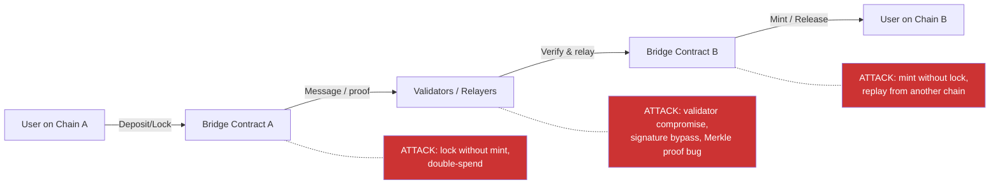

> Source: https://bugbounty.info/Attack-Surface/Web3/Cross-Chain-Bridge

# Cross-Chain Bridge

Bridges are where the largest single losses in web3 history happened. Ronin ($625M), Poly Network ($611M), Wormhole ($320M), Nomad ($190M), Harmony Horizon ($100M). The attack surface is broad because bridges sit at the intersection of multiple chains, multiple smart contracts, off-chain relayers, and threshold signature schemes  -  each component a potential point of failure.

Cumulative bridge losses exceed $2B. When Immunefi publishes its yearly loss reports, bridges dominate the top entries every year.

## Bridge Models

Three main architectures, each with a distinct attack surface:

**Lock-mint (wrapped asset):**
User locks native tokens on Chain A. Validators observe the lock event. The bridge mints wrapped tokens on Chain B. To redeem, the wrapped tokens are burned on Chain B and the native tokens released on Chain A.

Attack surface: the verification that the lock happened on Chain A before minting on Chain B. If validators can be bypassed or fooled, you can mint without locking.

**Mint-burn (canonical bridge):**
Similar to lock-mint but the bridge protocol owns the minting rights. No separate "wrapped" representation; the bridge's contract on each chain issues the canonical token. Compromise of the bridge's signing authority means unlimited minting.

**Liquidity pool (native swap):**
User deposits on Chain A, the bridge's liquidity provider on Chain B releases tokens from a pool. No wrapping; both sides use native tokens. Attack surface: the accounting between chains, the LP's solvency guarantees, and the messaging layer that confirms deposits.



## Signature Verification Attacks

The Wormhole exploit ($320M, February 2022) is the canonical signature verification bypass. Wormhole used Solana's native signature verification instruction (`secp256k1_program`) to validate guardian signatures. The bridge expected the verification to have been run; it checked that a verification *instruction* was present, but didn't verify the instruction referenced the correct data.

The attacker crafted a transaction with a `secp256k1` instruction that verified a different, attacker-controlled message, then called the bridge's complete_wrapped function. The bridge saw the instruction present, treated it as valid, and minted 120,000 wETH.

The generalised lesson: **verification of a process is not the same as verification of the result**. If a contract checks that a function was called rather than checking the return value of that function, or checks that a proof was provided without validating what the proof covers, there is an attack.

When auditing signature verification in bridges:

- Check that the hash being verified is the hash of the actual deposit message, not some attacker-supplied hash
- Confirm that the verification result (true/false) is actually checked, not just that verification was attempted
- Verify the signer set matches the expected validator set for the correct epoch

## Merkle Proof Verification Bugs

The Nomad bridge exploit ($190M, August 2022) was caused by a Merkle root initialisation bug. During an upgrade, the contract's trusted root was set to `bytes32(0)  -  all zeros. The Merkle proof verification function used `require(acceptableRoot[messages])`where`messages`was the Merkle leaf. Because`bytes32(0)` was marked as trusted, any message with a zero root (which is what any empty/malformed proof produces) was accepted.

The result: the check was bypassed by submitting an empty proof. Anyone could call the bridge's `process()` function with any message  -  no valid proof required. The attack was copied by hundreds of opportunists in the same block.

```solidity
// Simplified vulnerable pattern
mapping(bytes32 => bool) public acceptableRoot;
 
function process(bytes memory message, bytes32[32] calldata proof) external {
    bytes32 root = merkleRoot(proof, keccak256(message));
    // If acceptableRoot[bytes32(0)] == true, then any message with empty proof passes
    require(acceptableRoot[root], "invalid proof");
    _execute(message);
}
```

When auditing Merkle bridges:

- Check all root initialisation paths, especially in upgrade/migration functions
- Verify that `bytes32(0)` is never a trusted root
- Trace the proof verification to confirm it validates the path from leaf to root against a specific committed root, not just any acceptable root

## Validator and Committee Compromise

The Ronin bridge ($625M, March 2022) was not a code bug  -  it was a validator key compromise. The Ronin bridge used a threshold signature scheme where 5 of 9 validators had to sign. The attacker (attributed to Lazarus Group) compromised 4 validators via spear phishing, then exploited a backdoor in a separate Axie DAO validator node. With 5 valid signatures, they signed fraudulent withdrawal transactions.

For bounty hunters, full validator compromise is typically out of scope (it's an operational security issue, not a contract bug). What is in scope:

- The threshold is set too low and an attacker could reach it by compromising public endpoints
- Validator set changes can be triggered by a single compromised key
- Emergency functions (pause, halt) require only 1-of-N signatures
- Validator signatures are not bound to a specific epoch or nonce (allowing reuse)

## Cross-Chain Replay

Covered in depth in [Signature and Replay](../../Attack-Surface/Web3/Signature-and-Replay), but specific to bridges: a deposit proof from Chain A replayed on Chain A's other bridge endpoint, or a withdrawal message from an old bridge version replayed against an upgraded bridge.

The Harmony Horizon bridge ($100M, June 2022) used a 2-of-5 multisig. Two keys were compromised. The bridge also lacked sufficient replay protection  -  messages could be reused across bridge versions.

## Famous Cases Reference

| Bridge | Loss | Root Cause |
| --- | --- | --- |
| Ronin (Axie) | $625M | Validator key compromise (5/9 threshold reached) |
| Poly Network | $611M | Arbitrary cross-chain message injection bypassing access control |
| Wormhole | $320M | Signature verification bypass via fake verify instruction |
| Nomad | $190M | Merkle root initialised to 0x00, bypassing all proof checks |
| Harmony Horizon | $100M | Compromised 2/5 multisig keys |

## Checklist

- Identify the bridge architecture: lock-mint, mint-burn, or liquidity pool
- Trace the full path from deposit on Chain A to release on Chain B
- Audit the signature verification logic: is the hash covering the correct message?
- Check all Merkle root initialisation paths for zero-value or default-value roots
- Verify that `bytes32(0)` and similar sentinel values are never trusted roots
- Count the validator/guardian threshold and assess whether it can be reached via public key exposure
- Check all withdrawal and minting functions for replay protection (nonces, chain IDs)
- Look for upgrade functions that reset trusted roots, nonces, or validator sets
- Verify that the bridge contracts on both chains reject each other's proofs (cross-chain replay)
- Run Slither on both ends of the bridge contract pair

## Public Reports

- Wormhole signature verification bypass - [Immunefi Blog](https://immunefi.com/blog/wormhole-uninitialized-proxy-bugfix-review/)
- Nomad Merkle root zero-value initialisation - [Rekt.news](https://rekt.news/nomad-rekt/)
- Ronin validator compromise - [Rekt.news](https://rekt.news/ronin-rekt/)
- Poly Network access control bypass on cross-chain call - [Rekt.news](https://rekt.news/polynetwork-rekt2/)
- Harmony Horizon multisig compromise - [Rekt.news](https://rekt.news/harmony-rekt/)

## See Also

- [Signature and Replay](../../Attack-Surface/Web3/Signature-and-Replay)  -  cross-chain replay protection and EIP-712 domain separators
- [Access Control](../../Attack-Surface/Web3/Access-Control)  -  validator set management and privileged functions
- [Tooling](../../Attack-Surface/Web3/Tooling)  -  Foundry for PoC development on forked chains
- [Web3 Overview](../../Attack-Surface/Web3/)  -  Immunefi scope conventions for bridge programs
